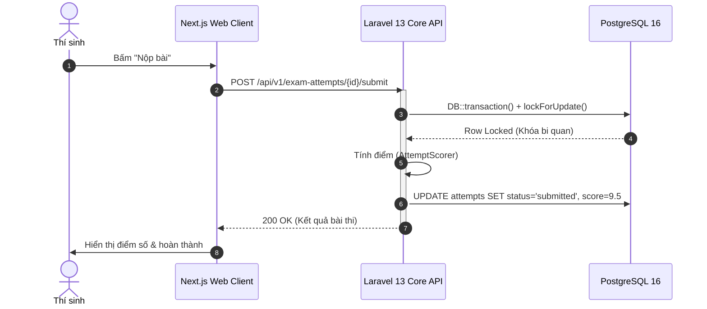
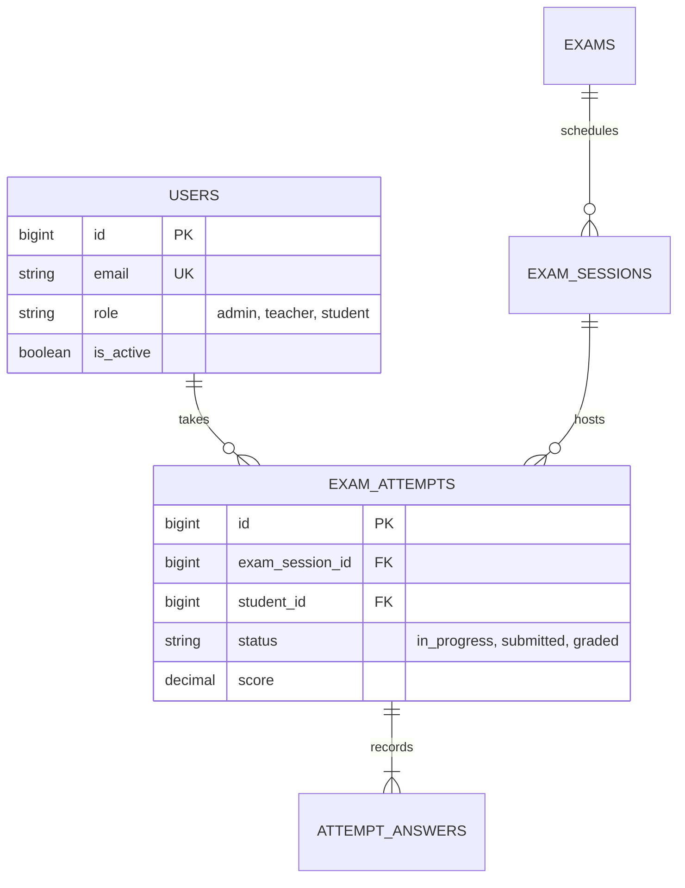
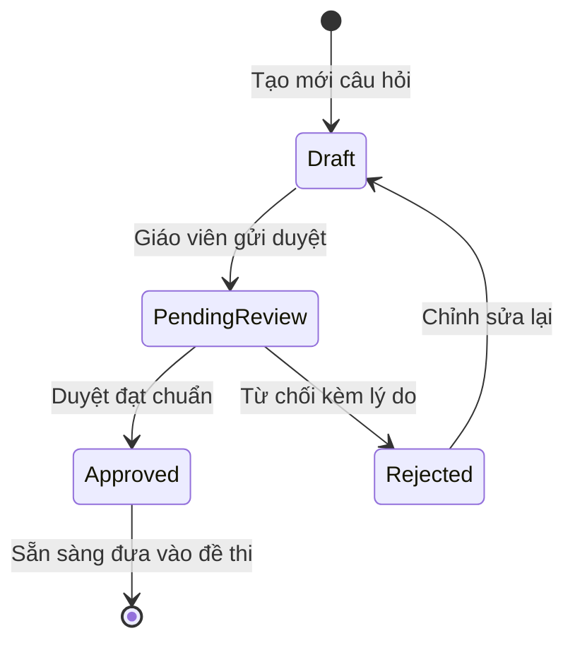
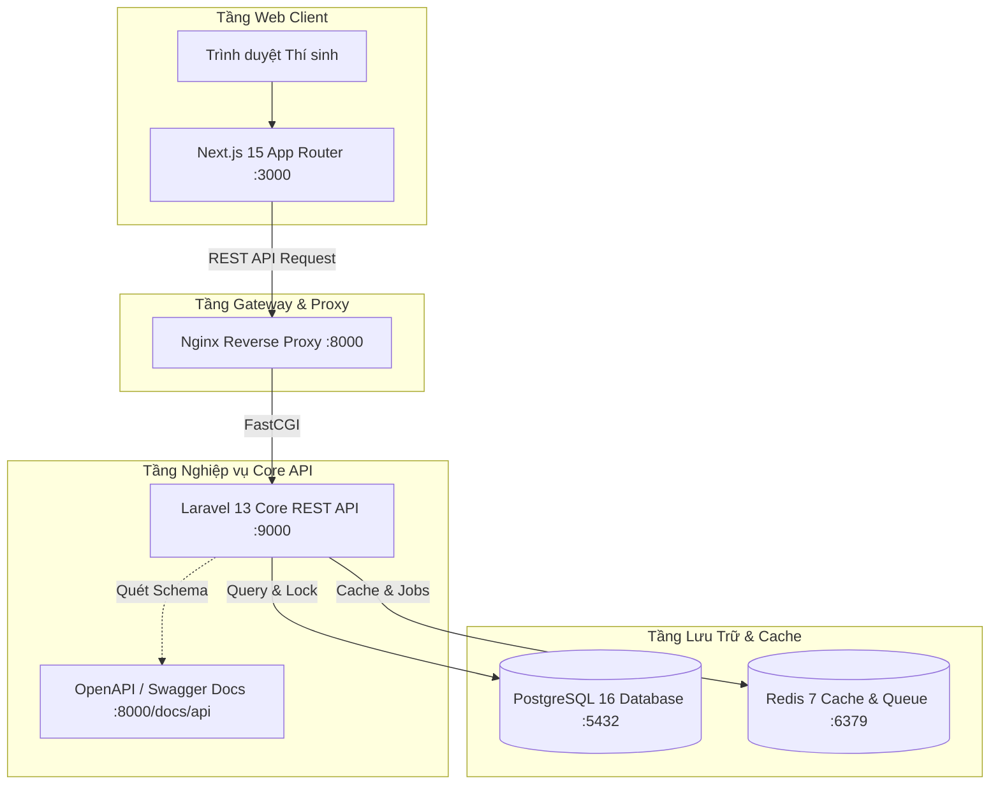
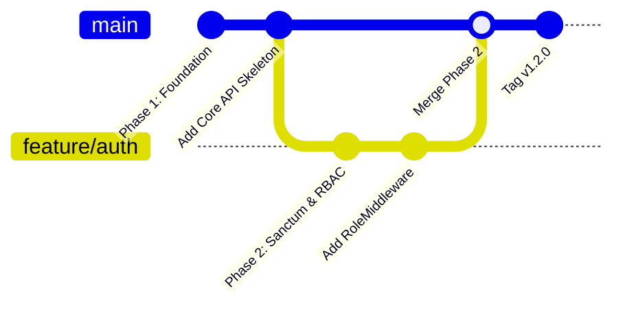

# 📊 Markdown Diagrams Skill (Diagrams-as-Code trong File .md)

Kỹ năng này hướng dẫn toàn diện cách **vẽ và quản lý sơ đồ kỹ thuật trực tiếp bên trong file Markdown (`.md`)** bằng cách tiếp cận **Diagrams-as-Code**, đồng thời kết nối với các **MCP Server (Draw.io MCP, Kroki MCP)** và công cụ CLI để render, chỉnh sửa và xuất bản tài liệu.

---

## 🎯 1. Tại Sao Vẽ Sơ Đồ Bằng File Markdown?

1. **Version Control thân thiện (Git-first)**: Toàn bộ sơ đồ là text thuần, dễ so sánh diff, review trên Pull Request, không bị xung đột binary.
2. **Native Render trên GitHub & IDE**: GitHub, GitLab, VS Code Markdown Preview tự động hiển thị khối ` ```mermaid ` thành hình vẽ vector trực quan mà không cần cài thêm phần mềm.
3. **Single Source of Truth**: Sơ đồ nằm chung file tài nguyên với phần giải thích nghiệp vụ, ngăn ngừa tình trạng tài liệu và sơ đồ bị lệch pha.
4. **Cầu nối linh hoạt với Draw.io MCP**: Bạn có thể copy mã Mermaid trong file `.md` và truyền vào công cụ `open_drawio_mermaid` của Draw.io MCP để mở ngay trên giao diện đồ họa.

---

## 🎨 2. Các Cú Pháp Sơ Đồ Markdown Chuẩn Hóa (Mermaid)

Khối mã bắt đầu bằng ` ```mermaid ` và kết thúc bằng ` ``` `.

### 2.1. Sơ đồ Luồng Tuần tự (Sequence Diagram)
Dùng cho: Luồng xác thực, nộp bài thi, giao dịch thanh toán, tương tác giữa các service.

````markdown

````

---

### 2.2. Sơ đồ Thực thể Quan hệ CSDL (Entity Relationship Diagram - ERD)
Dùng cho: Thiết kế bảng CSDL, quan hệ khóa ngoại, kiểu dữ liệu.

````markdown

````

---

### 2.3. Sơ đồ Máy Trạng Thái (State Diagram - FSM)
Dùng cho: Vòng đời Câu hỏi (`draft` $\rightarrow$ `approved`), Ca thi (`draft` $\rightarrow$ `published` $\rightarrow$ `closed`), Lượt thi.

````markdown

````

---

### 2.4. Sơ đồ Kiến trúc C4 Container (Flowchart / C4)
Dùng cho: Mô hình kiến trúc phân tầng, phân chia container, ranh giới an ninh.

````markdown

````

---

### 2.5. Sơ đồ Nhánh Git (GitGraph) & Tiến độ (Gantt)
Dùng cho: Kế hoạch triển khai release, quy trình branching git.

````markdown

````

---

## 🔌 3. Các MCP Server Hỗ Trợ Vẽ Sơ Đồ Từ Markdown

### 3.1. Draw.io MCP Server (`@drawio/mcp`) — Đang Hoạt Động Trong Dự Án
- **Công cụ:** `open_drawio_mermaid`
- **Cách dùng:**
  Truyền trực tiếp chuỗi Mermaid trích xuất từ file `.md` vào tham số `content`:
  ```json
  {
    "ServerName": "drawio",
    "ToolName": "open_drawio_mermaid",
    "Arguments": {
      "content": "sequenceDiagram\n  autonumber\n  Alice->>Bob: Hello"
    }
  }
  ```
  Lập tức trình duyệt mở giao diện Draw.io với sơ đồ tương tác để chỉnh sửa hoặc xuất PNG/SVG.

---

### 3.2. Kroki MCP Server — Đa Dạng Hơn 20 Định Dạng
[Kroki](https://kroki.io) là cổng chuyển đổi Diagrams-as-Code toàn diện nhất hiện nay.
- Hỗ trợ cú pháp nhúng:
  - `Mermaid` (`.md`)
  - `PlantUML` (`@startuml ... @enduml`)
  - `D2` (Hiện đại, bố cục tự động cực đẹp)
  - `Graphviz` (DOT graphs)
  - `Excalidraw` (Phong cách vẽ tay)
  - `BPMN`, `Bytefield`, `Vega-Lite`, `Structurizr C4`
- **Cách cấu hình vào `.agents/mcp_config.json`:**
  ```json
  {
    "mcpServers": {
      "kroki": {
        "command": "npx",
        "args": ["-y", "kroki-mcp"]
      }
    }
  }
  ```

---

## ⚡ 4. Công Cụ CLI Tự Động Render File Markdown Ra Ảnh (SVG / PNG)

Không cần mở trình duyệt, bạn có thể chạy lệnh để xuất thẳng sơ đồ từ file `.md`:

### 4.1. Xuất Sơ đồ Mermaid từ file `.md` qua `mermaid-cli`:
```bash
# Cài đặt hoặc chạy trực tiếp qua npx
npx -y @mermaid-js/mermaid-cli -i docs/02-domain-database/10-ERD.md -o docs/diagrams/database/erd.svg
```

### 4.2. Chuyển Markdown thành Mindmap tương tác qua `markmap`:
Biến danh sách đề mục Markdown (`#`, `##`, `-`) thành sơ đồ tư duy động:
```bash
npx -y markmap-cli README.md -o docs/diagrams/architecture/project_mindmap.html
```

---

## 📋 5. Bảng Tóm Tắt Giải Pháp

| Nhu cầu | Giải pháp Khuyên Dùng | Công cụ / MCP tương ứng |
| :--- | :--- | :--- |
| **Viết sơ đồ trực tiếp trong file .md** | Dùng khối ` ```mermaid ` | Native GitHub / IDE Markdown Preview |
| **Mở sơ đồ từ .md ra canvas đồ họa kéo thả** | Copy Mermaid trong `.md` chuyển sang Draw.io | MCP `drawio` (`open_drawio_mermaid`) |
| **Vẽ sơ đồ PlantUML, D2, Excalidraw từ text** | Sử dụng cú pháp tương ứng qua API Kroki | MCP `kroki` |
| **Tự động build ảnh SVG cho báo cáo đồ án** | Render hàng loạt file `.md` ra file `.svg` | CLI `@mermaid-js/mermaid-cli` (`mmdc`) |
| **Biến tài liệu Markdown thành Mindmap** | Markmap cú pháp Outline | CLI `markmap-cli` |
