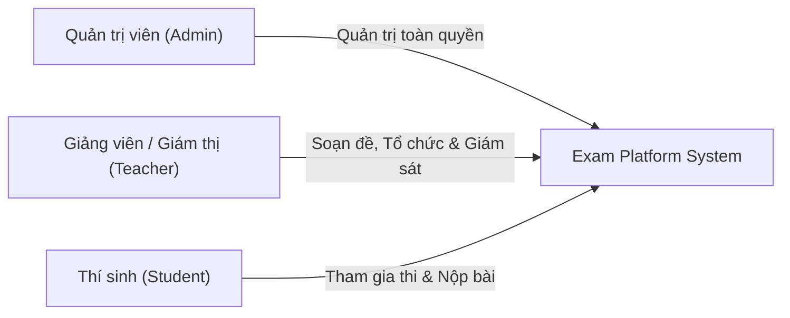
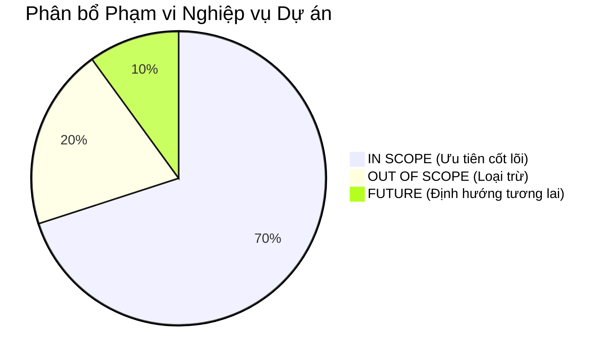

# 01 — Problem Definition & Scope Specification

**Dự án**: Exam Platform (Online Examination System)  
**Tác giả**: Architecture & Engineering Team  
**Vai trò**: Senior Software Architect / Senior Backend Engineer / Technical Tutor  
**Trạng thái**: Draft / Under Review  
**Tài liệu**: `docs/01-requirements/01-PROBLEM_AND_SCOPE.md`

---

## 1. Bối cảnh & Khảo sát Hiện trạng (AS-IS vs TO-BE vs GAP)

### 1.1. Hiện trạng Codebase (AS-IS)
- **Cấu trúc Repository**: Monorepo phân tách thành ba khối ứng dụng chính:
  - `core-api/`: Nơi chứa backend RESTful API (Laravel 13, PHP 8.3-FPM). Hiện tại có tài liệu `README.md`, sẵn sàng scaffold mã nguồn thực thi và migrations.
  - `web-client/`: Nơi chứa frontend Web Client (Next.js 15+, React 19, TypeScript, Tailwind CSS). Đã có `README.md` và `.env.example`.
  - `agentic-system/`: Nơi chứa Trợ lý Điều phối Thông minh ExamOps Agent (Python 3.11+, FastAPI, LangGraph). Đã khởi tạo cấu hình `pyproject.toml`, `.env.example`, `.gitignore`, `README.md` và thiết kế nền tảng đã được phê duyệt (APPROVED).
  - `docker/` & `docker-compose.yml`: Hạ tầng container hóa sẵn sàng cho các dịch vụ (`app`, `web`, `postgres`, `client`).
  - `docs/`: Tập hợp hệ thống tài liệu và thiết kế kiến trúc chuẩn hóa phân định theo vai trò (10 nhóm thư mục từ `01-requirements/` đến `agentic-ai/`, `agents/`).
- **Kết luận Audit**: Dự án đang ở giai đoạn tiền triển khai (Pre-implementation / Architecture Design Phase). Không có mã nguồn legacy hay dữ liệu production nào bị ảnh hưởng.

### 1.2. Mục tiêu Thiết kế (TO-BE)
- Một nền tảng thi trực tuyến chuyên nghiệp, có độ tin cậy cao, kiến trúc tách biệt rõ ràng giữa Backend (Laravel REST API - Single Source of Truth) và Frontend (Next.js App Router).
- Đảm bảo tính toàn vẹn dữ liệu ở cấp CSDL (PostgreSQL ACID, Composite Constraints, Pessimistic Locking), chống gian lận (Zero-leakage đáp án, Cảm biến Proctoring, Server-Authoritative Timer, Idempotent Submit).

### 1.3. Khoảng cách Cần Vượt qua (GAP Analysis)
- Cần chuẩn hóa toàn bộ tài liệu kiến trúc đặc tả theo tiêu chuẩn công nghiệp (Enterprise System Design) trước khi cho phép lập trình viên tạo bất kỳ Controller, Model hay Migration nào.
- Thiết lập hệ thống Traceability ma trận: `FR-*` (Functional Requirement) $\rightarrow$ `UC-*` (Use Case) $\rightarrow$ `BR-*` (Business Rule) $\rightarrow$ `API-*` $\rightarrow$ `TEST-*`.

---

## 2. Tuyên bố Bài toán (Problem Statement)

Trong các cơ sở giáo dục và tổ chức đào tạo, quy trình tổ chức kiểm tra và thi truyền thống gặp phải nhiều thách thức lớn:
1. **Rủi ro rò rỉ đề thi và đáp án**: Thiếu cơ chế bảo mật phân tầng khiến đáp án dễ bị lộ lọt qua API hoặc cache client.
2. **Sai sót và gian lận trong quá trình làm bài**: Thí sinh đổi giờ hệ thống máy khách, mở tab phụ để tra cứu Internet/AI, hoặc gửi nhiều yêu cầu nộp bài song song gây race condition.
3. **Chi phí vận hành và chấm điểm thủ công**: Tốn thời gian tổng hợp kết quả, tính điểm trắc nghiệm, và dễ sai sót khi cộng điểm thủ công.
4. **Thiếu khả năng kiểm toán (Audit Trail)**: Giám thị không có công cụ giám sát hành vi thí sinh theo thời gian thực (tab switching, devtools inspection, copy/paste).

**Exam Platform** được xây dựng nhằm cung cấp giải pháp thi trực tuyến khép kín, an toàn, có khả năng tự động hóa việc giao đề, giám sát hành vi, lưu đáp án phân tán và chấm điểm tức thì với độ chính xác tuyệt đối.

---

## 3. Mục tiêu Nghiệp vụ (Business Goals)

1. **Quản lý Ngân hàng Câu hỏi Phân cấp (Hierarchical Question Bank)**: Phân loại câu hỏi theo Môn học (`Subject`) và Chủ đề (`Topic`), hỗ trợ đa dạng loại câu hỏi (đơn lựa chọn, nhiều lựa chọn, đúng/sai, trả lời ngắn) cùng quy trình duyệt câu hỏi nghiêm ngặt (`draft` $\rightarrow$ `pending` $\rightarrow$ `approved` / `rejected`).
2. **Thiết kế Đề thi Mẫu Linh hoạt (Exam Templates)**: Cho phép tái sử dụng mẫu đề thi, cấu hình điểm số từng câu, xáo trộn câu hỏi và đáp án nhằm giảm thiểu gian lận nhìn bài.
3. **Quản lý Ca thi Thực tế (Scheduled Exam Sessions)**: Khởi tạo ca thi có khung giờ bắt đầu và kết thúc cố định, chỉ định danh sách giám thị phụ trách và phân bổ thí sinh được phép tham gia.
4. **Phòng thi Trực tuyến An toàn & Bền bỉ (Resilient Online Exam Room)**:
   - Cơ chế tự động lưu câu trả lời (Autosave) theo từng thao tác click của thí sinh.
   - Đồng hồ đếm ngược xác thực từ máy chủ (Server-authoritative timer).
   - Nộp bài an toàn (Idempotent submission), triệt tiêu hoàn toàn lỗi nộp đúp (Double Submit) bằng khóa dòng CSDL (`SELECT ... FOR UPDATE`).
5. **Chấm điểm Tự động & Quản lý Điểm số**: Tự động chấm điểm các câu hỏi định dạng trắc nghiệm ngay khi nộp bài; đảm bảo tính toán điểm số chính xác và minh bạch.
6. **Hệ thống Giám sát & Báo động (Proctoring & Anomaly Detection)**: Ghi nhận các tín hiệu vi phạm từ trình duyệt (rời màn hình, mở tab khác, thoát chế độ toàn màn hình, mở DevTools) để cung cấp báo cáo kiểm toán cho giám khảo.

---

## 4. Phân tích Các Tác nhân Hệ thống (Actors Analysis)

Hệ thống định nghĩa 3 Actor chính:

### 4.1. Quản trị viên (Admin)
- **Mục tiêu**: Đảm bảo hệ thống vận hành liên tục, bảo mật, quản lý tài khoản người dùng và phân bổ quyền hạn đúng đắn.
- **Quyền hạn**:
  - Toàn quyền CRUD trên người dùng (`users`), gán vai trò (`role: admin, teacher, student`).
  - Toàn quyền trên danh mục Môn học (`subjects`) và Chủ đề (`topics`).
  - Quyền xem toàn bộ ngân hàng câu hỏi, đề thi, ca thi, lịch sử nộp bài và log giám sát toàn trường.
- **Dữ liệu được truy cập**: Toàn bộ dữ liệu hệ thống, bao gồm log kiểm toán và báo cáo tổng hợp.
- **Dữ liệu không được truy cập**: Mật khẩu thô của người dùng (chỉ lưu dạng hash Bcrypt), Token bí mật của người khác.
- **Hành động quan trọng**: Kích hoạt/khóa tài khoản, xem thống kê tải hệ thống, can thiệp xử lý sự cố ca thi.

### 4.2. Giảng viên / Giám thị (Teacher)
- **Mục tiêu**: Xây dựng ngân hàng câu hỏi chất lượng, tổ chức các ca thi công bằng, giám sát phòng thi và đánh giá kết quả của thí sinh.
- **Quyền hạn**:
  - Quản lý câu hỏi do mình tạo; duyệt hoặc từ chối câu hỏi của đồng nghiệp (nếu có quyền duyệt).
  - Soạn đề thi mẫu (`exams`), gán câu hỏi và đặt trọng số điểm.
  - Tạo ca thi (`exam_sessions`), phân công thí sinh (`session_assignments`), phân công giám thị (`session_teachers`).
  - Xuất bản (`publish`) hoặc đóng (`close`) ca thi.
  - Xem kết quả bài làm, phổ điểm và timeline vi phạm giám sát của ca thi mình được phân công.
- **Dữ liệu được truy cập**: Câu hỏi trong bộ môn, danh sách thí sinh thuộc ca thi mình phụ trách, bài làm của thí sinh sau khi nộp.
- **Dữ liệu không được truy cập**: Không được sửa/xóa tài khoản của người dùng khác; không được sửa điểm sau khi kết quả đã chốt mà không có quyền; không can thiệp vào ca thi của giảng viên khác trừ khi được cấp quyền.
- **Hành động quan trọng**: Phê duyệt câu hỏi, xuất bản ca thi, giám sát timeline vi phạm trực tiếp.

### 4.3. Thí sinh (Student)
- **Mục tiêu**: Tham gia các bài thi được phân công đúng giờ, làm bài mượt mà, lưu đáp án an toàn và nhận kết quả minh bạch.
- **Quyền hạn**:
  - Xem danh sách ca thi mà mình được phân công tham gia.
  - Khởi tạo lượt thi (`StartExamAttempt`) trong khung giờ cho phép.
  - Tải danh sách câu hỏi đề thi (phiên bản không có đáp án đúng).
  - Lưu đáp án tạm thời (`PATCH /answers`) và Nộp bài chính thức (`POST /submit`).
  - Gửi tín hiệu giám sát phòng thi (`proctoring-events`).
  - Xem kết quả/điểm số của chính mình khi ca thi cho phép công bố.
- **Dữ liệu được truy cập**: Thông tin cá nhân, danh sách đề thi được phân công, nội dung câu hỏi/các lựa chọn trong ca thi đang diễn ra, câu trả lời do chính mình chọn, điểm số cá nhân.
- **Dữ liệu tuyệt đối KHÔNG được truy cập**:
  - **Đáp án đúng (`correct_answer`)**, giải thích chi tiết (`explanation`), tiêu chí chấm (`grading_rubric`) khi đang làm bài.
  - Bài thi (`exam_attempts`) và câu trả lời của thí sinh khác (ngăn chặn triệt để lỗ hổng IDOR).
  - Ngân hàng đề thi chưa xuất bản hoặc danh sách câu hỏi của các đề thi khác.
- **Hành động quan trọng**: Bắt đầu bài thi, click chọn đáp án (autosave), nộp bài thi.

---

## 5. Phạm vi Dự án (Project Scope)

### 5.1. IN SCOPE (Trong phạm vi triển khai)
- **Xác thực & Ủy quyền**: Laravel Sanctum Token, Middleware phân quyền vai trò (Admin, Teacher, Student), Laravel Policies bảo vệ tài nguyên (chống IDOR).
- **Quản lý Danh mục**: CRUD Môn học (`Subject`), Chủ đề (`Topic`).
- **Ngân hàng Câu hỏi**: Quản lý câu hỏi trắc nghiệm (đơn lựa chọn, nhiều lựa chọn, đúng/sai, trả lời ngắn), lưu trữ `options` dạng JSONB, quy trình duyệt câu hỏi (`draft`, `pending`, `approved`, `rejected`), Soft Delete để bảo toàn dữ liệu lịch sử.
- **Đề thi mẫu**: Tạo đề thi mẫu, gán câu hỏi kèm số điểm và thứ tự, cấu hình xáo trộn câu hỏi và phương án.
- **Tổ chức Ca thi**: Khởi tạo ca thi có thời gian bắt đầu/kết thúc, phân công thí sinh và giám thị, vòng đời ca thi (`draft` $\rightarrow$ `published` $\rightarrow$ `closed`).
- **Phòng thi Trực tuyến**:
  - Kiểm tra điều kiện vào phòng (phải được gán, ca thi đang mở, chưa quá số lần thi).
  - Trả về danh sách câu hỏi được ẩn toàn bộ đáp án đúng (`QuestionStudentResource`).
  - Tự động lưu đáp án từng câu (`upsert` vào CSDL).
  - Nộp bài thi an toàn, sử dụng Database Transaction kết hợp khóa độc quyền dòng (`lockForUpdate`) chống nộp đúp.
  - Tính điểm tự động cho các câu hỏi trắc nghiệm khách quan.
- **Giám sát Trình duyệt**: Thu thập tín hiệu vi phạm từ client (chuyển tab, thoát fullscreen, mở DevTools, copy/paste) và lưu nhật ký có đánh giá mức độ nghiêm trọng.
- **Báo cáo Thống kê Cơ bản**: Xem danh sách điểm số, số câu đúng/sai, tỷ lệ đậu/rớt.

### 5.2. OUT OF SCOPE (Tuyệt đối loại trừ ở giai đoạn này)
- Không xây dựng tính năng họp trực tuyến qua video (WebRTC, Zoom/Teams integration) hoặc AI nhận diện khuôn mặt sinh trắc học phức tạp (yêu cầu hạ tầng GPU đắt đỏ).
- Không hỗ trợ thanh toán trực tuyến (Payment Gateway).
- Không tự động sinh câu hỏi bằng AI/LLM (giữ nguyên tắc nguồn câu hỏi do giảng viên biên soạn và kiểm duyệt).
- Không hỗ trợ chấm bài tự luận dài bằng ngôn ngữ tự nhiên (NLP) ở giai đoạn này.

### 5.3. FUTURE (Xem xét ở các giai đoạn sau)
- Hệ thống Snapshot đề thi bất biến (Exam Versioning) để đảm bảo nếu sửa câu hỏi trong ngân hàng đề, đề thi của các năm trước vẫn giữ nguyên bản gốc.
- Tính năng phúc khảo điểm thi trực tuyến và chấm bài tự luận thủ công bởi hội đồng chấm thi.
- Tích hợp Redis Pub/Sub hoặc WebSockets (Laravel Reverb) để Giám thị nhận thông báo vi phạm của thí sinh theo thời gian thực (Real-time Proctoring Dashboard).
- Hỗ trợ câu hỏi ghép đôi (Matching), điền khuyết (Fill-in-the-blank) phức tạp.

---

## 6. Danh sách Giả định Kỹ thuật (Assumptions Log)

Để đảm bảo quá trình thiết kế không bị đình trệ vì những yếu tố chưa xác định, các giả định sau được thiết lập:

| ID | Giả định Kỹ thuật (Assumption) | Lý do đưa ra | Mức độ ảnh hưởng nếu sai | Cần xác nhận |
| :---: | :--- | :--- | :--- | :---: |
| **A-001** | Một ca thi (`ExamSession`) chỉ áp dụng duy nhất cho một đề thi mẫu (`Exam`). | Đảm bảo tính công bằng và đồng nhất về độ khó trong cùng một ca thi. | Trung bình (cần tạo bảng pivot nếu 1 session có nhiều đề). | Không |
| **A-002** | Mặc định mỗi thí sinh chỉ được làm bài 01 lần duy nhất trong một ca thi (`max_attempts = 1`). | Bản chất của các kỳ thi chính thức là kiểm tra 1 lần. Hệ thống vẫn lưu cột `attempt_number` để mở rộng. | Thấp (chỉ cần điều chỉnh tham số cấu hình ca thi). | Không |
| **A-003** | Điểm số câu hỏi trắc nghiệm nhiều đáp án (`multiple_choice`) yêu cầu chọn chính xác toàn bộ đáp án đúng mới được điểm tối đa (All-or-Nothing). | Thuật toán đơn giản, minh bạch và phổ biến trong thi đại học/chứng chỉ. | Trung bình (có thể mở rộng sang chấm điểm thành phần - Partial Credit). | CÓ |
| **A-004** | Trình duyệt của thí sinh hỗ trợ các Web API chuẩn: `Page Visibility API`, `Fullscreen API`. | Các trình duyệt hiện đại (Chrome 90+, Edge 90+, Firefox 90+, Safari 14+) đều hỗ trợ đầy đủ. | Rất thấp. | Không |
| **A-005** | Múi giờ hệ thống thống nhất là **UTC** trên toàn bộ API và CSDL; Frontend Next.js chịu trách nhiệm chuyển đổi sang giờ địa phương của thí sinh. | Tránh lỗi lệch giờ mùa hè (DST) hoặc khác múi giờ giữa máy chủ và người dùng. | Rất cao nếu vi phạm (gây lệch giờ thi). | Không |
