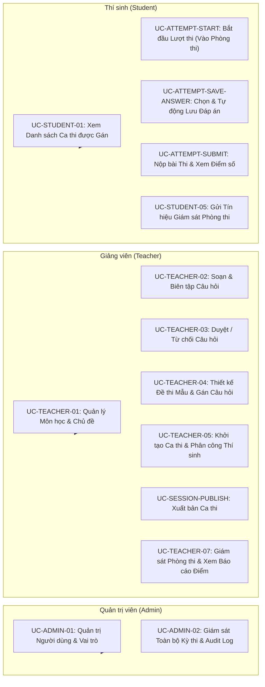

# 04 — Use Case Design & Detailed Specifications

**Dự án**: Exam Platform  
**Tài liệu**: `docs/01-requirements/04-USE_CASES.md`  
**Trạng thái**: Approved for Architecture Baseline  

---

## 1. Sơ đồ Ca sử dụng Tổng quan (System Use Case Diagrams)

### 1.1. Sơ đồ Use Case theo Actor

---

## 2. Đặc tả Chi tiết các Use Case Cốt lõi (Critical Use Case Specifications)

---

### 2.1. `UC-SESSION-PUBLISH`: Xuất bản Ca thi phục vụ đón thí sinh

| Trường thông tin | Đặc tả chi tiết |
| :--- | :--- |
| **Use Case ID** | `UC-SESSION-PUBLISH` |
| **Tên Use Case** | Xuất bản ca thi (Publish Exam Session) |
| **Actor chính** | Giảng viên (`teacher`) phụ trách ca thi, Quản trị viên (`admin`) |
| **Mục tiêu** | Đưa ca thi từ trạng thái dự thảo (`draft`) sang trạng thái công bố (`published`), sẵn sàng đón thí sinh vào làm bài thi. |
| **Tiền điều kiện (Preconditions)** | 1. Người dùng đã đăng nhập và có vai trò `admin` hoặc `teacher` được phân công phụ trách ca thi. 2. Ca thi đang ở trạng thái `draft`. 3. Thời điểm hiện tại phải nhỏ hơn thời gian kết thúc ca thi (`now < end_at`). |
| **Tác nhân kích hoạt (Trigger)** | Giảng viên bấm nút "Xuất bản ca thi" (Publish Session) trên giao diện quản trị ca thi. |
| **Luồng sự kiện chính (Main Flow)** | 1. Frontend gửi yêu cầu `POST /api/v1/exam-sessions/{id}/publish`. 2. Backend xác thực Sanctum Bearer Token và kiểm tra quyền hạn (`SessionPolicy@publish`). 3. Hệ thống mở một Database Transaction. 4. Hệ thống kiểm tra số lượng câu hỏi của đề thi gắn với ca thi (`exam.questions_count > 0`). 5. Hệ thống kiểm tra số lượng thí sinh đã được gán vào ca thi (`session_assignments.count > 0`). 6. Hệ thống cập nhật trạng thái ca thi: `status = 'published'`, `updated_at = NOW()`. 7. Hệ thống Commit Transaction. 8. Backend trả về `200 OK` kèm dữ liệu ca thi đã cập nhật. 9. Giao diện Frontend chuyển trạng thái ca thi sang Badge màu xanh "Đang hoạt động" (Published). |
| **Luồng thay thế (Alternative Flow)** | Không có. |
| **Luồng thất bại (Failure Flow)** | - **F1 (Chưa đủ điều kiện đề thi)**: Đề thi mẫu rỗng (chưa gán câu hỏi nào) $\rightarrow$ Rollback, trả về `409 Conflict`: "Đề thi chưa có câu hỏi nào, không thể xuất bản ca thi." - **F2 (Chưa phân công thí sinh)**: Ca thi chưa có thí sinh nào được gán $\rightarrow$ Rollback, trả về `409 Conflict`: "Ca thi chưa phân công thí sinh nào." - **F3 (Ca thi đã hết hạn hoặc đã đóng)**: Thời gian hiện tại $\ge end\_at \rightarrow$ Trả về `422 Unprocessable Content`: "Thời gian kết thúc ca thi đã trôi qua." - **F4 (Không có quyền)**: Giảng viên không được phân công vào ca thi $\rightarrow$ Trả về `403 Forbidden`. |
| **Hậu điều kiện (Postconditions)** | Ca thi chuyển sang trạng thái `published`. Thí sinh được phân công trong ca thi này bắt đầu nhìn thấy kỳ thi trên bảng điều khiển của mình và có thể vào thi khi đến giờ. |
| **Dữ liệu Đọc (Data Read)** | `exam_sessions`, `exams`, `exam_questions`, `session_assignments`, `session_teachers`. |
| **Dữ liệu Ghi (Data Written)** | Cập nhật dòng tương ứng trong bảng `exam_sessions` (`status = 'published'`). |
| **Quy tắc Nghiệp vụ (Business Rules)**| Tuân thủ `BR-005` (end_at > start_at), `BR-006` (chỉ xuất bản khi đủ câu hỏi và thí sinh). |
| **Xem xét An ninh (Security)** | Kiểm tra Policy ngăn chặn IDOR (giảng viên không được xuất bản ca thi của bộ môn khác mà mình không phụ trách). |

---

### 2.2. `UC-ATTEMPT-START`: Thí sinh Bắt đầu Lượt thi (Vào Phòng thi)

| Trường thông tin | Đặc tả chi tiết |
| :--- | :--- |
| **Use Case ID** | `UC-ATTEMPT-START` |
| **Tên Use Case** | Bắt đầu lượt làm bài thi (Start Exam Attempt) |
| **Actor chính** | Thí sinh (`student`) |
| **Mục tiêu** | Khởi tạo phiên làm bài thi chính thức, thiết lập mốc thời gian bắt đầu và tạo bản ghi lượt thi trong cơ sở dữ liệu. |
| **Tiền điều kiện (Preconditions)** | 1. Thí sinh đã đăng nhập tài khoản hợp lệ (`role = 'student'`). 2. Thí sinh đã được phân công vào ca thi này (`session_assignments` tồn tại cặp `session_id + student_id`). 3. Ca thi đang ở trạng thái `published`. 4. Thời điểm hiện tại nằm trong khung giờ cho phép vào thi: `start_at <= now <= start_at + allow_late_minutes`. 5. Thí sinh chưa có lượt thi nào đang diễn ra hoặc đã hoàn thành nếu `max_attempts = 1`. |
| **Tác nhân kích hoạt (Trigger)** | Thí sinh bấm nút "Vào phòng thi" (Start Exam) từ danh sách kỳ thi của tôi. |
| **Luồng sự kiện chính (Main Flow)** | 1. Frontend gửi yêu cầu `POST /api/v1/exam-sessions/{sessionId}/attempts`. 2. Backend xác thực Token Sanctum và lấy `authenticated_student_id`. 3. Hệ thống mở Database Transaction. 4. Hệ thống kiểm tra điều kiện phân công trong `session_assignments`. 5. Hệ thống kiểm tra trạng thái và khung giờ của `exam_sessions`. 6. Hệ thống đếm số lượt thi hiện có của thí sinh trong ca thi này: `count = COUNT(*) FROM exam_attempts WHERE exam_session_id = ? AND student_id = ?`. 7. Nếu `count < max_attempts`: Hệ thống tạo mới một bản ghi trong `exam_attempts` với `attempt_number = count + 1`, `status = 'in_progress'`, `started_at = NOW()`. 8. Hệ thống tính toán thời gian làm bài thực tế: `remaining_seconds = MIN(exam.duration_minutes * 60, (session.end_at - NOW()))`. 9. Hệ thống Commit Transaction. 10. Backend trả về `201 Created` kèm `attempt_id`, `started_at`, `remaining_seconds`. 11. Frontend Next.js chuyển hướng thí sinh vào màn hình làm bài thi tập trung `/exam/{attemptId}`. |
| **Luồng thay thế (Alternative Flow)** | Nếu thí sinh gặp sự cố mạng/máy tính bị sập nguồn khi đang thi và mở lại: Hệ thống nhận diện attempt đang ở `status = 'in_progress'`, không tạo mới mà trả về thông tin attempt hiện tại kèm `remaining_seconds` đã trừ đi khoảng thời gian gián đoạn. |
| **Luồng thất bại (Failure Flow)** | - **F1 (Chưa được phân công)**: Sinh viên cố tình gọi API ca thi không thuộc về mình $\rightarrow$ Trả về `403 Forbidden`: "Bạn không được phân công tham gia ca thi này." - **F2 (Ca thi chưa mở hoặc đã đóng)**: Chưa đến giờ hoặc ca thi đã hết hạn $\rightarrow$ Trả về `409 Conflict`: "Ca thi chưa bắt đầu hoặc đã kết thúc." - **F3 (Đến muộn quá thời gian cho phép)**: `now > start_at + allow_late_minutes` $\rightarrow$ Trả về `409 Conflict`: "Bạn đã đến muộn quá thời gian quy định vào phòng thi." - **F4 (Đã hết lượt thi)**: Đã có attempt với trạng thái `submitted` và ca thi chỉ cho thi 1 lần $\rightarrow$ Trả về `409 Conflict`: "Bạn đã hoàn thành lượt thi cho ca thi này." |
| **Hậu điều kiện (Postconditions)** | Một bản ghi `exam_attempts` mới được tạo với trạng thái `in_progress`. Thí sinh chính thức bước vào thời gian tính giờ làm bài. |
| **Dữ liệu Đọc (Data Read)** | `exam_sessions`, `session_assignments`, `exams`, `exam_attempts`. |
| **Dữ liệu Ghi (Data Written)** | Tạo dòng mới trong bảng `exam_attempts`. |
| **Quy tắc Nghiệp vụ (Business Rules)**| Tuân thủ `BR-001` (chỉ bắt đầu nếu được gán), `BR-008` (ràng buộc chống duplicate attempt). |
| **Xem xét An ninh (Security)** | Ràng buộc Unique Composite Index `(exam_session_id, student_id, attempt_number)` bảo vệ chống tấn công Race Condition bấm nút nhiều lần đồng thời. |

---

### 2.3. `UC-ATTEMPT-SAVE-ANSWER`: Tự động Lưu Câu trả lời (Autosave)

| Trường thông tin | Đặc tả chi tiết |
| :--- | :--- |
| **Use Case ID** | `UC-ATTEMPT-SAVE-ANSWER` |
| **Tên Use Case** | Tự động lưu đáp án câu hỏi (Autosave Answer) |
| **Actor chính** | Thí sinh (`student`) |
| **Mục tiêu** | Lưu ngay lập tức lựa chọn của thí sinh vào CSDL mỗi khi click chọn phương án, tránh mất dữ liệu khi mất mạng hoặc sự cố phần cứng. |
| **Tiền điều kiện (Preconditions)** | 1. Lượt thi đang ở trạng thái `in_progress`. 2. Thí sinh đang đăng nhập là chủ sở hữu của lượt thi (`attempt.student_id === Auth::id()`). 3. Thời gian làm bài vẫn còn hiệu lực (`now < started_at + duration + grace_period`). |
| **Tác nhân kích hoạt (Trigger)** | Thí sinh click vào phương án A, B, C, D trên giao diện hoặc nhập văn bản vào ô trả lời ngắn. |
| **Luồng sự kiện chính (Main Flow)** | 1. Frontend thực hiện cập nhật lạc quan (Optimistic UI update) và gửi yêu cầu `PATCH /api/v1/exam-attempts/{attemptId}/answers` kèm `{ question_id, answer }`. 2. Backend xác thực Token Sanctum và kiểm tra Policy (`ExamAttemptPolicy@update`). 3. Backend kiểm tra câu hỏi `question_id` có thực sự nằm trong đề thi của ca thi này hay không. 4. Backend kiểm tra giá trị `answer` gửi lên có hợp lệ theo danh sách các `id` phương án của câu hỏi. 5. Backend thực hiện câu lệnh `UPSERT` vào bảng `attempt_answers` theo cặp khóa `(attempt_id, question_id)`:    - Nếu chưa có: Thêm mới dòng đáp án.    - Nếu đã có: Cập nhật trường `selected_options` và `updated_at = NOW()`. 6. Backend trả về `200 OK` kèm `{ data: { question_id, saved_at } }`. 7. Frontend hiển thị trạng thái "Đã lưu" (Saved badge màu xanh) cạnh câu hỏi. |
| **Luồng thay thế (Alternative Flow)** | Nếu mạng của thí sinh bị mất kết nối: Hook TanStack Query phía Frontend giữ yêu cầu trong hàng đợi retry và hiển thị cảnh báo "Đang kết nối lại..." (Reconnecting badge). Khi mạng phục hồi, dữ liệu tự động gửi lại. |
| **Luồng thất bại (Failure Flow)** | - **F1 (Sửa bài người khác)**: Thí sinh gửi request với `attemptId` của bạn cùng phòng $\rightarrow$ Trả về `403 Forbidden` (Chặn IDOR). - **F2 (Bài thi đã nộp hoặc đã đóng)**: `status !== 'in_progress'` $\rightarrow$ Trả về `409 Conflict`: "Bài thi đã nộp, không thể chỉnh sửa đáp án." - **F3 (Hết giờ làm bài)**: Thời gian vượt quá thời lượng quy định $\rightarrow$ Trả về `409 Conflict`: "Đã hết thời gian làm bài thi." - **F4 (Lựa chọn phương án không tồn tại)**: Gửi phương án "opt_z" trong khi câu hỏi chỉ có A, B, C, D $\rightarrow$ Trả về `422 Unprocessable Content`. |
| **Hậu điều kiện (Postconditions)** | Câu trả lời của thí sinh được lưu trữ an toàn trong bảng `attempt_answers`. |
| **Dữ liệu Đọc (Data Read)** | `exam_attempts`, `exam_questions`, `questions`. |
| **Dữ liệu Ghi (Data Written)** | Thêm mới hoặc cập nhật một dòng trong bảng `attempt_answers`. |
| **Quy tắc Nghiệp vụ (Business Rules)**| Tuân thủ `BR-002` (không sửa sau khi đã submit), `BR-003` (không can thiệp bài của người khác). |
| **Xem xét An ninh (Security)** | Whitelist xác thực cấu trúc `answer` ngăn chặn chèn các chuỗi SQL injection hoặc mã độc JSON payload. |

---

### 2.4. `UC-ATTEMPT-SUBMIT`: Nộp Bài thi Chính thức & Chấm điểm Tự động

| Trường thông tin | Đặc tả chi tiết |
| :--- | :--- |
| **Use Case ID** | `UC-ATTEMPT-SUBMIT` |
| **Tên Use Case** | Nộp bài thi và kích hoạt chấm điểm (Submit Exam Attempt) |
| **Actor chính** | Thí sinh (`student`) hoặc Hệ thống tự động (Auto-submit when timer expires) |
| **Mục tiêu** | Đóng lượt làm bài thi, khóa hoàn toàn quyền chỉnh sửa, tính toán điểm số chính xác và ghi nhận kết quả cuối cùng. |
| **Tiền điều kiện (Preconditions)** | 1. Lượt thi đang ở trạng thái `in_progress`. 2. Thí sinh đang đăng nhập là chủ sở hữu của lượt thi. 3. Thời điểm nhận yêu cầu nộp bài chưa vượt quá thời gian làm bài cộng với 30 giây khoảng ân hạn kỹ thuật (`now <= started_at + duration + 30s`). |
| **Tác nhân kích hoạt (Trigger)** | Thí sinh chủ động bấm nút "Nộp bài thi" (Submit Exam) và xác nhận trong hộp thoại, HOẶC đồng hồ đếm ngược hết giờ và tự động kích hoạt nộp bài. |
| **Luồng sự kiện chính (Main Flow)** | 1. Frontend gửi yêu cầu `POST /api/v1/exam-attempts/{attemptId}/submit` kèm `Idempotency-Key` header và payload danh sách đáp án cuối cùng (`final_answers`). 2. Backend xác thực Token và kiểm tra Policy (`ExamAttemptPolicy@submit`). 3. Backend khởi tạo một Database Transaction. 4. **Hệ thống thực thi câu lệnh khóa độc quyền dòng trong PostgreSQL**:   `SELECT * FROM exam_attempts WHERE id = ? FOR UPDATE;` 5. Hệ thống kiểm tra trạng thái hiện tại của bản ghi:   Nếu `status !== 'in_progress'` $\rightarrow$ Bị xung đột (đã nộp trước đó) $\rightarrow$ Rollback transaction và trả về ngay `409 Conflict`. 6. Nếu còn các câu trả lời trong `final_answers` chưa được đồng bộ, hệ thống lưu toàn bộ vào `attempt_answers`. 7. Hệ thống gọi Service chuyên trách tính điểm `AttemptScorer`:   - Tải danh sách câu hỏi đề thi kèm `correct_answer` gốc.   - Duyệt qua từng câu hỏi và so sánh với đáp án thí sinh đã nộp.   - Tính toán tổng điểm đạt được (`score`) và tổng điểm tối đa của đề thi (`total_points`). 8. Hệ thống cập nhật bản ghi `exam_attempts`:   `status = 'submitted'`, `submitted_at = NOW()`, `score = calculated_score`, `total_points = calculated_total_points`. 9. Hệ thống Commit Transaction. 10. Backend trả về `200 OK` kèm thông tin tổng kết: `{ attempt_id, status: 'submitted', total_questions, answered_questions, score, total_points }`. 11. Frontend hiển thị màn hình chúc mừng nộp bài thành công và điểm số (nếu ca thi cho phép). |
| **Luồng thay thế (Alternative Flow)** | Nếu ca thi được cấu hình không công bố điểm tức thì (`show_result_immediately = false`): Backend trả về `score = null`, Frontend hiển thị thông báo "Bài thi đã được ghi nhận. Điểm số sẽ được công bố sau khi ca thi kết thúc." |
| **Luồng thất bại (Failure Flow)** | - **F1 (Nộp đúp - Double Submit)**: Thí sinh click nút nộp 2 lần liên tiếp hoặc 2 tab trình duyệt cùng gửi request $\rightarrow$ Luồng thứ hai chạm phải dòng bị khóa `FOR UPDATE` $\rightarrow$ Khi luồng thứ nhất commit xong, luồng thứ hai thấy `status = 'submitted'` $\rightarrow$ Rollback và trả về `409 Conflict`: "Bài thi đã được nộp trước đó." - **F2 (Nộp bài người khác)**: Thí sinh gửi request nộp bài với ID của thí sinh khác $\rightarrow$ Trả về `403 Forbidden`. - **F3 (Nộp quá muộn vượt ân hạn)**: Thí sinh cố tình gửi request sau khi hết giờ quá 30 giây $\rightarrow$ Trả về `409 Conflict`: "Thời gian làm bài đã kết thúc quá hạn cho phép nộp." |
| **Hậu điều kiện (Postconditions)** | Bản ghi `exam_attempts` chuyển vĩnh viễn sang trạng thái `submitted`. Điểm số được tính toán và lưu bền vững. Mọi thao tác lưu đáp án tiếp theo đều bị từ chối tuyệt đối. |
| **Dữ liệu Đọc (Data Read)** | `exam_attempts`, `attempt_answers`, `exam_questions`, `questions`. |
| **Dữ liệu Ghi (Data Written)** | Cập nhật `exam_attempts` (`status`, `submitted_at`, `score`, `total_points`), cập nhật `attempt_answers`. |
| **Quy tắc Nghiệp vụ (Business Rules)**| Tuân thủ `BR-002`, `BR-007` (chống double submit), `BR-004` (không rò rỉ đáp án). |
| **Xem xét An ninh (Security)** | Đảm bảo tính toán điểm số được thực hiện 100% tại máy chủ backend; client tuyệt đối không có quyền gửi trường `score` lên trong request. |
