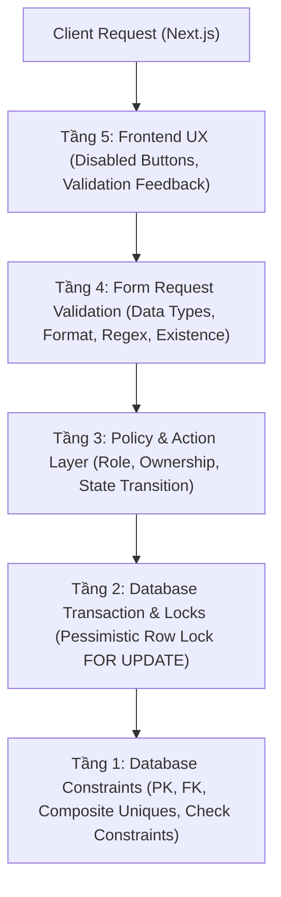

# 05 — Business Rules (BR) Specification

**Dự án**: Exam Platform  
**Tài liệu**: `docs/01-requirements/05-BUSINESS_RULES.md`  
**Trạng thái**: Approved for Architecture Baseline  

---

## 1. Nguyên tắc Thực thi Quy tắc Nghiệp vụ (Enforcement Philosophy)

1. **Nguyên tắc "Zero-Trust Client"**: Phía giao diện Frontend (Next.js) chỉ đóng vai trò hỗ trợ trải nghiệm người dùng (UX) — ví dụ làm mờ nút bấm, hiển thị hộp thoại xác nhận. **Không một quy tắc nghiệp vụ hoặc kiểm tra an ninh nào được phép chỉ dựa vào Client**.
2. **Kiến trúc Phòng thủ Đa tầng (Defense-in-Depth)**:
   - **Tầng 1 (Database Layer)**: Sử dụng các ràng buộc toàn vẹn quan hệ (Foreign Keys, NOT NULL, Composite Unique Constraints, Check Constraints) làm chốt chặn cuối cùng.
   - **Tầng 2 (Transaction & Concurrency)**: Sử dụng Database Transactions và Pessimistic Locking (`lockForUpdate`) để bảo vệ dữ liệu trước các cuộc đua trạng thái (Race Conditions).
   - **Tầng 3 (Backend Actions & Policies)**: Đóng gói logic chuyển đổi trạng thái và kiểm tra quyền truy cập tài nguyên (IDOR Protection) tại Laravel Policies và Actions.
   - **Tầng 4 (Validation Layer)**: Sử dụng Form Request để kiểm tra kiểu dữ liệu, định dạng và giới hạn đầu vào.
   - **Tầng 5 (Frontend UX)**: Cảnh báo sớm, hiển thị lỗi thân thiện và vô hiệu hóa nút bấm hợp lý.

---

## 2. Bảng Danh mục Quy tắc Nghiệp vụ (Business Rules Catalog)

| Mã Rule | Tên Quy tắc Nghiệp vụ | Mô tả Nội dung Chi tiết | Tầng Thực thi Chính (Enforcement Layer) | Mã lỗi khi Vi phạm |
| :---: | :--- | :--- | :--- | :---: |
| **`BR-001`** | **Điều kiện Tham gia Ca thi** | Thí sinh chỉ được phép bắt đầu làm bài thi (`StartExamAttempt`) nếu đã được phân công vào ca thi đó từ trước (`session_assignments`). | Backend Action + Policy | `403 Forbidden` |
| **`BR-002`** | **Tính Bất biến của Bài thi đã nộp** | Thí sinh tuyệt đối không được sửa đổi câu trả lời hoặc nộp lại một bài thi đã ở trạng thái `submitted` hoặc `closed`. | Database Transaction + State Check | `409 Conflict` |
| **`BR-003`** | **Chống Truy cập Trái phép (IDOR)** | Thí sinh chỉ được quyền đọc, lưu đáp án và nộp bài thi thuộc quyền sở hữu của chính mình (`attempt.student_id === Auth::id()`). | Laravel Policy (`ExamAttemptPolicy`) | `403 Forbidden` |
| **`BR-004`** | **Bảo mật Đề thi (Zero-Leakage)** | Tuyệt đối không bao gồm `correct_answer`, `explanation`, hay `grading_rubric` trong bất kỳ response nào trả về cho vai trò `student` khi đang thi. | Dedicated API Resource (`QuestionStudentResource`) | N/A (Thiết kế ngăn chặn rò rỉ) |
| **`BR-005`** | **Tính Hợp lệ của Khung giờ Ca thi** | Thời gian kết thúc ca thi bắt buộc phải lớn hơn thời gian bắt đầu (`end_at > start_at`) và khoảng cách thời gian phải $\ge$ thời lượng làm bài của đề thi. | Form Request + DB Check Constraint | `422 Unprocessable` |
| **`BR-006`** | **Điều kiện Xuất bản Ca thi** | Ca thi chỉ được phép xuất bản (`publish`) khi đề thi mẫu có ít nhất 01 câu hỏi đã duyệt (`approved`) và đã phân công ít nhất 01 thí sinh. | Backend Action (`PublishSessionAction`) | `409 Conflict` |
| **`BR-007`** | **Chống Nộp đúp (Double Submit)** | Mỗi lượt thi chỉ được phép kích hoạt tính điểm và nộp bài duy nhất một lần; mọi request nộp song song phải bị chặn và trả về kết quả ban đầu. | DB Lock (`FOR UPDATE`) + Idempotency | `409 Conflict` |
| **`BR-008`** | **Chống Trùng lặp Phân công Thí sinh** | Một thí sinh không thể bị phân công nhiều hơn 01 lần vào cùng một ca thi. | Database Unique (`exam_session_id, student_id`) | `422 Unprocessable` / DB Exception |
| **`BR-009`** | **Chống Trùng lặp Lượt thi Đồng thời** | Một thí sinh chỉ được mở tối đa số lượt thi theo quy định của ca thi (`max_attempts`), ngăn chặn mở nhiều tab thi cùng lúc. | Composite Unique (`session_id, student_id, attempt_no`) | `409 Conflict` |
| **`BR-010`** | **Điểm số Câu hỏi Không Âm** | Điểm số của mỗi câu hỏi trong đề thi (`exam_questions.points`) bắt buộc phải là số thực dương ($points > 0$). | Form Request + DB Check Constraint | `422 Unprocessable` |
| **`BR-011`** | **Tự động Tính Tổng điểm Đề thi** | Tổng điểm của đề thi (`exams.total_points`) phải luôn bằng tổng điểm của tất cả các câu hỏi cấu thành (`SUM(points)`). Không cho phép sửa trực tiếp tổng điểm. | Backend Action trong Transaction | Tự động tính toán |
| **`BR-012`** | **Kiểm định Câu hỏi Gán vào Đề thi** | Chỉ những câu hỏi đã được phê duyệt chất lượng (`status = 'approved'`) mới được phép gắn vào đề thi mẫu. | Form Request Rule + Backend Action | `422 Unprocessable` |
| **`BR-013`** | **Kiểm tra Phương án Trả lời Hợp lệ** | Câu trả lời của thí sinh gửi lên (`selected_options`) phải là tập con hợp lệ của danh sách các `id` phương án thuộc câu hỏi tương ứng trong đề. | Form Request Validator | `422 Unprocessable` |
| **`BR-014`** | **Xử lý Đến muộn (Late Arrival)** | Thí sinh vào phòng thi sau mốc `start_at + allow_late_minutes` sẽ bị từ chối cấp lượt làm bài mới. | Backend Action (`StartExamAttemptAction`) | `409 Conflict` |
| **`BR-015`** | **Bảo tồn Lịch sử bằng Soft Delete** | Câu hỏi trong ngân hàng câu hỏi không được xóa cứng (Hard Delete) để không làm mất liên kết của các đề thi và bài thi đã diễn ra trong quá khứ. | Eloquent `SoftDeletes` Trait | N/A |
| **`BR-016`** | **Giới hạn Tần suất Giám sát (Proctoring Throttling)**| Thí sinh không được gửi quá 30 sự kiện giám sát mỗi phút nhằm bảo vệ hệ thống khỏi các cuộc tấn công làm nghẽn CSDL. | Laravel RateLimiter Middleware | `429 Too Many Requests` |

---

## 3. Ma trận Phân tích Chi tiết Từng Tầng Thực thi



### 3.1. Ví dụ Thực thi `BR-007` (Chống Double Submit)
- **Frontend UX (Tầng 5)**: Nút "Nộp bài" bị disable ngay khi người dùng click lần đầu, kèm spinner "Đang nộp bài...".
- **Backend Policy (Tầng 3)**: Kiểm tra thí sinh là chủ sở hữu lượt thi và lượt thi có `status == 'in_progress'`.
- **Database Transaction & Lock (Tầng 2)**:
  ```php
  DB::transaction(function () use ($attemptId) {
      $attempt = ExamAttempt::where('id', $attemptId)->lockForUpdate()->first();
      if ($attempt->status !== AttemptStatus::IN_PROGRESS) {
          throw new ConflictHttpException('Attempt already submitted.');
      }
      // Thực hiện tính điểm và cập nhật status = SUBMITTED
  });
  ```
- **Database Layer (Tầng 1)**: Cột `status` trong PostgreSQL được quản lý bởi kiểu Enum/Check constraint hợp lệ.

### 3.2. Ví dụ Thực thi `BR-004` (Zero-Leakage Đáp án)
- **Database Layer (Tầng 1)**: Trường `correct_answer` và `explanation` nằm ở bảng `questions`.
- **Eloquent Model (Tầng 2)**: Khai báo `$hidden = ['correct_answer', 'explanation']` để phòng thủ theo chiều sâu (Defense-in-depth).
- **API Resource (Tầng 3)**: Tuyệt đối không dùng chung một Resource cho Admin và Student. Sinh viên dùng `QuestionStudentResource` (chỉ serialize các trường công khai); Giảng viên dùng `QuestionAdminResource`.
