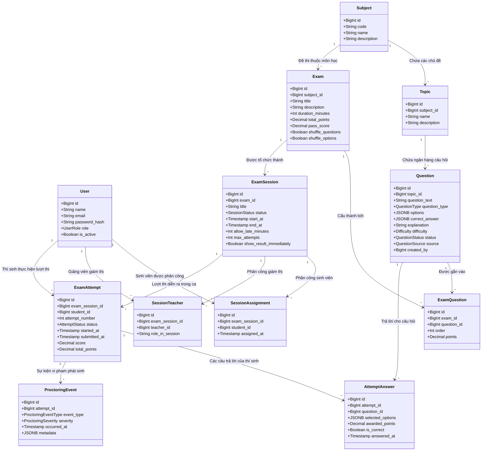

# 06 — Domain Model Specification

**Dự án**: Exam Platform  
**Tài liệu**: `docs/02-domain-database/06-DOMAIN_MODEL.md`  
**Trạng thái**: Approved for Architecture Baseline  

---

## 1. Sơ đồ Mô hình Miền Nghiệp vụ (Domain Model Diagram)

---

## 2. Phân tích Các Khái niệm Cốt lõi & Phân biệt Nghiệp vụ

### 2.1. Phân biệt `Exam` (Đề thi Mẫu) và `ExamSession` (Ca thi Thực tế)

Đây là phân tách kiến trúc quan trọng nhất trong hệ thống thi cử:

| Tiêu chí so sánh | `Exam` (Đề thi Mẫu / Template) | `ExamSession` (Ca thi / Scheduled Instance) |
| :--- | :--- | :--- |
| **Bản chất** | **Bản thiết kế (Blueprint)**: Là tập hợp các câu hỏi, cấu trúc đề, thời lượng làm bài và điểm số mục tiêu. | **Sự kiện thực tế (Event / Execution)**: Là một buổi thi cụ thể diễn ra tại một thời điểm xác định trong thế giới thực. |
| **Tính tái sử dụng** | Có thể tái sử dụng nhiều lần qua nhiều năm học, kỳ thi hoặc lớp học khác nhau. | Duy nhất cho một lần tổ chức thi, có thời điểm bắt đầu (`start_at`) và kết thúc (`end_at`) cụ thể. |
| **Gắn với Thí sinh?** | **KHÔNG**. Đề thi mẫu không biết ai sẽ là người làm bài. | **CÓ**. Ca thi trực tiếp quản lý danh sách thí sinh được phép vào thi (`session_assignments`). |
| **Trạng thái (Lifecycle)**| Quản lý dạng bản nháp hoặc xuất bản đề (`draft`, `published`). | Quản lý theo vòng đời thời gian thực (`draft` $\rightarrow$ `published` $\rightarrow$ `closed`). |

> **Ví dụ thực tế**: Môn "Lập trình Web" có đề thi mẫu **"Đề kiểm tra giữa kỳ 2026 - Mã đề 101"** (`Exam`). Đề này được dùng để tổ chức cho **"Ca 1: Sáng thứ Hai 08:00 - Phòng LAB 301"** (`ExamSession 1`) và **"Ca 2: Chiều thứ Hai 13:30 - Phòng LAB 302"** (`ExamSession 2`).

---

### 2.2. Phân biệt `SessionAssignment` (Quyền Tham gia) và `ExamAttempt` (Lượt Thi Thực tế)

| Tiêu chí | `SessionAssignment` (Quyền được thi) | `ExamAttempt` (Lượt làm bài thực tế) |
| :--- | :--- | :--- |
| **Thời điểm sinh ra** | Trước khi ca thi diễn ra (do Giảng viên/Giám thị phân công). | Khi thí sinh bấm nút "Vào thi" trong giờ thi. |
| **Ý nghĩa nghiệp vụ** | "Sinh viên A được phép tham gia Ca thi số 1". | "Sinh viên A đang thực hiện bài thi lúc 08:05:00". |
| **Số lượng bản ghi** | Luôn là 1 bản ghi duy nhất cho mỗi sinh viên trong 1 ca thi. | 0 bản ghi (nếu sinh viên vắng thi) hoặc 1 bản ghi (nếu đã vào thi). |
| **Chứa điểm số?** | Không chứa điểm. | Chứa điểm số (`score`), thời gian nộp (`submitted_at`), và trạng thái nộp bài. |

---

### 2.3. Phân biệt `Question` (Ngân hàng Đề) và `ExamQuestion` (Câu hỏi trong Đề thi)

- **`Question`**: Là câu hỏi độc lập nằm trong ngân hàng câu hỏi tổng thể của Bộ môn. Câu hỏi này có thể được dùng cho nhiều đề thi khác nhau.
- **`ExamQuestion` (Bảng trung gian mang metadata)**:
  - Xác định câu hỏi này nằm ở vị trí thứ mấy trong đề thi cụ thể (`order`).
  - Xác định câu hỏi này chiếm bao nhiêu điểm trong đề thi cụ thể (`points`).
  - Cho phép cùng một câu hỏi ở đề thi A chiếm 0.25 điểm nhưng ở đề thi B lại chiếm 0.5 điểm tùy theo cấu trúc ma trận đề.

---

## 3. Trách nhiệm & Các Bất biến của Từng Thực thể (Entity Responsibilities & Invariants)

### 3.1. `User`
- **Trách nhiệm**: Định danh người dùng, xác thực tài khoản và nắm giữ vai trò gốc (`role: admin, teacher, student`).
- **Invariants**: `email` phải là duy nhất trên toàn hệ thống; `password_hash` không bao giờ được để trống; `role` chỉ nhận 1 trong 3 giá trị Enum hợp lệ.

### 3.2. `Question`
- **Trách nhiệm**: Lưu trữ nội dung câu hỏi, định dạng câu hỏi, các phương án lựa chọn (JSONB), đáp án đúng và lời giải thích.
- **Invariants**: Các phương án trong `options` phải có `id` duy nhất trong phạm vi câu hỏi; `correct_answer` phải khớp với một hoặc nhiều `id` trong `options`. Không được xóa cứng (`SoftDeletes`).

### 3.3. `Exam`
- **Trách nhiệm**: Quản lý danh sách câu hỏi cấu thành đề thi, thời lượng làm bài và tổng điểm.
- **Invariants**: `duration_minutes > 0`; `total_points` phải luôn bằng tổng `points` của các `ExamQuestion` trực thuộc.

### 3.4. `ExamSession`
- **Trách nhiệm**: Điều phối sự kiện thi trong đời thực, kiểm soát cửa sổ thời gian và trạng thái ca thi.
- **Invariants**: `end_at > start_at`; chỉ được xuất bản (`publish`) khi đề thi có câu hỏi và có thí sinh được phân công.

### 3.5. `ExamAttempt`
- **Trách nhiệm**: Đại diện cho một bài làm thực tế của thí sinh, quản lý thời gian làm bài, tính bất biến sau khi nộp, và lưu trữ kết quả điểm số cuối cùng.
- **Invariants**: Thuộc về duy nhất 1 sinh viên và 1 ca thi; không thể chuyển trạng thái ngược từ `submitted` về `in_progress`; điểm số không thể lớn hơn `total_points`.

### 3.6. `AttemptAnswer`
- **Trách nhiệm**: Lưu trữ câu trả lời chi tiết cho từng câu hỏi của thí sinh.
- **Invariants**: Cặp `(attempt_id, question_id)` là duy nhất trong CSDL.
