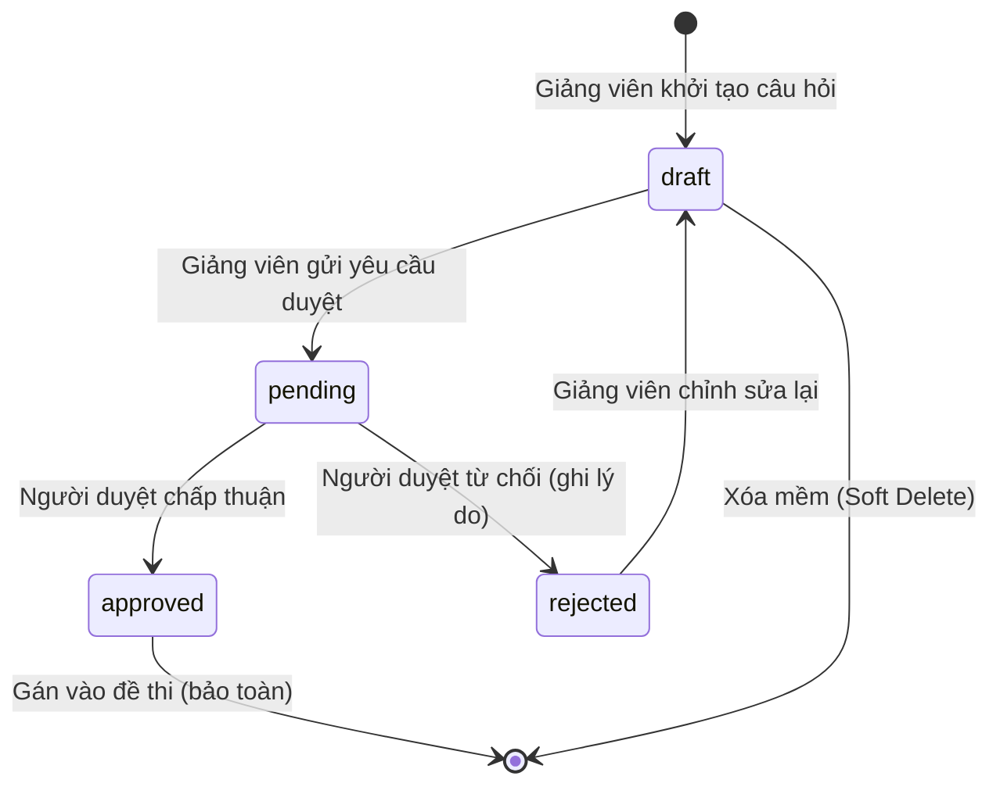
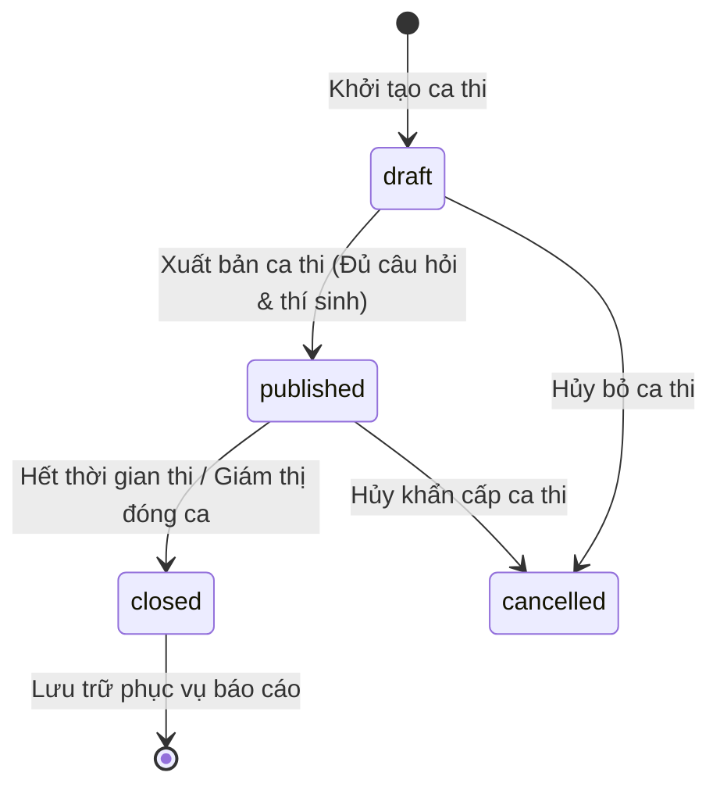
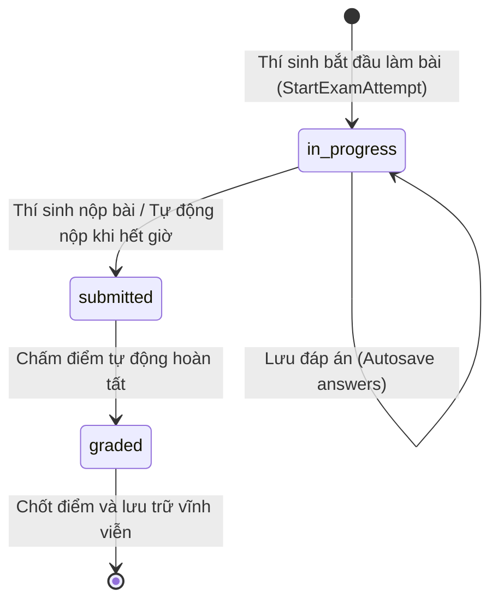
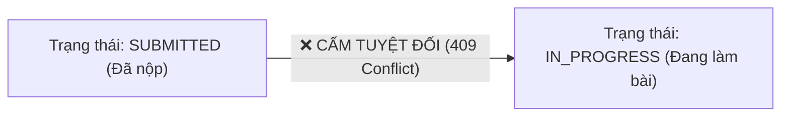

# 07 — State Machine Design & Entity Lifecycles

**Dự án**: Exam Platform  
**Tài liệu**: `docs/02-domain-database/07-STATE_MACHINES.md`  
**Trạng thái**: Approved for Architecture Baseline  

---

## 1. Giới thiệu về Máy trạng thái Hữu hạn (Finite State Machines - FSM)

Trong hệ thống thi trực tuyến, việc kiểm soát chặt chẽ trạng thái và các bước chuyển trạng thái (State Transitions) của thực thể là yếu tố sống còn để bảo đảm tính toàn vẹn dữ liệu, chống gian lận và ngăn ngừa lỗi logic.

Hệ thống định nghĩa 3 FSM trọng yếu:
1. **`Question Lifecycle`**: Vòng đời kiểm định câu hỏi trong ngân hàng đề.
2. **`ExamSession Lifecycle`**: Vòng đời tổ chức và mở/đóng ca thi.
3. **`ExamAttempt Lifecycle`**: Vòng đời một lượt làm bài thi của thí sinh.

---

## 2. Máy trạng thái Câu hỏi (Question State Machine)

### 2.1. Sơ đồ Trạng thái (Mermaid State Diagram)

### 2.2. Bảng Chuyển đổi Trạng thái Hợp lệ & Điều kiện

| Trạng thái hiện tại | Trạng thái tiếp theo | Tác nhân (Actor) | Điều kiện kiểm tra (Condition) | Tác dụng phụ (Side Effect) |
| :--- | :--- | :--- | :--- | :--- |
| `[*] (None)` | `draft` | Teacher, Admin | Dữ liệu câu hỏi hợp lệ theo Form Request. | Tạo bản ghi mới trong bảng `questions`. |
| `draft` | `pending` | Teacher (Tác giả) | Câu hỏi có đầy đủ `question_text`, `options`, `correct_answer`. | Thông báo cho bộ phận kiểm duyệt đề. |
| `pending` | `approved` | Reviewer, Admin | Câu hỏi chính xác về kiến thức, không vi phạm chuẩn. | Đánh dấu câu hỏi sẵn sàng được gán vào `exams`. |
| `pending` | `rejected` | Reviewer, Admin | Bắt buộc phải nhập trường `rejection_reason`. | Lưu lý do từ chối để tác giả sửa đổi. |
| `rejected` | `draft` | Teacher (Tác giả) | Tác giả tiếp nhận phản hồi và mở lại để sửa. | Cho phép cập nhật nội dung câu hỏi. |

### 2.3. Các Bước Chuyển Bị Cấm Tuyệt đối (Forbidden Transitions)
- ❌ **`approved` $\rightarrow$ `draft`**: Khi câu hỏi đã được phê duyệt và đã được gắn vào đề thi đang mở, cấm tuyệt đối quay lại `draft` để sửa nội dung (tránh làm thay đổi đề thi của thí sinh đang làm bài).
- ❌ **`draft` $\rightarrow$ `approved`**: Giảng viên không được tự ý duyệt câu hỏi của chính mình khi chưa qua bước kiểm duyệt `pending` (trừ khi có quyền Admin).

---

## 3. Máy trạng thái Ca thi (ExamSession State Machine)

### 3.1. Sơ đồ Trạng thái (Mermaid State Diagram)

### 3.2. Bảng Chuyển đổi Trạng thái Hợp lệ & Điều kiện

| Trạng thái hiện tại | Trạng thái tiếp theo | Tác nhân (Actor) | Điều kiện kiểm tra (Condition) | Tác dụng phụ (Side Effect) |
| :--- | :--- | :--- | :--- | :--- |
| `[*] (None)` | `draft` | Teacher, Admin | `end_at > start_at`, đề thi mẫu tồn tại. | Khởi tạo bản ghi ca thi ở chế độ riêng tư. |
| `draft` | `published` | Teacher, Admin | Đề thi có `questions_count > 0` và ca thi có `assigned_students > 0`. | Hiển thị ca thi lên lịch thi của các thí sinh được gán. |
| `published` | `closed` | Hệ thống (Cron) / Giám thị | Thời điểm hiện tại `now >= end_at` HOẶC giám thị chủ động kết thúc ca thi. | Khóa toàn bộ quyền vào thi mới của thí sinh. |
| `draft` / `published` | `cancelled` | Admin | Có sự cố bất khả kháng cần hủy ca thi. | Gửi thông báo hủy thi đến thí sinh. |

### 3.3. Các Bước Chuyển Bị Cấm Tuyệt đối (Forbidden Transitions)
- ❌ **`closed` $\rightarrow$ `draft` / `published`**: Ca thi đã kết thúc không bao giờ được phép mở lại để tránh làm xáo trộn kết quả và thời gian thi đã ghi nhận.
- ❌ **`draft` $\rightarrow$ `published` khi chưa có câu hỏi**: Tuyệt đối không cho phép xuất bản một ca thi có đề thi rỗng (vi phạm `BR-006`).

---

## 4. Máy trạng thái Lượt làm bài (ExamAttempt State Machine)

Đây là FSM có mức độ rủi ro cao nhất, liên quan trực tiếp đến tính điểm và công bằng thi cử.

### 4.1. Sơ đồ Trạng thái (Mermaid State Diagram)

### 4.2. Bảng Chuyển đổi Trạng thái Hợp lệ & Điều kiện

| Trạng thái hiện tại | Trạng thái tiếp theo | Tác nhân (Actor) | Điều kiện kiểm tra (Condition) | Tác dụng phụ (Side Effect) |
| :--- | :--- | :--- | :--- | :--- |
| `[*] (None)` | `in_progress` | Student | Được gán vào ca thi, ca thi đang `published`, trong khung giờ thi, chưa quá `max_attempts`. | Tạo bản ghi `exam_attempts`, bắt đầu tính đồng hồ đếm ngược. |
| `in_progress` | `in_progress` | Student | Đang trong giờ thi (`now < started_at + duration + grace_period`). | Cập nhật `selected_options` trong bảng `attempt_answers`. |
| `in_progress` | `submitted` | Student / System | Thí sinh bấm Nộp HOẶC hết thời gian thi. | **Thực hiện khóa dòng `SELECT ... FOR UPDATE`**, ghi nhận `submitted_at = NOW()`. |
| `submitted` | `graded` | Hệ thống (`AttemptScorer`) | Nằm trong cùng một Database Transaction với bước nộp bài. | So sánh đáp án, tính toán `score` và ghi nhận điểm số cuối cùng. |

### 4.3. Các Bước Chuyển Bị Cấm Tuyệt đối (Strictly Forbidden Transitions)

- ❌ **`submitted` $\rightarrow$ `in_progress`**: **NGHIÊM CẤM DƯỚI MỌI HÌNH THỨC**. Một khi bài thi đã được đánh dấu là `submitted`, trạng thái này là **BẤT BIẾN** (Immutable). Bất kỳ yêu cầu nào cố gắng mở lại bài thi đều bị từ chối với mã lỗi `409 Conflict`.
- ❌ **`submitted` $\rightarrow$ `submitted` (Double Submit)**: Không cho phép nộp đè lần 2. Cơ chế khóa dòng `lockForUpdate()` sẽ phát hiện và từ chối ngay lập tức.
