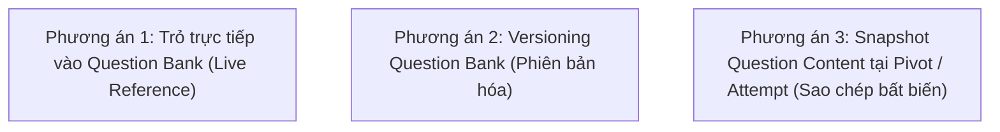

# 09 — Database Design & Data Architecture Specification

**Dự án**: Exam Platform  
**Tài liệu**: `docs/02-domain-database/09-DATABASE_DESIGN.md`  
**Trạng thái**: Approved for Architecture Baseline  

---

## 1. Bảng Tổng hợp Toàn bộ Các Bảng Cơ sở Dữ liệu (Schema Inventory)

Hệ thống được chuẩn hóa trên cơ sở dữ liệu quan hệ **PostgreSQL 16**, bao gồm 13 bảng nghiệp vụ chính thức:

| Tên bảng (Table) | Mục đích nghiệp vụ (Purpose) | Khóa chính (PK) | Khóa ngoại (FK) | Ràng buộc duy nhất (Unique) | Chỉ mục quan trọng (Indexes) | Cột dữ liệu cốt lõi (Core Columns) |
| :--- | :--- | :---: | :--- | :--- | :--- | :--- |
| **`users`** | Quản lý định danh, tài khoản và vai trò người dùng | `id` | Không | `email` | `email`, `role` | `name`, `email`, `password`, `role`, `is_active` |
| **`subjects`** | Danh mục môn học đào tạo | `id` | `created_by` | `code` | `code`, `created_by` | `code`, `name`, `description` |
| **`topics`** | Các chủ đề kiến thức thuộc môn học | `id` | `subject_id` | Không | `subject_id` | `subject_id`, `name`, `description` |
| **`questions`** | Ngân hàng câu hỏi trắc nghiệm/tự luận | `id` | `topic_id`, `created_by` | Không | `topic_id`, `status`, `difficulty`, `type` | `question_text`, `question_type`, `options (JSONB)`, `correct_answer (JSONB)`, `status` |
| **`exams`** | Mẫu đề thi (Blueprint/Template) | `id` | `subject_id`, `created_by` | Không | `subject_id`, `created_by` | `title`, `duration_minutes`, `total_points`, `pass_score`, `shuffle_questions` |
| **`exam_questions`** | Bảng pivot gán câu hỏi vào đề thi kèm metadata | `id` | `exam_id`, `question_id` | `(exam_id, question_id)` | `exam_id`, `question_id` | `order`, `points` |
| **`exam_sessions`** | Ca thi cụ thể theo lịch trình | `id` | `exam_id`, `created_by` | Không | `exam_id`, `status`, `start_at`, `end_at` | `title`, `status`, `start_at`, `end_at`, `allow_late_minutes`, `max_attempts` |
| **`session_assignments`** | Danh sách thí sinh được phân công vào ca thi | `id` | `exam_session_id`, `student_id` | `(exam_session_id, student_id)` | `exam_session_id`, `student_id` | `assigned_at` |
| **`session_teachers`** | Danh sách giảng viên/giám thị phụ trách ca thi | `id` | `exam_session_id`, `teacher_id` | `(exam_session_id, teacher_id)` | `exam_session_id`, `teacher_id` | `role_in_session` |
| **`exam_attempts`** | Lượt làm bài thực tế của thí sinh | `id` | `exam_session_id`, `student_id` | `(exam_session_id, student_id, attempt_number)` | `exam_session_id`, `student_id`, `status` | `attempt_number`, `status`, `started_at`, `submitted_at`, `score`, `total_points` |
| **`attempt_answers`** | Câu trả lời chi tiết của thí sinh cho từng câu | `id` | `attempt_id`, `question_id` | `(attempt_id, question_id)` | `attempt_id`, `question_id` | `selected_options (JSONB)`, `awarded_points`, `is_correct` |
| **`proctoring_events`** | Nhật ký các sự kiện vi phạm từ trình duyệt | `id` | `attempt_id` | Không | `attempt_id`, `event_type`, `severity` | `event_type`, `severity`, `occurred_at`, `metadata (JSONB)` |
| **`personal_access_tokens`**| Bảng quản lý Sanctum Token truy cập API | `id` | Polymorphic `tokenable` | `token` | `tokenable_type + tokenable_id` | `name`, `token`, `abilities`, `last_used_at`, `expires_at` |

---

## 2. Phân tích Khóa ngoại & Hành vi Tham chiếu (Referential Integrity & Actions)

Việc lựa chọn hành động tham chiếu khóa ngoại (`ON DELETE`) quyết định tính an toàn và khả năng bảo toàn dữ liệu lịch sử của trường học:

| Khóa ngoại (Foreign Key) | Bảng nguồn $\rightarrow$ Bảng đích | Hành vi `ON DELETE` | Lý do kỹ thuật & Rủi ro nếu chọn sai |
| :--- | :--- | :---: | :--- |
| `topics.subject_id` | `topics` $\rightarrow$ `subjects` | **`RESTRICT`** | Không cho phép xóa Môn học nếu môn học đó đang chứa các Chủ đề kiến thức. Phải dọn sạch các chủ đề trước. |
| `questions.topic_id` | `questions` $\rightarrow$ `topics` | **`RESTRICT`** | Ngăn chặn xóa Chủ đề nếu chủ đề đang có câu hỏi trong ngân hàng đề. |
| `exam_questions.question_id` | `exam_questions` $\rightarrow$ `questions` | **`RESTRICT`** | **CỰC KỲ QUAN TRỌNG**: Tuyệt đối không cho phép xóa câu hỏi khỏi CSDL nếu câu hỏi đó đã được dùng trong bất kỳ Đề thi nào. Phải dùng Soft Delete (`deleted_at`). |
| `exam_sessions.exam_id` | `exam_sessions` $\rightarrow$ `exams` | **`RESTRICT`** | Không được xóa Đề thi mẫu nếu đã có Ca thi được tổ chức dựa trên đề thi đó. |
| `exam_attempts.student_id` | `exam_attempts` $\rightarrow$ `users` | **`RESTRICT`** | Không được xóa tài khoản Sinh viên nếu sinh viên đó đã có lịch sử làm bài và điểm số trong hệ thống. |
| `attempt_answers.attempt_id` | `attempt_answers` $\rightarrow$ `exam_attempts` | **`CASCADE`** | Nếu một lượt làm bài nháp bị xóa trong giai đoạn dọn dẹp kiểm thử, các câu trả lời thuộc lượt làm bài đó sẽ tự động bị xóa theo. |
| `proctoring_events.attempt_id` | `proctoring_events` $\rightarrow$ `exam_attempts` | **`CASCADE`** | Log giám sát đi liền với vòng đời của lượt thi. |

---

## 3. Ràng buộc Toàn vẹn Chống Dữ liệu Rác (Unique & Check Constraints)

Các ràng buộc này được thực thi ở mức nhân CSDL (PostgreSQL Engine), đảm bảo dữ liệu luôn toàn vẹn kể cả khi có lỗi logic phần mềm:

1. **Chống phân công trùng lặp**:
   ```sql
   ALTER TABLE session_assignments ADD CONSTRAINT uq_session_student UNIQUE (exam_session_id, student_id);
   ```
2. **Chống trùng lặp lượt thi đồng thời (Race condition)**:
   ```sql
   ALTER TABLE exam_attempts ADD CONSTRAINT uq_session_student_attempt UNIQUE (exam_session_id, student_id, attempt_number);
   ```
3. **Chống trùng lặp câu trả lời**:
   ```sql
   ALTER TABLE attempt_answers ADD CONSTRAINT uq_attempt_question UNIQUE (attempt_id, question_id);
   ```
4. **Chống gán trùng câu hỏi vào đề thi**:
   ```sql
   ALTER TABLE exam_questions ADD CONSTRAINT uq_exam_question UNIQUE (exam_id, question_id);
   ```
5. **Ràng buộc thời gian ca thi hợp lệ**:
   ```sql
   ALTER TABLE exam_sessions ADD CONSTRAINT chk_session_time_window CHECK (end_at > start_at);
   ```
6. **Ràng buộc điểm câu hỏi dương**:
   ```sql
   ALTER TABLE exam_questions ADD CONSTRAINT chk_exam_question_points CHECK (points > 0);
   ```

---

## 4. Chuẩn hóa CSDL (Normalization Evaluation) & Chiến lược Denormalization

### 4.1. Đánh giá Chuẩn 3NF (Third Normal Form)
- Toàn bộ các bảng danh mục (`users`, `subjects`, `topics`, `questions`, `exams`, `exam_sessions`, `session_assignments`, `session_teachers`) đều đạt **Chuẩn 3NF**:
  - Không có thuộc tính đa trị (1NF).
  - Mọi thuộc tính không khóa đều phụ thuộc đầy đủ vào khóa chính (2NF).
  - Không có sự phụ thuộc bắc cầu giữa các thuộc tính không khóa (3NF).

### 4.2. Quyết định Phi chuẩn hóa có Chủ đích (Intentional Denormalization)
- **Trường `exams.total_points`**:
  - *Lý do*: Thay vì mỗi lần thí sinh vào thi hoặc giáo viên xem danh sách đề thi hệ thống phải chạy câu lệnh `SELECT SUM(points) FROM exam_questions WHERE exam_id = ?`, hệ thống lưu sẵn giá trị tổng điểm trên bảng `exams`.
  - *Cơ chế bảo đảm tính nhất quán*: Giá trị này chỉ được tính toán lại trong Transaction khi có hành động thêm/sửa/gỡ câu hỏi (`AttachQuestionsToExamAction`).
- **Trường `exam_attempts.total_points`**:
  - *Lý do*: Lưu lại tổng điểm tối đa của đề thi tại thời điểm thí sinh nộp bài, đề phòng trường hợp đề thi mẫu sau này bị cập nhật điểm số.

---

## 5. Tính toàn vẹn Lịch sử Thi cử (Historical Integrity: Snapshot vs Versioning)

### 5.1. Vấn đề Đặt ra
> *"Nếu một câu hỏi trong ngân hàng câu hỏi bị giảng viên sửa nội dung sau khi kỳ thi đã kết thúc, kết quả bài thi của các sinh viên năm trước có bị ảnh hưởng không?"*

### 5.2. Đánh giá Các Phương án Kỹ thuật



| Tiêu chí | Phương án 1 (Live Reference) | Phương án 2 (Question Versioning) | Phương án 3 (Exam/Attempt Snapshot) |
| :--- | :--- | :--- | :--- |
| **Cách triển khai** | `exam_questions` lưu `question_id`. Khi xem bài làm join sang bảng `questions`. | Bảng `questions` có thêm `version`, `parent_id`. Khi sửa thì tạo dòng mới `version + 1`. | Khi nộp bài hoặc gán vào đề thi, sao chép nguyên trạng `question_text`, `options` vào JSONB. |
| **Ưu điểm** | Đơn giản nhất, CSDL nhỏ gọn, không trùng lặp văn bản. | Giữ được toàn bộ lịch sử chỉnh sửa câu hỏi của giảng viên; ngân hàng câu hỏi rất mạnh. | Độc lập tuyệt đối. Dù ngân hàng câu hỏi bị xóa sạch thì bài thi cũ vẫn hiển thị nguyên vẹn 100%. |
| **Nhược điểm** | **RỦI RO CAO**: Nếu sửa câu hỏi, đề thi cũ bị đổi chữ; nếu xóa mềm thì query phức tạp. | Cấu trúc quan hệ phức tạp, query cần lọc `latest_version`, migration nặng nề. | Tốn dung lượng lưu trữ CSDL (duplicate text). |
| **Quyết định cho Giai đoạn này** | **Áp dụng Phương án 1 kết hợp Quy tắc Bất biến (Immutability Rule)**: Một câu hỏi khi đã được gắn vào đề thi đang mở hoặc đã thi thì **KHÔNG ĐƯỢC PHÉP CHỈNH SỬA NỘI DUNG**. Giảng viên muốn sửa phải tạo câu hỏi mới. Cân nhắc Phương án 3 ở giai đoạn tương lai. |

---

## 6. Chiến lược Chỉ mục Tối ưu Truy vấn (Indexing Strategy)

Các chỉ mục B-Tree và Composite Index được thiết kế chuyên biệt cho các câu truy vấn có tần suất cao:

```sql
-- 1. Tối ưu tìm kiếm câu hỏi theo chủ đề và trạng thái duyệt
CREATE INDEX idx_questions_topic_status ON questions(topic_id, status);

-- 2. Tối ưu tải danh sách câu hỏi của một đề thi theo thứ tự
CREATE INDEX idx_exam_questions_exam_order ON exam_questions(exam_id, "order");

-- 3. Tối ưu truy vấn ca thi đang mở theo khung giờ
CREATE INDEX idx_exam_sessions_status_time ON exam_sessions(status, start_at, end_at);

-- 4. Tối ưu kiểm tra thí sinh đã vào thi hay chưa
CREATE INDEX idx_exam_attempts_lookup ON exam_attempts(exam_session_id, student_id, status);

-- 5. Tối ưu lấy toàn bộ đáp án của một lượt thi
CREATE INDEX idx_attempt_answers_attempt ON attempt_answers(attempt_id);

-- 6. Tối ưu tra cứu log vi phạm của ca thi theo mức độ nghiêm trọng
CREATE INDEX idx_proctoring_attempt_severity ON proctoring_events(attempt_id, severity);
```

---

## 7. Migration Code Mẫu Chuẩn Laravel (PostgreSQL JSONB & Constraints)

### 7.1. Migration Bảng `questions`
```php
<?php

use Illuminate\Database\Migrations\Migration;
use Illuminate\Database\Schema\Blueprint;
use Illuminate\Support\Facades\Schema;

return new class extends Migration
{
    public function up(): void
    {
        Schema::create('questions', function (Blueprint $table) {
            $table->id();
            $table->foreignId('topic_id')->constrained('topics')->restrictOnDelete();
            $table->foreignId('created_by')->constrained('users')->cascadeOnDelete();
            $table->foreignId('updated_by')->nullable()->constrained('users')->nullOnDelete();
            $table->text('question_text');
            $table->string('question_type'); // single_choice, multiple_choice, true_false, short_answer
            $table->jsonb('options'); // [{id, content}]
            $table->jsonb('correct_answer'); // scalar or array
            $table->text('explanation')->nullable();
            $table->string('difficulty')->default('medium'); // easy, medium, hard
            $table->string('status')->default('draft'); // draft, pending, approved, rejected
            $table->string('source')->default('manual');
            $table->text('rejection_reason')->nullable();
            $table->softDeletes();
            $table->timestamps();

            $table->index(['topic_id', 'status', 'difficulty']);
            $table->index('created_by');
        });
    }

    public function down(): void
    {
        Schema::dropIfExists('questions');
    }
};
```

### 7.2. Migration Bảng `exam_attempts`
```php
<?php

use Illuminate\Database\Migrations\Migration;
use Illuminate\Database\Schema\Blueprint;
use Illuminate\Support\Facades\Schema;

return new class extends Migration
{
    public function up(): void
    {
        Schema::create('exam_attempts', function (Blueprint $table) {
            $table->id();
            $table->foreignId('exam_session_id')->constrained('exam_sessions')->restrictOnDelete();
            $table->foreignId('student_id')->constrained('users')->restrictOnDelete();
            $table->unsignedInteger('attempt_number')->default(1);
            $table->string('status')->default('in_progress'); // in_progress, submitted, graded
            $table->timestampTz('started_at');
            $table->timestampTz('submitted_at')->nullable();
            $table->decimal('score', 6, 2)->nullable();
            $table->decimal('total_points', 6, 2)->nullable();
            $table->timestamps();

            // Chống tạo trùng attempt ở cấp Database (Race condition defense):
            $table->unique(['exam_session_id', 'student_id', 'attempt_number']);
            $table->index(['exam_session_id', 'status']);
        });
    }

    public function down(): void
    {
        Schema::dropIfExists('exam_attempts');
    }
};
```

---

## 8. Nguyên Tắc Truy Vấn CSDL & Phòng Chống N+1

1. **Khi tải Đề thi cho Thí sinh làm bài:**
   ```php
   $attempt = ExamAttempt::with([
       'examSession.exam.examQuestions.question' => function ($query) {
           $query->select('id', 'question_text', 'question_type', 'options'); // Tuyệt đối KHÔNG select correct_answer
       },
       'answers'
   ])->findOrFail($attemptId);
   ```

2. **Khi Khóa dòng Chấm điểm Nộp bài (Submit Transaction):**
   ```php
   DB::transaction(function () use ($attemptId) {
       $attempt = ExamAttempt::where('id', $attemptId)->lockForUpdate()->firstOrFail();
       $examQuestions = $attempt->examSession->exam->examQuestions()->with('question')->get();
       // ... Tính điểm và cập nhật status = submitted ...
   });
   ```

