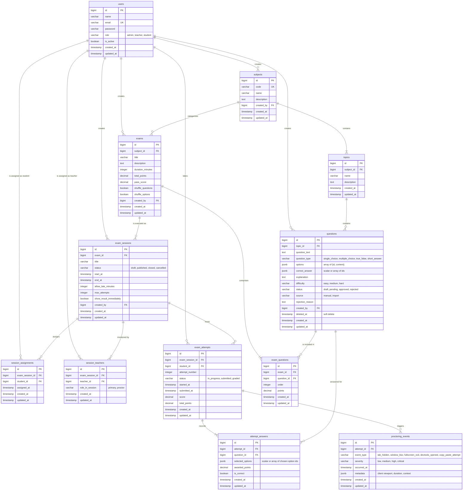

# 10 — Entity Relationship Diagram (ERD)

**Dự án**: Exam Platform  
**Tài liệu**: `docs/02-domain-database/10-ERD.md`  
**Trạng thái**: Approved for Architecture Baseline  

---

## 1. Sơ đồ Quan hệ Thực thể Toàn diện (Mermaid ERD)

---

## 2. Bảng Danh mục Cardinality (Bản số Quan hệ)

| Mối quan hệ giữa 2 bảng | Bản số (Cardinality) | Ý nghĩa nghiệp vụ |
| :--- | :---: | :--- |
| `subjects` $\rightarrow$ `topics` | **1 : N** | Một môn học chứa một hoặc nhiều chủ đề; mỗi chủ đề thuộc về duy nhất một môn học. |
| `topics` $\rightarrow$ `questions` | **1 : N** | Một chủ đề chứa nhiều câu hỏi trong ngân hàng; mỗi câu hỏi thuộc về một chủ đề. |
| `exams` $\leftrightarrow$ `questions` | **N : N** | Quan hệ nhiều-nhiều được liên kết qua bảng trung gian `exam_questions`. Một câu hỏi có thể xuất hiện trong nhiều đề thi; một đề thi chứa nhiều câu hỏi. |
| `exams` $\rightarrow$ `exam_sessions` | **1 : N** | Một đề thi mẫu có thể được tổ chức thành nhiều ca thi khác nhau theo thời gian thực. |
| `exam_sessions` $\leftrightarrow$ `users (students)` | **N : N** | Liên kết qua `session_assignments`. Một ca thi phân công nhiều sinh viên; một sinh viên có thể tham gia nhiều ca thi. |
| `exam_sessions` $\leftrightarrow$ `users (teachers)` | **N : N** | Liên kết qua `session_teachers`. Một ca thi có nhiều giám thị coi thi. |
| `exam_sessions` $\rightarrow$ `exam_attempts` | **1 : N** | Một ca thi chứa tất cả các lượt làm bài của các thí sinh tham gia. |
| `exam_attempts` $\rightarrow$ `attempt_answers` | **1 : N** | Mỗi lượt làm bài chứa danh sách các câu trả lời tương ứng với các câu hỏi trong đề. |
| `exam_attempts` $\rightarrow$ `proctoring_events` | **1 : N** | Mỗi lượt làm bài lưu trữ chuỗi các sự kiện vi phạm giám sát do trình duyệt gửi lên. |
