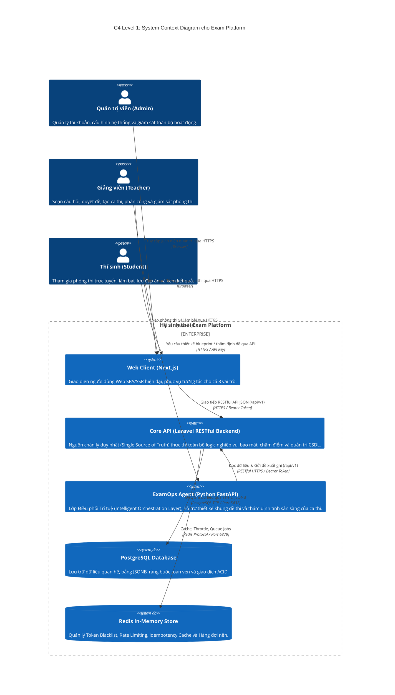
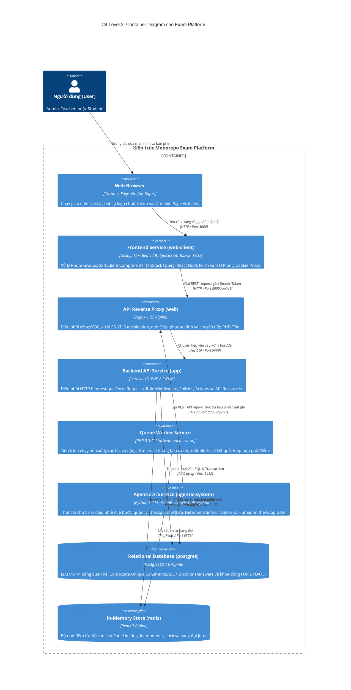
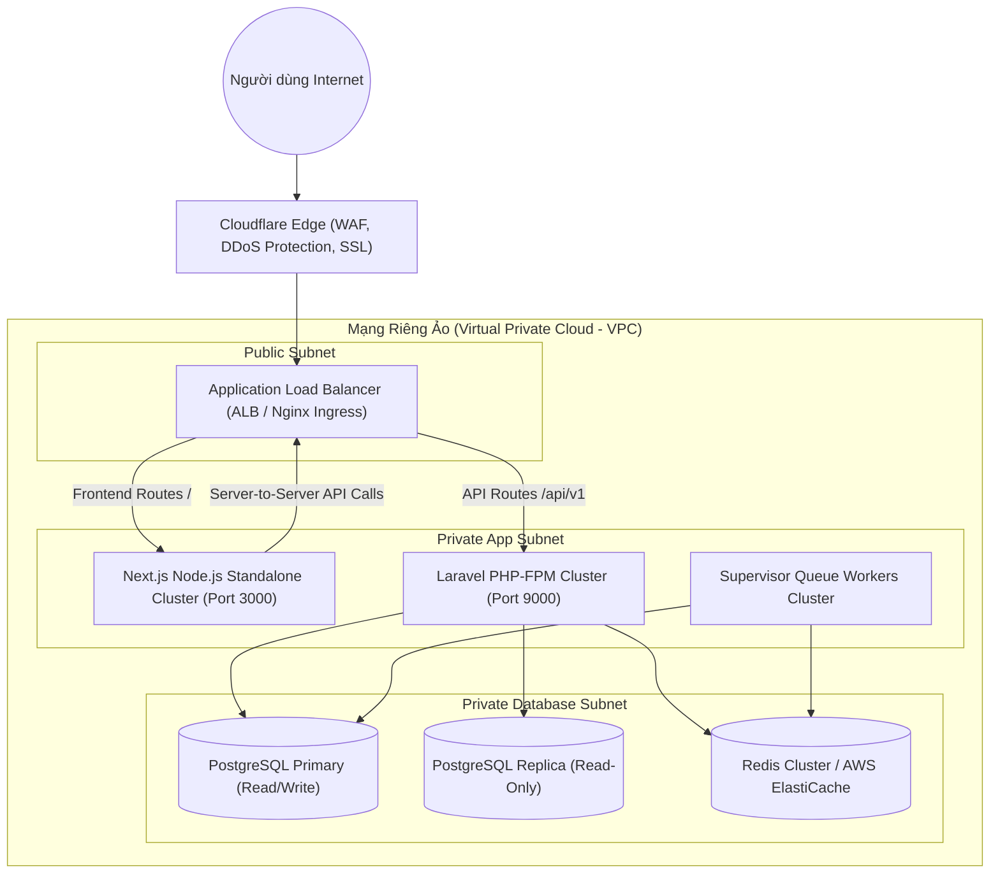

# 08 — System Architecture Specification (C4 Model)

**Dự án**: Exam Platform  
**Tài liệu**: `docs/03-architecture-api/08-ARCHITECTURE.md`  
**Trạng thái**: Approved for Architecture Baseline  

---

## 1. C4 Mức 1: Sơ đồ Ngữ cảnh Hệ thống (System Context Diagram)

Sơ đồ thể hiện vị trí của Exam Platform trong mối tương quan với các Actor người dùng và các hệ thống bên ngoài:

---

## 2. C4 Mức 2: Sơ đồ Thùng chứa (Container Diagram)

Sơ đồ mô tả chi tiết các khối dịch vụ phần mềm cấu thành hệ thống và công nghệ tương ứng:

---

## 3. Sơ đồ Triển khai (Deployment Architecture)

### 3.1. Môi trường Phát triển Địa phương (Local Development)
Tất cả các thành phần được đóng gói trong một file `docker-compose.yml` duy nhất trên máy lập trình viên:
- **`app`**: PHP 8.3-FPM gắn volume `./core-api:/var/www/html`.
- **`web`**: Nginx lắng nghe tại `localhost:8000`.
- **`postgres`**: PostgreSQL 16 lắng nghe tại `localhost:5432`, volume `postgres_data`.
- **`redis`**: Redis 7 lắng nghe tại `localhost:6379`.
- **`client`**: Node 20 Next.js lắng nghe tại `localhost:3000`, volume `./web-client:/app`.

### 3.2. Môi trường Production (Sản xuất)

---

## 4. Ranh giới Bảo mật & Phân vùng Mạng (Security Boundaries)

1. **Ranh giới Trình duyệt $\leftrightarrow$ Web Client**:
   - Trình duyệt chỉ giao tiếp với Next.js qua giao thức HTTPS có gắn HTTP-Only Cookie. Không bao giờ lộ Bearer Token ra môi trường JavaScript máy khách.
2. **Ranh giới Web Client $\leftrightarrow$ Core API**:
   - Giao tiếp qua mạng nội bộ hoặc HTTPS có xác thực Bearer Token.
   - Core API là người gác cổng (Gatekeeper) thực thi kiểm tra phân quyền RBAC/PBAC.
3. **Ranh giới Core API $\leftrightarrow$ Cơ sở dữ liệu**:
   - PostgreSQL và Redis nằm trong Private Subnet, không mở cổng công khai ra Internet.
   - Chỉ có các container trong mạng nội bộ VPC mới có quyền kết nối thông qua tài khoản có mật khẩu mạnh.
4. **Ranh giới ExamOps Agent $\leftrightarrow$ Core API**:
   - ExamOps Agent hoạt động như một REST Client độc lập, giao tiếp với Core API thông qua RESTful API `/api/v1` có xác thực Bearer Token.
   - Tuyệt đối không kết nối trực tiếp đến PostgreSQL của Core API. Checkpoint SQLite được lưu trữ tách biệt hoàn toàn.
   - Mọi hành vi sửa đổi dữ liệu (tạo đề, công bố ca thi...) bắt buộc phải dừng tại cổng Human-in-the-Loop (`WAITING_FOR_APPROVAL`) và tuân thủ các quy tắc Laravel Policy.
