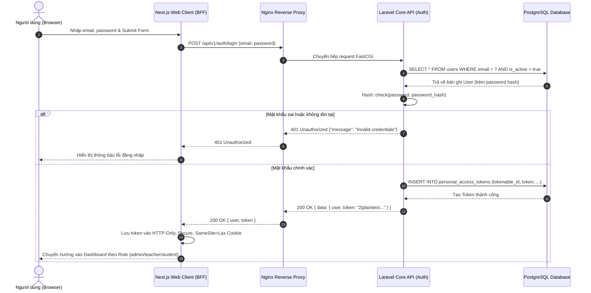
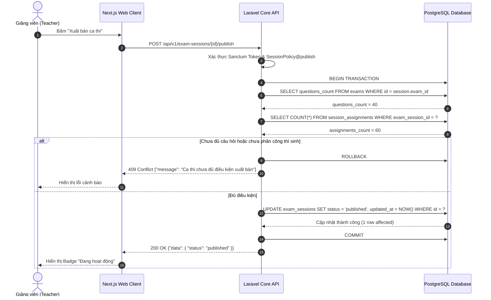
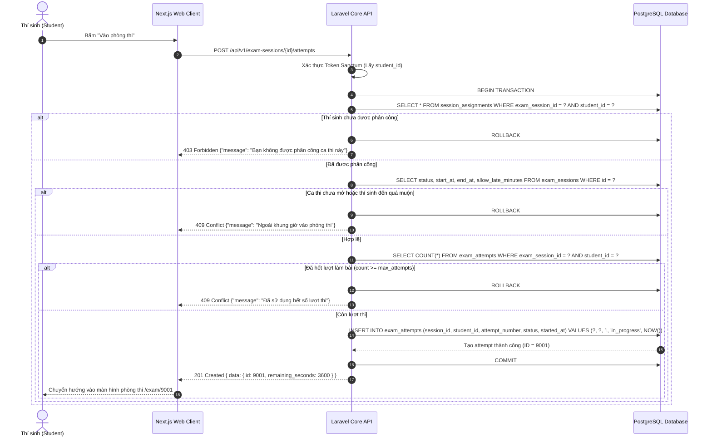
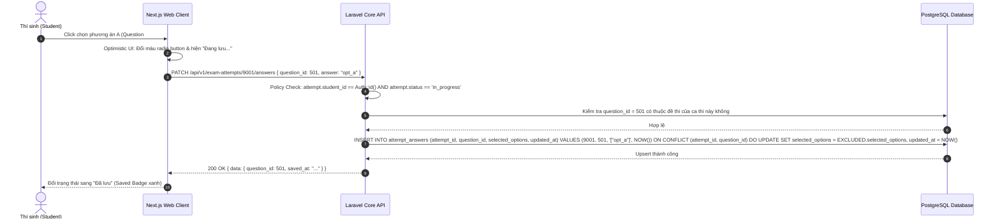
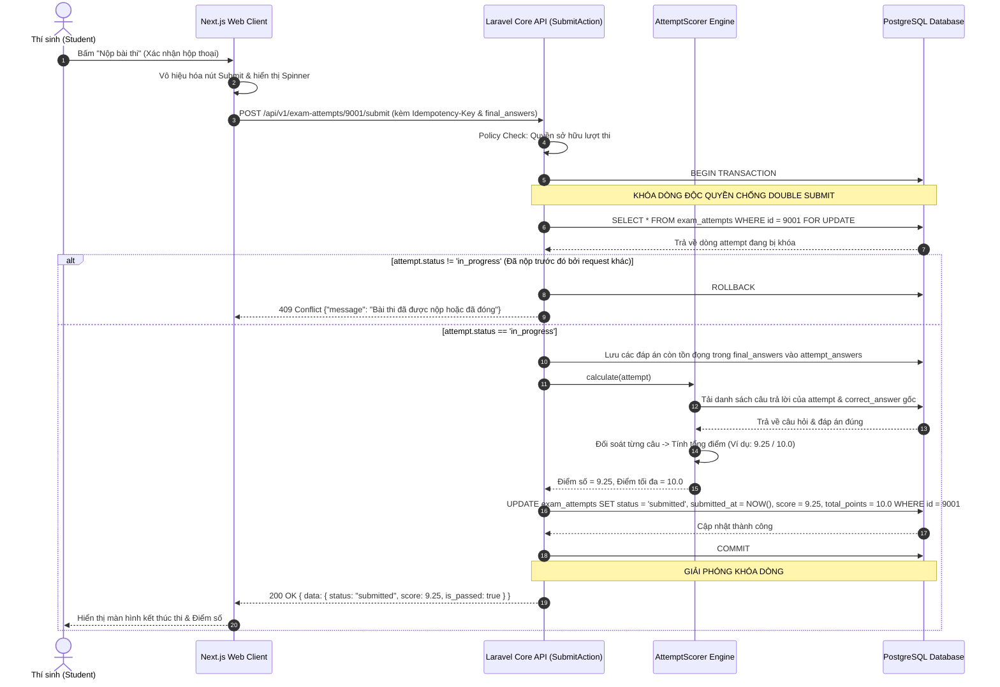

# 15 — Critical Sequence Diagrams Specification

**Dự án**: Exam Platform  
**Tài liệu**: `docs/03-architecture-api/15-SEQUENCE_DIAGRAMS.md`  
**Trạng thái**: Approved for Architecture Baseline  

---

## 1. Luồng Đăng nhập Hệ thống (User Login Flow)

---

## 2. Luồng Xuất bản Ca thi (Publish Exam Session Flow)

---

## 3. Luồng Thí sinh Bắt đầu Làm bài (Start Exam Attempt Flow)

---

## 4. Luồng Tự động Lưu Đáp án (Autosave Answer Flow)

---

## 5. Luồng Nộp bài thi & Chấm điểm Toàn vẹn (Submit Exam Flow)

