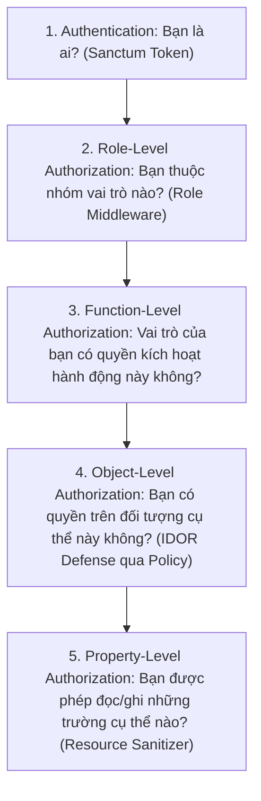

# 13 — Authentication & Access Control Specification

**Dự án**: Exam Platform  
**Tài liệu**: `docs/04-security-concurrency/13-AUTH_AND_ACCESS_CONTROL.md`  
**Trạng thái**: Approved for Architecture Baseline  

---

## 1. Kiến trúc Xác thực (Authentication Strategy)

### 1.1. Lựa chọn Công nghệ: Laravel Sanctum + HTTP-Only Cookie Proxy
- **Core API (Backend)**: Triển khai cơ chế xác thực phi trạng thái (Stateless Bearer Token) bằng **Laravel Sanctum**. Token được lưu trữ trong bảng `personal_access_tokens` và có thời hạn sử dụng 8 giờ.
- **Web Client (Frontend Next.js)**:
  - Đóng vai trò là **BFF (Backend For Frontend)**.
  - Khi người dùng đăng nhập qua Next.js Route Handler (`/api/auth/login`), Next.js gọi `POST /api/v1/auth/login` sang Laravel Core API và nhận Token plaintext.
  - Next.js lưu token này vào **HTTP-Only, Secure, SameSite=Lax Cookie** gửi về trình duyệt của người dùng.
  - **Lợi ích an ninh vượt trội**: Mã JavaScript phía client (kể cả mã độc XSS) không thể đọc được cookie này. Khi trình duyệt gọi API, Edge Middleware của Next.js tự động đọc Cookie, gắn header `Authorization: Bearer <token>` và chuyển tiếp tới Laravel Core API.

---

## 2. Ma trận Phân quyền Toàn diện (Permission Matrix)

| Tài nguyên / Hành động (Resource / Action) | Admin | Teacher | Student | Lớp kiểm tra (Enforcement Layer) |
| :--- | :---: | :---: | :---: | :--- |
| **User.list (Xem danh sách tài khoản)** | ✅ | ⚠️ *(Chỉ đọc danh sách Student để gán)* | ❌ | Middleware (`role:admin,teacher`) |
| **User.create / update / delete** | ✅ | ❌ | ❌ | Middleware (`role:admin`) |
| **Subject.create / update / delete** | ✅ | ✅ | ❌ | Middleware (`role:admin,teacher`) |
| **Topic.create / update / delete** | ✅ | ✅ | ❌ | Middleware (`role:admin,teacher`) |
| **Question.read** | ✅ | ✅ | ❌ | Middleware (`role:admin,teacher`) |
| **Question.create / update / delete** | ✅ | ✅ | ❌ | Policy (`QuestionPolicy@manage`) |
| **Question.approve / reject** | ✅ | ✅ | ❌ | Policy (`QuestionPolicy@review`) |
| **Exam.create / update / delete** | ✅ | ✅ | ❌ | Policy (`ExamPolicy@manage`) |
| **ExamSession.create / update** | ✅ | ✅ | ❌ | Policy (`SessionPolicy@manage`) |
| **ExamSession.publish / close** | ✅ | ✅ *(Chỉ ca thi được phân công)* | ❌ | Policy (`SessionPolicy@publish`) |
| **ExamSession.assignStudents** | ✅ | ✅ *(Chỉ ca thi được phân công)* | ❌ | Policy (`SessionPolicy@assign`) |
| **Student.viewAssignedExams** | ❌ | ❌ | ✅ | Middleware (`role:student`) |
| **Attempt.start (Vào phòng thi)** | ❌ | ❌ | ✅ *(Phải có trong assignment)* | Action + Assignment Check |
| **Attempt.read (Xem bài thi & câu hỏi)** | ✅ | ✅ *(Chỉ ca thi phụ trách)* | ✅ *(Chỉ bài của chính mình)* | Policy (`ExamAttemptPolicy@view`) |
| **Attempt.saveAnswer (Lưu đáp án)** | ❌ | ❌ | ✅ *(Chỉ bài của chính mình)* | Policy (`ExamAttemptPolicy@update`) |
| **Attempt.submit (Nộp bài thi)** | ❌ | ❌ | ✅ *(Chỉ bài của chính mình)* | Policy (`ExamAttemptPolicy@submit`) |
| **Proctoring.recordEvent** | ❌ | ❌ | ✅ *(Chỉ bài của chính mình)* | Policy (`ExamAttemptPolicy@recordProctoring`)|
| **Proctoring.viewSummary** | ✅ | ✅ *(Chỉ ca thi phụ trách)* | ❌ | Policy (`SessionPolicy@viewProctoring`) |
| **Result.viewSummary** | ✅ | ✅ *(Chỉ ca thi phụ trách)* | ⚠️ *(Chỉ xem điểm của chính mình)* | Policy (`ResultPolicy@view`) |

---

## 3. Phân biệt 5 Cấp độ Kiểm soát Truy cập (Multi-Level Authorization)

Một sai lầm phổ biến là chỉ kiểm tra vai trò người dùng (Role Check) ở Controller. Hệ thống Exam Platform bắt buộc phải vượt qua 5 lớp phòng thủ:



### 3.1. Ví dụ Cấp độ 4: Object-Level Authorization (Chống IDOR)
Thí sinh có vai trò hợp lệ (`student`), gửi request hợp lệ, nhưng **sửa `attempt_id` thành ID bài thi của bạn khác**:
- Role Middleware: **PASS** (Vì là `student`).
- Form Request: **PASS** (Vì `attempt_id` là số nguyên hợp lệ).
- **Laravel Policy (Chặn đứng)**:
  ```php
  public function view(User $user, ExamAttempt $attempt): bool
  {
      return $attempt->student_id === $user->id; // FALSE -> 403 Forbidden!
  }
  ```

### 3.2. Ví dụ Cấp độ 5: Property-Level Authorization (Chống lộ đáp án)
Thí sinh đọc bài thi của chính mình (`Object-Level: PASS`), nhưng **không được phép nhìn thấy trường `correct_answer`**:
- Controller trả về: `new QuestionStudentResource($question)` thay vì Model gốc.
- Kết quả: Thuộc tính `correct_answer` và `explanation` hoàn toàn bị loại bỏ khỏi JSON response.
