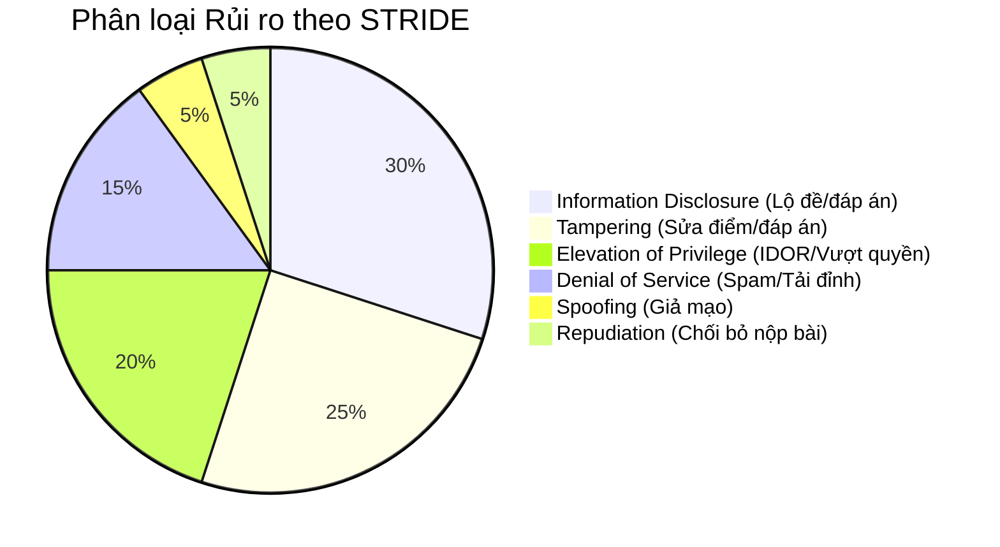

# 14 — Threat Modeling & Security Risk Assessment

**Dự án**: Exam Platform  
**Tài liệu**: `docs/04-security-concurrency/14-THREAT_MODEL.md`  
**Khung phương pháp**: STRIDE Model + OWASP API Security Top 10 (2023)  
**Trạng thái**: Approved for Architecture Baseline  

---

## 1. Phân loại Mối đe dọa theo Mô hình STRIDE

---

## 2. Bảng Phân tích Ma trận Rủi ro & Kịch bản Tấn công Bắt buộc

| Mã Kịch bản | Tài sản (Asset) | Mối đe dọa (STRIDE / OWASP) | Kịch bản Tấn công (Attack Scenario) | Mức độ Ảnh hưởng (Impact) | Xác suất (Likelihood) | Cơ chế Khắc phục (Mitigation) | Phương pháp Kiểm chứng (Verification) |
| :---: | :--- | :--- | :--- | :---: | :---: | :--- | :--- |
| **`ATK-01`** | **Exam Attempt** | Elevation of Privilege / BOLA (API1:2023) | Thí sinh thay đổi `attempt_id` trên URL/payload thành ID của bạn cùng phòng để xem hoặc sửa câu trả lời. | **Critical** | High | Bắt buộc kiểm tra quyền sở hữu qua Laravel Policy: `$attempt->student_id === Auth::id()`. | Feature Test: `student_cannot_access_another_students_attempt` (Kỳ vọng `403`). |
| **`ATK-02`** | **Teacher/Admin Endpoints** | Elevation of Privilege / BFLA (API5:2023) | Thí sinh có tài khoản hợp lệ gửi request tới các route quản trị (`POST /questions`, `POST /exam-sessions/publish`). | **High** | High | Áp dụng Role Middleware (`role:teacher,admin`) tại tầng Route nhóm API. | Feature Test: `student_cannot_call_teacher_routes` (Kỳ vọng `403`). |
| **`ATK-03`** | **Đáp án đúng (`correct_answer`)** | Information Disclosure (API3:2023) | Thí sinh mở Tab Network trên DevTools để soi response JSON của API lấy danh sách câu hỏi (`GET /exam-attempts/{id}`). | **Critical** | High | Tách riêng `QuestionStudentResource`, loại bỏ hoàn toàn `correct_answer`, `explanation` khỏi serialization. | Feature Test: `student_cannot_see_correct_answers` (assertJsonMissing `correct_answer`). |
| **`ATK-04`** | **Điểm số & Quyền hạn** | Tampering / Mass Assignment (API6:2023) | Client chèn thêm các trường `score: 10`, `status: "submitted"`, `role: "admin"` vào payload khi cập nhật hồ sơ hoặc lưu đáp án. | **Critical** | Medium | Không bao giờ dùng `$request->all()`. Chỉ sử dụng `$request->validated()` từ Form Request; cấu hình Eloquent `$fillable` chặt chẽ. | Feature Test: `extra_fields_in_payload_are_ignored_or_rejected` (Kỳ vọng `422`). |
| **`ATK-05`** | **Lượt nộp bài** | Tampering / Race Condition (Double Submit) | Thí sinh click nút "Nộp bài" liên tiếp hoặc dùng script gửi 2 request `POST /submit` song song tại mili-giây cuối cùng. | **High** | High | Dùng Database Transaction kết hợp khóa dòng `lockForUpdate()`, kiểm tra `status === in_progress`. Header `Idempotency-Key`. | Concurrency Feature Test: Gửi 2 request đồng thời, khẳng định request 2 nhận `409 Conflict`. |
| **`ATK-06`** | **Hệ thống API** | Denial of Service / Rate Limiting (API4:2023) | Thí sinh hoặc bot gửi liên tục hàng ngàn request đăng nhập hoặc sự kiện proctoring làm nghẽn CSDL và CPU. | **High** | Medium | Áp dụng Rate Limiting qua Redis: Đăng nhập tối đa 5 lần/phút; Proctoring tối đa 30 lần/phút. | Feature Test: `rate_limiter_blocks_excessive_requests` (Kỳ vọng `429`). |
| **`ATK-07`** | **Đồng hồ ca thi** | Tampering (Clock Skew Manipulation) | Thí sinh chỉnh lùi ngày giờ trên hệ điều hành máy tính để kéo dài thời gian làm bài sau khi đã hết giờ thi. | **High** | High | Đồng hồ đếm ngược phía client chỉ là hiển thị UX; máy chủ là người quyết định thời gian duy nhất: `remaining = started_at + duration - server_now`. | Feature Test: `submission_after_server_deadline_is_rejected` (Kỳ vọng `409`). |
| **`ATK-08`** | **Nhật ký hệ thống** | Information Disclosure / Sensitive Logging | File log trên máy chủ ghi lại toàn bộ request body, vô tình để lộ mật khẩu, token hoặc đáp án đúng của đề thi. | **High** | Medium | Tạo Logger Middleware tự động che giấu (`[REDACTED]`) các key nhạy cảm: `password`, `token`, `correct_answer`. | Security Test: Kiểm tra log file sau khi chạy test, khẳng định không chứa chuỗi nhạy cảm. |
