# 17 — Frontend Architecture & UI/UX Specification

**Dự án**: Exam Platform  
**Tài liệu**: `docs/05-frontend/17-FRONTEND_DESIGN.md`  
**Công nghệ**: Next.js 15+ (App Router), React 19, TypeScript Strict, Tailwind CSS, TanStack Query v5  
**Trạng thái**: Approved for Architecture Baseline  

---

## 1. Cây Định tuyến Ứng dụng (Route Tree & Sitemap)

```mermaid
graph TD
    Root["/ (Root Layout)"] --> AuthGroup["(auth) Route Group"]
    Root --> DashboardGroup["(dashboard) Route Group"]
    Root --> ExamRoom["/exam/[attemptId] (Focus Exam Layout)"]
    Root --> SystemPages["Trang Hệ thống: /forbidden, /not-found"]

    AuthGroup --> Login["/login (Đăng nhập)"]
    AuthGroup --> Register["/register (Đăng ký)"]

    DashboardGroup --> AdminRoutes["/admin/*"]
    DashboardGroup --> TeacherRoutes["/teacher/*"]
    DashboardGroup --> StudentRoutes["/student/*"]

    AdminRoutes --> AdminUsers["/admin/users (Quản lý User & Role)"]
    AdminRoutes --> AdminAudit["/admin/audit-logs (Giám sát)"]

    TeacherRoutes --> T_Questions["/teacher/questions (Ngân hàng câu hỏi & Duyệt)"]
    TeacherRoutes --> T_Exams["/teacher/exams (Mẫu đề thi & Gán điểm)"]
    TeacherRoutes --> T_Sessions["/teacher/sessions (Ca thi & Phân công)"]
    TeacherRoutes --> T_Monitor["/teacher/sessions/[id]/monitor (Giám sát trực tiếp)"]
    TeacherRoutes --> T_Results["/teacher/sessions/[id]/results (Bảng điểm & Thống kê)"]

    StudentRoutes --> S_Exams["/student/exams (Danh sách ca thi được gán)"]
    StudentRoutes --> S_Instructions["/student/exams/[id]/instructions (Nội quy & Vào thi)"]
    StudentRoutes --> S_Results["/student/results (Lịch sử điểm số)"]
```



---

## 2. Bố cục Giao diện Phòng thi Tập trung (Focus Exam Layout)

Phòng thi `/exam/[attemptId]` được thiết kế tối giản, loại bỏ hoàn toàn thanh điều hướng trang web (Sidebar, Header thông thường) để tránh phân tâm và giảm thiểu thao tác bấm nhầm:

```text
┌────────────────────────────────────────────────────────────────────────────────────────┐
│ 🎯 EXAM PLATFORM | Môn: Lập trình Web - K21 | Thí sinh: Nguyễn Văn A (SV101)          │
│ [ ⏱️ THỜI GIAN CÒN LẠI: 45:12 ]                     [ Trạng thái: 🟢 Đã lưu đáp án ]  │
├─────────────────────────────────────────────────────────┬──────────────────────────────┤
│ NỘI DUNG CÂU HỎI HIỆN TẠI                               │ BẢNG ĐIỀU HƯỚNG CÂU HỎI      │
│                                                         │ (Question Navigator Palette) │
│ Câu 15 / 40 (Điểm: 0.25)                                │                              │
│                                                         │ ┌──┐ ┌──┐ ┌──┐ ┌──┐ ┌──┐     │
│ Phương thức HTTP nào dưới đây bắt buộc phải có tính     │ │01│ │02│ │03│ │04│ │05│ ... │
│ chất Idempotent theo chuẩn RFC 9110?                    │ └──┘ └──┘ └──┘ └──┘ └──┘     │
│                                                         │ (Xanh: Đã chọn, Trắng: Chưa) │
│ [ ] A. GET                                              │                              │
│ [ ] B. POST                                             │ Tổng số: 40 câu              │
│ [ ] C. PUT                                              │ Đã làm:  28 câu              │
│ [ ] D. DELETE                                           │ Chưa làm: 12 câu             │
│                                                         │                              │
│ ┌──────────────────────┐      ┌──────────────────────┐  │ ┌──────────────────────────┐ │
│ │ ⬅️ Câu trước         │      │ Câu tiếp theo ➡️     │  │ │ 📤 NỘP BÀI THI           │ │
│ └──────────────────────┘      └──────────────────────┘  │ └──────────────────────────┘ │
└─────────────────────────────────────────────────────────┴──────────────────────────────┘
```

---

## 3. Kiến trúc Quản lý Trạng thái Phía Client (State Management)

### 3.1. Phân tách Trạng thái Rõ ràng
- **Server State (Dữ liệu từ API)**: Quản lý 100% bằng **TanStack Query v5**.
  - Cache bài thi, câu hỏi và đáp án.
  - Tự động hủy cache khi nộp bài (`queryClient.invalidateQueries`).
- **Form State (Nhập liệu)**: Quản lý bằng **React Hook Form** kết hợp **Zod** schema validation.
- **Local Exam State**:
  - Lưu trạng thái câu hỏi đang xem (`currentQuestionIndex`).
  - Đồng hồ đếm ngược nội bộ được đồng bộ định kỳ với thời gian máy chủ.

### 3.2. Cơ chế Cập nhật Lạc quan (Optimistic Autosave)
```text
Thí sinh click chọn đáp án
  │
  ├── 1. [UI tức thì]: Đổi trạng thái ô radio sang checked; hiện badge "Đang lưu..."
  ├── 2. [TanStack Mutation]: Gửi PATCH /exam-attempts/{id}/answers
  └── 3. [Kết quả]:
         - Thành công: Đổi badge sang "🟢 Đã lưu"
         - Thất bại (Mất mạng): Hiện badge "🔴 Mất kết nối - Đang thử lại..." và tự động retry
```

---

## 4. Tích hợp Cảm biến Trình duyệt Chống gian lận (Anti-Cheat Sensors)

Trong trang `/exam/[attemptId]`, một hook chuyên trách `useExamProctoring` được kích hoạt:

```typescript
// hooks/useExamProctoring.ts
import { useEffect } from 'react';
import { useMutation } from '@tanstack/react-query';
import { api } from '@/lib/api';

export function useExamProctoring(attemptId: number) {
  const { mutate: logEvent } = useMutation({
    mutationFn: (eventType: string) =>
      api.post(`/exam-attempts/${attemptId}/proctoring-events`, {
        event_type: eventType,
        occurred_at: new Date().toISOString(),
      }),
  });

  useEffect(() => {
    // 1. Cảm biến chuyển Tab hoặc ẩn trình duyệt
    const handleVisibilityChange = () => {
      if (document.hidden) {
        logEvent('tab_hidden');
      }
    };

    // 2. Cảm biến mất tiêu điểm cửa sổ
    const handleBlur = () => {
      logEvent('window_blur');
    };

    // 3. Cảm biến thoát chế độ toàn màn hình
    const handleFullscreenChange = () => {
      if (!document.fullscreenElement) {
        logEvent('fullscreen_exit');
      }
    };

    document.addEventListener('visibilitychange', handleVisibilityChange);
    window.addEventListener('blur', handleBlur);
    document.addEventListener('fullscreenchange', handleFullscreenChange);

    return () => {
      document.removeEventListener('visibilitychange', handleVisibilityChange);
      window.removeEventListener('blur', handleBlur);
      document.removeEventListener('fullscreenchange', handleFullscreenChange);
    };
  }, [attemptId, logEvent]);
}
```
