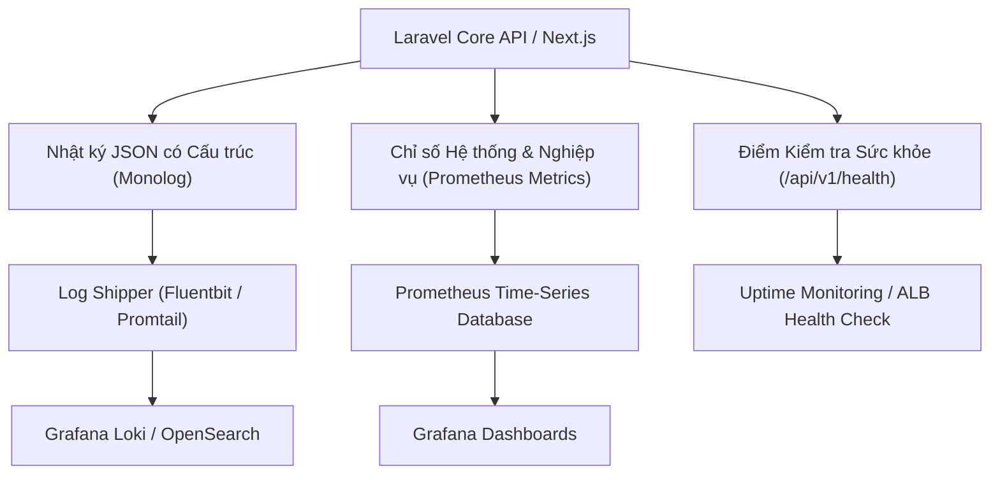

# 18 — Observability, Logging & Monitoring Specification

**Dự án**: Exam Platform  
**Tài liệu**: `docs/06-operations-devops/18-OBSERVABILITY.md`  
**Trạng thái**: Approved for Architecture Baseline  

---

## 1. Kiến trúc Khả năng Quan sát (Observability Architecture)

Hệ thống được thiết kế theo 3 trụ cột khả năng quan sát tiêu chuẩn: **Logs (Nhật ký có cấu trúc)**, **Metrics (Chỉ số đo lường)** và **Health Checks (Kiểm tra sức khỏe dịch vụ)**.



---

## 2. Định dạng Nhật ký Có cấu trúc (Structured JSON Logging)

Mọi dòng nhật ký xuất ra từ Backend bắt buộc phải ở định dạng JSON để phục vụ phân tích tự động:

```json
{
  "timestamp": "2026-10-06T01:55:00.124Z",
  "level": "INFO",
  "message": "Exam attempt submitted successfully.",
  "context": {
    "request_id": "req-9b1deb4d-3b7d-4bad-9bdd-2b0d7b3dcb6d",
    "user_id": 101,
    "role": "student",
    "ip_address": "192.168.1.45",
    "exam_session_id": 88,
    "attempt_id": 9001,
    "score": 9.25,
    "duration_ms": 142.5
  }
}
```

### Quy tắc Thanh lọc Nhật ký (Data Sanitization)
- **CẤM GHI VÀO LOG**: `password`, `password_confirmation`, `token`, `bearer_token`, `correct_answer`.
- **MẶT NẠ EMAIL**: Email người dùng trong log được che giấu: `ng***@example.com`.

---

## 3. Các Chỉ số Vận hành Cốt lõi (Core Metrics Catalog)

| Tên Chỉ số (Metric Name) | Loại Metric | Ngưỡng Cảnh báo (Alert Threshold) | Ý nghĩa Nghiệp vụ & Kỹ thuật |
| :--- | :---: | :---: | :--- |
| **`http_request_duration_seconds`** | Histogram | $P95 > 500\text{ms}$ (với API thường)<br>$P95 > 200\text{ms}$ (với Autosave) | Đo lường độ trễ phản hồi API. Nếu tăng vọt báo hiệu nghẽn CSDL. |
| **`http_5xx_error_rate`** | Counter / Rate | $> 1\%$ trong 5 phút | Tỷ lệ lỗi máy chủ nội bộ. Cần thông báo khẩn cấp cho On-call Engineer. |
| **`login_failure_rate`** | Counter / Rate | $> 20$ lần thất bại / phút | Dấu hiệu của một đợt tấn công dò mật khẩu (Brute-Force Attack). |
| **`active_exam_attempts_count`** | Gauge | Tùy quy mô ca thi | Số lượng thí sinh đang làm bài thi cùng lúc trong phòng thi. |
| **`exam_submit_conflicts_total`** | Counter | Tăng đột biến | Dấu hiệu thí sinh bị lỗi mạng click nộp bài liên tục hoặc lỗi Race Condition. |
| **`database_slow_queries_total`** | Counter | Truy vấn $> 100\text{ms}$ | CSDL đang thiếu chỉ mục hoặc xuất hiện câu truy vấn N+1 nghiêm trọng. |
| **`redis_queue_failed_jobs`** | Counter | $> 0$ jobs | Có tác vụ nền bị lỗi (ví dụ không gửi được email hoặc crash báo cáo). |

---

## 4. Điểm Kiểm tra Sức khỏe Dịch vụ (Health Check Endpoint)

Endpoint: `GET /api/v1/health`

### Phản hồi Mẫu khi Hệ thống Khỏe mạnh (`200 OK`)
```json
{
  "status": "healthy",
  "timestamp": "2026-10-06T02:00:00Z",
  "checks": {
    "database": {
      "status": "connected",
      "latency_ms": 1.4
    },
    "redis": {
      "status": "connected",
      "latency_ms": 0.6
    },
    "storage": {
      "status": "writable"
    }
  }
}
```

Nếu một trong các dịch vụ phụ thuộc (như PostgreSQL) bị mất kết nối, endpoint trả về mã lỗi `503 Service Unavailable` kèm trạng thái `unhealthy`, báo hiệu cho Load Balancer tạm thời ngừng định tuyến lưu lượng vào máy chủ này.
