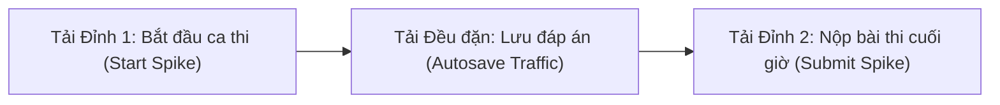

# 20 — Performance & Capacity Planning Specification

**Dự án**: Exam Platform  
**Tài liệu**: `docs/06-operations-devops/20-PERFORMANCE_PLAN.md`  
**Trạng thái**: Approved for Architecture Baseline  

---

## 1. Phân tích Các Kịch bản Tải Đỉnh (Peak Load Scenarios)

Hệ thống thi trực tuyến có đặc thù về tải không phân bổ đều mà tập trung thành các đợt bùng nổ (Traffic Spikes) tại 3 thời điểm:

### 1.1. Kịch bản 1: Đỉnh Bắt đầu Ca thi (Start Spike)
- **Tình huống**: 1.000 thí sinh cùng click "Vào phòng thi" trong vòng 2 phút đầu tiên.
- **Tác động**: Phát sinh $\approx 50$ requests `POST /attempts` và `GET /exam-attempts/{id}` mỗi giây.
- **Điểm nghẽn tiềm ẩn**:
  - Giao dịch CSDL kiểm tra điều kiện và tạo dòng mới trong `exam_attempts`.
  - N+1 Query khi tải danh sách 40 câu hỏi và các phương án tương ứng.
- **Giải pháp**:
  - Eager Loading bắt buộc: `ExamAttempt::with(['examSession.exam.questions'])` gom toàn bộ câu hỏi vào 1 câu lệnh `IN (...)`.
  - Ràng buộc Unique Composite Index `(exam_session_id, student_id, attempt_number)` bắt lỗi ở CSDL cực nhanh mà không cần quét nhiều bảng.

### 1.2. Kịch bản 2: Lưu Đáp án Liên tục (Autosave Traffic)
- **Tình huống**: 1.000 thí sinh làm đề thi 40 câu trong 60 phút $\rightarrow$ Trung bình $40.000$ requests `PATCH /answers` trong 1 giờ ($\approx 12 - 25$ write requests/giây).
- **Điểm nghẽn tiềm ẩn**: Ghi đè vào bảng `attempt_answers` liên tục gây khóa bảng hoặc nghẽn IOPS.
- **Giải pháp**:
  - Sử dụng câu lệnh atomic `UPSERT` trực tiếp trên PostgreSQL: `ON CONFLICT (attempt_id, question_id) DO UPDATE`.
  - Phía Client sử dụng cơ chế Debounce (khoảng 300ms) khi thí sinh gõ câu trả lời ngắn để gom cụm request.

### 1.3. Kịch bản 3: Đỉnh Nộp bài Cuối giờ (Submit Spike)
- **Tình huống**: 500 - 800 thí sinh cùng nộp bài trong 30 giây cuối cùng của ca thi.
- **Tác động**: Hàng trăm giao dịch ghi đồng thời kèm khóa dòng `FOR UPDATE` và tính toán điểm số.
- **Điểm nghẽn tiềm ẩn**: Quá tải CPU máy chủ CSDL do tính điểm và nghẽn Connection Pool.
- **Giải pháp**:
  - Thuật toán `AttemptScorer` được tối ưu hóa chạy hoàn toàn trên bộ nhớ RAM (In-Memory Comparison), so sánh mảng dữ liệu đã nạp sẵn mà không phát sinh thêm bất kỳ câu truy vấn phụ nào vào CSDL.
  - Áp dụng PgBouncer quản lý Connection Pooling giữ số lượng kết nối thực tế tới PostgreSQL ổn định dưới 200 connections.

---

## 2. Ứng viên Lưu bộ đệm & Xử lý Bất đồng bộ (Cache & Queue Candidates)

### 2.1. Đối tượng Thích hợp để Cache (Justified Cache Candidates)
- **Danh mục Môn học & Chủ đề (`subjects`, `topics`)**: Dữ liệu gần như tĩnh, ít thay đổi. Cache tại Redis với TTL 24 giờ; tự động xóa cache (Invalidation) khi có sự kiện `SubjectUpdated` hoặc `TopicCreated`.
- **Cấu trúc Đề thi Mẫu (`exams/{id}`)**: Trong thời gian ca thi đang diễn ra, nội dung câu hỏi của đề thi là bất biến. Cache cấu trúc câu hỏi của đề thi để phục vụ hàng ngàn thí sinh tải đề cùng lúc mà không cần quét lại bảng `questions`.

### 2.2. Đối tượng Tuyệt đối KHÔNG Cache
- Trạng thái Lượt làm bài (`exam_attempts.status`).
- Câu trả lời của thí sinh (`attempt_answers`).
- Thời gian làm bài còn lại (`remaining_seconds`).
*(Các đối tượng này phải luôn đọc từ CSDL hoặc tính toán trực tiếp từ đồng hồ máy chủ).*

### 2.3. Đối tượng Thích hợp Đưa vào Hàng đợi (Queue Candidates)
Chỉ chuyển sang Background Jobs khi tác vụ có thời gian thực thi $> 500\text{ms}$ hoặc có side-effect mạng:
1. **Gửi Email thông báo ca thi**: Tránh việc giảng viên bấm Publish phải chờ gửi 100 email làm treo request.
2. **Xuất Báo cáo Kết quả Kỳ thi (Export Excel / PDF)**: Tổng hợp điểm của hàng ngàn sinh viên thành file bảng tính.
3. **Tính toán Phổ điểm Phân tích Sâu**: Thống kê độ khó thực tế của từng câu hỏi (Item Analysis) sau khi ca thi kết thúc.
