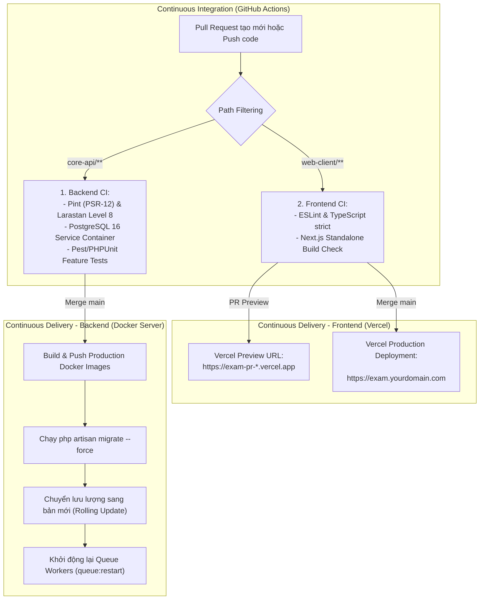

# 21 — Deployment & CI/CD Pipeline Specification

**Dự án**: Exam Platform  
**Tài liệu**: `docs/06-operations-devops/21-DEPLOYMENT.md`  
**Trạng thái**: Approved for Architecture Baseline  

---

## 1. Môi trường Vận hành (Environments Matrix)

| Hạng mục Hạ tầng | Môi trường Local Development | Môi trường Staging (Thử nghiệm) | Môi trường Production (Sản xuất) |
| :--- | :--- | :--- | :--- |
| **Frontend Web** | Next.js Dev Server (Node 20) trên `localhost:3000` | Next.js Standalone Container / Vercel Preview | Next.js Standalone Runner Cluster / Vercel Production |
| **Backend API** | PHP 8.3-FPM + Nginx trên `localhost:8000` | Containerized PHP 8.3-FPM + Nginx Reverse Proxy | Cluster PHP 8.3-FPM (OPcache Tuned) sau AWS ALB / Cloudflare |
| **Cơ sở Dữ liệu** | PostgreSQL 16 Alpine container (`localhost:5432`) | PostgreSQL 16 Managed DB (Dữ liệu giả lập ẩn danh) | PostgreSQL 16 Primary (Read/Write) + Replica (Read-Only) + PITR |
| **Bộ nhớ đệm & Queue**| Redis 7 Alpine container (`localhost:6379`) | Redis 7 Container | Redis Cluster / AWS ElastiCache |
| **Queue Workers** | Chạy trực tiếp `php artisan queue:listen` | Supervisor quản lý 2 workers | Supervisor / Kubernetes Deployments (4-8 workers autoscaling) |
| **Quản lý Secrets** | Tệp `.env` cục bộ (bị `.gitignore`) | GitHub Secrets / AWS Secrets Manager | HashiCorp Vault / AWS Secrets Manager |
| **Thu thập Nhật ký** | Docker stdout/stderr | Grafana Loki / CloudWatch | Grafana Loki + Alertmanager (Cảnh báo Telegram/Slack) |

---

## 2. Quy trình CI/CD Tự động hóa (Continuous Integration & Delivery)



### 2.1. Thiết lập CI với GitHub Actions (`.github/workflows/ci.yml`)
- **Cơ chế Path Filtering**: Sử dụng `dorny/paths-filter@v3` để phân lập tác vụ. Khi PR chỉ thay đổi giao diện (`web-client/**`), hệ thống bỏ qua kiểm thử backend để tiết kiệm tài nguyên CI và trả về kết quả nhanh chóng.
- **Backend Quality Gates**:
  - `composer install --prefer-dist --optimize-autoloader`
  - Code Style: `./vendor/bin/pint --test`
  - Phân tích tĩnh: `./vendor/bin/phpstan analyse --memory-limit=2G` (Larastan Level 8)
  - Khởi tạo PostgreSQL 16 container dịch vụ (`postgres:16-alpine`) và chạy: `php artisan test --parallel`
- **Frontend Quality Gates**:
  - `pnpm install --frozen-lockfile` (kèm lưu cache pnpm store)
  - Linter: `pnpm lint`
  - Kiểu dữ liệu: `pnpm typecheck` (`tsc --noEmit`)
  - Biên dịch kiểm thử: `pnpm build`

### 2.2. Thiết lập CD Frontend với Vercel
- **Cấu hình Monorepo trên Vercel**:
  - **Root Directory**: `web-client`
  - **Framework Preset**: `Next.js`
  - **Build Command**: `pnpm build`
  - **Install Command**: `pnpm install`
- **Tập tin cấu hình `web-client/vercel.json`**:
  - Thiết lập bộ tiêu đề bảo mật HTTP (Security Headers): `X-Frame-Options: DENY`, `X-Content-Type-Options: nosniff`, `Referrer-Policy: strict-origin-when-cross-origin`.
- **Phương thức triển khai**:
  - *Cách 1 (Khuyến nghị)*: Tích hợp Vercel GitHub App trực tiếp. Kết hợp bật Branch Protection trên GitHub (bắt buộc job `Frontend Quality Gates` và `Backend Quality Gates` pass mới cho phép merge vào `main`).
  - *Cách 2*: Triển khai tự động bằng GitHub Actions CLI qua workflow `.github/workflows/deploy-frontend-vercel.yml` với các Secrets: `VERCEL_TOKEN`, `VERCEL_ORG_ID`, `VERCEL_PROJECT_ID`.

### 2.3. Giải pháp Reverse Proxy Next.js chống lỗi Cross-Domain Cookie & CORS
Do Web Client nằm trên tên miền Vercel (ví dụ: `exam.edu.vn`) và API Backend nằm trên máy chủ riêng (ví dụ: `api.exam.edu.vn`), trình duyệt mặc định chặn Third-Party Cookies.
Hệ thống giải quyết triệt để thông qua cấu hình `rewrites()` trong [`web-client/next.config.ts`](../../web-client/next.config.ts):
```typescript
async rewrites() {
  const backendUrl = process.env.INTERNAL_BACKEND_URL || 'http://localhost:8000/api/v1';
  return [
    {
      source: '/api/backend/:path*',
      destination: `${backendUrl}/:path*`,
    },
  ];
}
```
*Lợi ích*: Toàn bộ request từ client gửi về `/api/backend/*` được Next.js server-side chuyển tiếp tới Backend. Trình duyệt coi đây là First-Party request, giúp cookie HttpOnly hoạt động hoàn hảo và triệt tiêu rủi ro CORS.

### 2.4. Danh mục Secrets & Biến Môi Trường (Environment Variables)

| Vị trí cấu hình | Tên biến | Mục đích sử dụng |
| :--- | :--- | :--- |
| **Vercel Project Settings** | `INTERNAL_BACKEND_URL` | URL API Backend thật để Next.js Rewrites chuyển tiếp (`https://api.yourdomain.com/api/v1`) |
| **Vercel Project Settings** | `NEXT_PUBLIC_API_URL` | URL Backend dành cho client trực tiếp (`https://api.yourdomain.com/api/v1`) |
| **Vercel Project Settings** | `NEXT_PUBLIC_APP_ENV` | Môi trường ứng dụng (`production` hoặc `preview`) |
| **GitHub Repository Secrets**| `VERCEL_TOKEN` | Token xác thực Vercel CLI (nếu deploy qua GitHub Action) |
| **GitHub Repository Secrets**| `VERCEL_ORG_ID` | Vercel Organization ID |
| **GitHub Repository Secrets**| `VERCEL_PROJECT_ID` | Vercel Project ID |
| **GitHub Repository Secrets**| `SSH_PRIVATE_KEY` | SSH Key kết nối server Backend để deploy Docker (CD Backend) |

---

## 3. Chiến lược Di chuyển CSDL Không gián đoạn (Zero-Downtime Migrations)

Để tránh hiện tượng khóa bảng (Table Lock) làm gián đoạn các ca thi đang diễn ra:
1. **Quy tắc Thêm Cột Mới**: Các migration thêm cột mới bắt buộc phải là `nullable()` hoặc có giá trị mặc định (`default(...)`). Không thêm cột `NOT NULL` mà không có giá trị mặc định vào bảng đang chứa triệu dòng dữ liệu.
2. **Quy tắc Đổi tên / Xóa Cột (Expand-Contract Pattern)**:
   - *Bước 1 (Expand)*: Thêm cột mới song song.
   - *Bước 2 (Code Release)*: Ứng dụng ghi đồng thời vào cả cột cũ và cột mới.
   - *Bước 3 (Backfill)*: Chạy script cập nhật dữ liệu lịch sử từ cột cũ sang cột mới.
   - *Bước 4 (Contract)*: Ứng dụng chuyển sang chỉ đọc từ cột mới; xóa bỏ cột cũ trong bản release tiếp theo.
3. **Thêm Chỉ mục An toàn**: Trên PostgreSQL Production, các chỉ mục bổ sung trên bảng lớn phải được tạo với từ khóa `CONCURRENTLY` để không khóa các luồng ghi của thí sinh:
   ```sql
   CREATE INDEX CONCURRENTLY idx_attempt_answers_question ON attempt_answers(question_id);
   ```

---

## 4. Bản Thiết kế Container Hóa Production (Production Multi-stage Builds)

### 4.1. Production Dockerfile cho Core API (`docker/php/Dockerfile.prod`)
```dockerfile
# Stage 1: Vendor Dependencies
FROM composer:2.7 AS vendor
WORKDIR /app
COPY core-api/composer.json core-api/composer.lock ./
RUN composer install --no-dev --no-interaction --prefer-dist --optimize-autoloader --no-scripts

# Stage 2: Production PHP 8.3-FPM Runtime
FROM php:8.3-fpm-alpine
RUN apk add --no-cache postgresql-dev libzip-dev linux-headers $PHPIZE_DEPS \
    && docker-php-ext-install pdo pdo_pgsql bcmath zip opcache \
    && pecl install redis && docker-php-ext-enable redis \
    && apk del $PHPIZE_DEPS

# Tối ưu hóa OPcache
RUN { \
    echo 'opcache.enable=1'; \
    echo 'opcache.memory_consumption=256'; \
    echo 'opcache.interned_strings_buffer=16'; \
    echo 'opcache.max_accelerated_files=20000'; \
    echo 'opcache.validate_timestamps=0'; \
    echo 'opcache.save_comments=1'; \
    echo 'opcache.fast_shutdown=1'; \
} > /usr/local/etc/php/conf.d/opcache-recommended.ini

WORKDIR /var/www/html
COPY core-api/ ./
COPY --from=vendor /app/vendor ./vendor
RUN chown -R www-data:www-data /var/www/html/storage /var/www/html/bootstrap/cache

USER www-data
EXPOSE 9000
CMD ["php-fpm"]
```

### 4.2. Cấu hình Supervisor cho Laravel Queue Workers
```ini
[program:exam-platform-worker]
process_name=%(program_name)s_%(process_num)02d
command=php /var/www/html/artisan queue:work redis --sleep=3 --tries=3 --max-time=3600 --timeout=90
autostart=true
autorestart=true
stopasgroup=true
killasgroup=true
user=www-data
numprocs=4
redirect_stderr=true
stdout_logfile=/var/www/html/storage/logs/worker.log
stopwaitsecs=3600
```

