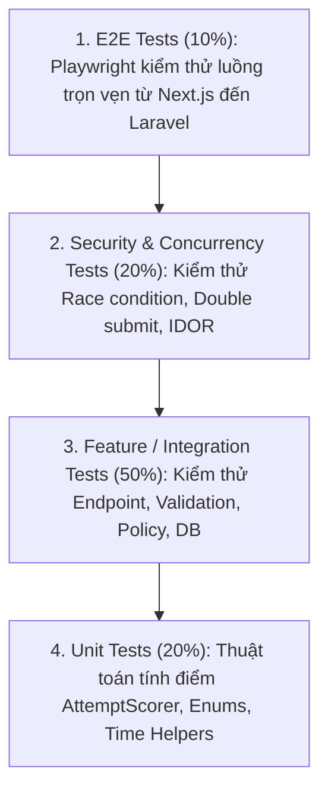

# 19 — Quality Assurance & Testing Strategy Specification

**Dự án**: Exam Platform  
**Tài liệu**: `docs/07-testing-execution/19-TEST_STRATEGY.md`  
**Công cụ**: Pest PHP / PHPUnit, Playwright / Cypress, PostgreSQL Testing DB  
**Trạng thái**: Approved for Architecture Baseline  

---

## 1. Kim tự tháp Kiểm thử (Testing Pyramid)

Hệ thống tuân thủ mô hình kim tự tháp kiểm thử ưu tiên **Feature Tests** để đảm bảo kiểm tra trọn vẹn toàn bộ chu trình xử lý của RESTful API:



---

## 2. Danh mục Các Test Case Sống còn (Critical Test Cases)

| Mã Test Case | Tên Kịch bản Kiểm thử | Loại Kiểm thử | Mục tiêu & Điều kiện Khẳng định (Assertion) | Mã HTTP |
| :---: | :--- | :---: | :--- | :---: |
| **`TC-SEC-01`** | Chống IDOR xem bài thi người khác | Security / Feature | Thí sinh A cố tình gọi `GET /api/v1/exam-attempts/{attempt_b_id}` $\rightarrow$ Bị chặn. | `403 Forbidden` |
| **`TC-SEC-02`** | Ngăn chặn rò rỉ đáp án đúng | Security / Feature | Thí sinh bắt đầu và tải đề thi $\rightarrow$ Khẳng định `assertJsonMissing(['correct_answer', 'explanation'])`. | `200 OK` |
| **`TC-CONC-01`**| Chống Double Submit | Concurrency / Feature | Gửi 2 request `POST /submit` song song $\rightarrow$ Request 1 thành công (200), Request 2 nhận xung đột. | `409 Conflict` |
| **`TC-STATE-01`**| Khóa sửa bài sau khi nộp | State / Feature | Sau khi attempt có `status = submitted`, gửi `PATCH /answers` $\rightarrow$ Bị từ chối. | `409 Conflict` |
| **`TC-AUTH-01`**| Chống vào thi khi chưa được phân công | Security / Feature | Thí sinh không nằm trong `session_assignments` bấm vào thi $\rightarrow$ Bị từ chối. | `403 Forbidden` |
| **`TC-TIME-01`**| Cưỡng chế thời gian phía máy chủ | Business / Feature | Thí sinh nộp bài sau khi đồng hồ máy chủ đã hết giờ quá 30s ân hạn $\rightarrow$ Bị từ chối. | `409 Conflict` |
| **`TC-RBAC-01`**| Giảng viên không được thao tác của Admin | Security / Feature | Giảng viên gọi endpoint `DELETE /api/v1/users/{id}` $\rightarrow$ Bị chặn bởi Role Middleware. | `403 Forbidden` |
| **`TC-FSM-01`** | Từ chối bước chuyển trạng thái sai | State / Feature | Chuyển ca thi từ `closed` quay lại `published` $\rightarrow$ Bị từ chối. | `409 Conflict` |
| **`TC-TX-01`**  | Rollback giao dịch khi có lỗi | DB / Integration | Gán danh sách câu hỏi vào đề nếu có 1 câu không tồn tại $\rightarrow$ Toàn bộ transaction rollback sạch. | `422 Unprocessable` |
| **`TC-UNIT-01`**| Độ chính xác của thuật toán tính điểm | Unit Test | Đưa vào 40 câu hỏi trắc nghiệm (đơn/nhiều lựa chọn) $\rightarrow$ Khẳng định điểm số tính toán chính xác tuyệt đối. | N/A |

---

## 3. Ma trận Truy xuất Nguồn gốc Yêu cầu (Traceability Matrix)

Ma trận bảo đảm mỗi yêu cầu chức năng (`FR`) đều được hiện thực hóa qua Use Case, API, Business Rule, Kiểm soát An ninh và Bộ test tương ứng:

| Yêu cầu (FR) | Use Case (UC) | API Endpoint | Business Rule (BR) | Kiểm soát An ninh (Security) | Test Case Kiểm chứng |
| :--- | :--- | :--- | :--- | :--- | :--- |
| **`FR-ATTEMPT-001`** | `UC-ATTEMPT-START` | `POST /exam-sessions/{id}/attempts` | `BR-001`, `BR-008` | Assignment Check + Role Middleware | `TC-AUTH-01`, `TC-TIME-01` |
| **`FR-ATTEMPT-004`** | `UC-ATTEMPT-START` | `GET /exam-attempts/{id}` | `BR-004` | `QuestionStudentResource` Sanitizer | `TC-SEC-02` |
| **`FR-ANSWER-001`** | `UC-ATTEMPT-SAVE-ANSWER` | `PATCH /exam-attempts/{id}/answers` | `BR-002`, `BR-003` | Policy Check Ownership + State Guard | `TC-SEC-01`, `TC-STATE-01` |
| **`FR-SUBMIT-001`** | `UC-ATTEMPT-SUBMIT` | `POST /exam-attempts/{id}/submit` | `BR-002`, `BR-007` | Pessimistic Lock `FOR UPDATE` | `TC-CONC-01` |
| **`FR-SCORING-001`** | `UC-ATTEMPT-SUBMIT` | `POST /exam-attempts/{id}/submit` | `BR-010`, `BR-011` | Server-Side Isolated Scoring Engine | `TC-UNIT-01` |
| **`FR-SESSION-004`** | `UC-SESSION-PUBLISH` | `POST /exam-sessions/{id}/publish` | `BR-006` | Policy Check Proctor Assignment | `TC-FSM-01` |
| **`FR-USER-002`** | `UC-ADMIN-01` | `PATCH /users/{id}` | `BR-001` | Role Middleware (`role:admin`) | `TC-RBAC-01` |

---

## 4. Các Test Case Mẫu Chuẩn Senior (Feature Test Examples)

### 4.1. Kiểm thử Bảo mật: Không bao giờ rò rỉ đáp án đúng (`QuestionStudentResource`)
```php
namespace Tests\Feature\Attempts;

use Tests\TestCase;
use App\Models\User;
use App\Models\ExamSession;
use Illuminate\Foundation\Testing\RefreshDatabase;

class StartAttemptSecurityTest extends TestCase
{
    use RefreshDatabase;

    public function test_student_cannot_see_correct_answer_when_starting_or_loading_attempt(): void
    {
        $student = User::factory()->create(['role' => 'student']);
        $session = ExamSession::factory()->published()->create();
        $session->students()->attach($student->id);

        $response = $this->actingAs($student)
            ->postJson("/api/v1/exam-sessions/{$session->id}/attempts");

        $response->assertStatus(201);
        $attemptId = $response->json('data.id');

        // Khi tải câu hỏi bài thi
        $loadResponse = $this->actingAs($student)
            ->getJson("/api/v1/exam-attempts/{$attemptId}");

        $loadResponse->assertStatus(200)
            ->assertJsonMissing(['correct_answer'])
            ->assertJsonMissing(['explanation'])
            ->assertJsonStructure([
                'data' => [
                    'attempt' => ['id', 'status', 'started_at', 'remaining_seconds'],
                    'questions' => [
                        '*' => [
                            'question_id',
                            'question_text',
                            'question_type',
                            'options' => [
                                '*' => ['id', 'content']
                            ]
                        ]
                    ]
                ]
            ]);
    }
}
```

### 4.2. Kiểm thử Tính toàn vẹn: Chống Double Submit & IDOR
```php
namespace Tests\Feature\Attempts;

use Tests\TestCase;
use App\Models\User;
use App\Models\ExamAttempt;
use App\Enums\AttemptStatus;
use Illuminate\Foundation\Testing\RefreshDatabase;

class SubmitAttemptTest extends TestCase
{
    use RefreshDatabase;

    public function test_student_cannot_submit_another_students_attempt(): void
    {
        $owner = User::factory()->create(['role' => 'student']);
        $attacker = User::factory()->create(['role' => 'student']);

        $attempt = ExamAttempt::factory()->inProgress()->create([
            'student_id' => $owner->id
        ]);

        $response = $this->actingAs($attacker)
            ->postJson("/api/v1/exam-attempts/{$attempt->id}/submit", [
                'final_answers' => []
            ]);

        $response->assertStatus(403);
        $this->assertEquals(AttemptStatus::IN_PROGRESS, $attempt->fresh()->status);
    }

    public function test_student_cannot_submit_the_same_attempt_twice(): void
    {
        $student = User::factory()->create(['role' => 'student']);
        $attempt = ExamAttempt::factory()->inProgress()->create([
            'student_id' => $student->id
        ]);

        // Lần nộp thứ nhất: Thành công
        $firstSubmit = $this->actingAs($student)
            ->postJson("/api/v1/exam-attempts/{$attempt->id}/submit", [
                'final_answers' => []
            ]);
        $firstSubmit->assertStatus(200);

        // Lần nộp thứ hai: Xung đột trạng thái (409 Conflict)
        $secondSubmit = $this->actingAs($student)
            ->postJson("/api/v1/exam-attempts/{$attempt->id}/submit", [
                'final_answers' => []
            ]);
        $secondSubmit->assertStatus(409);
    }
}
```

