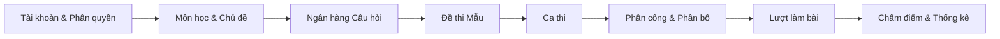
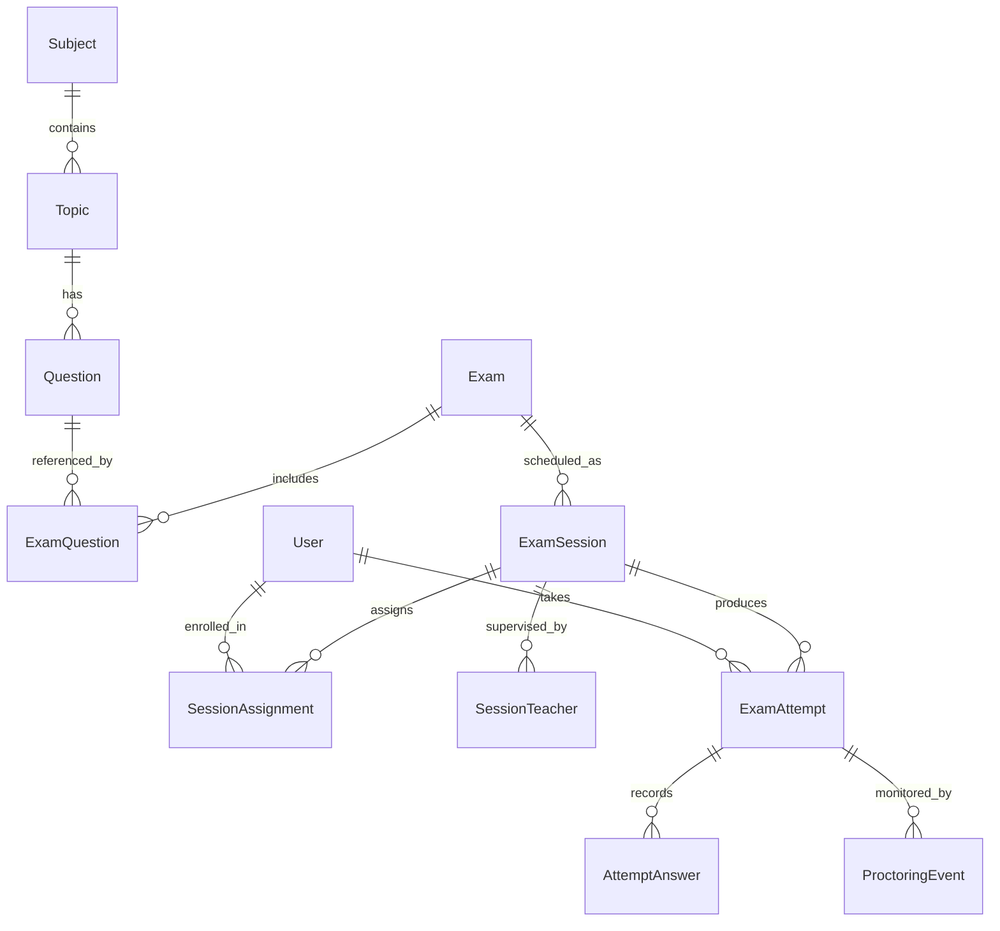
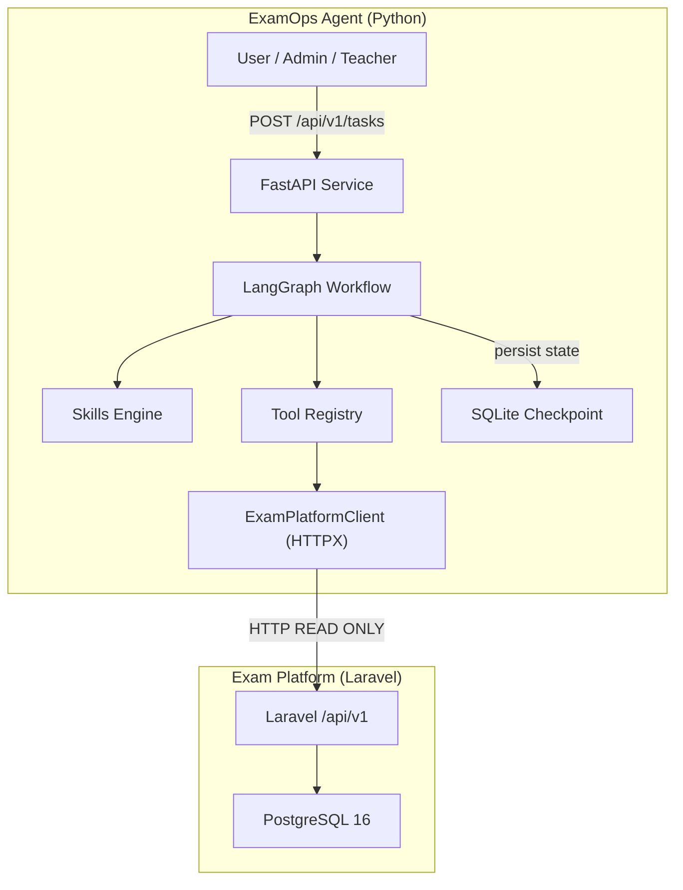
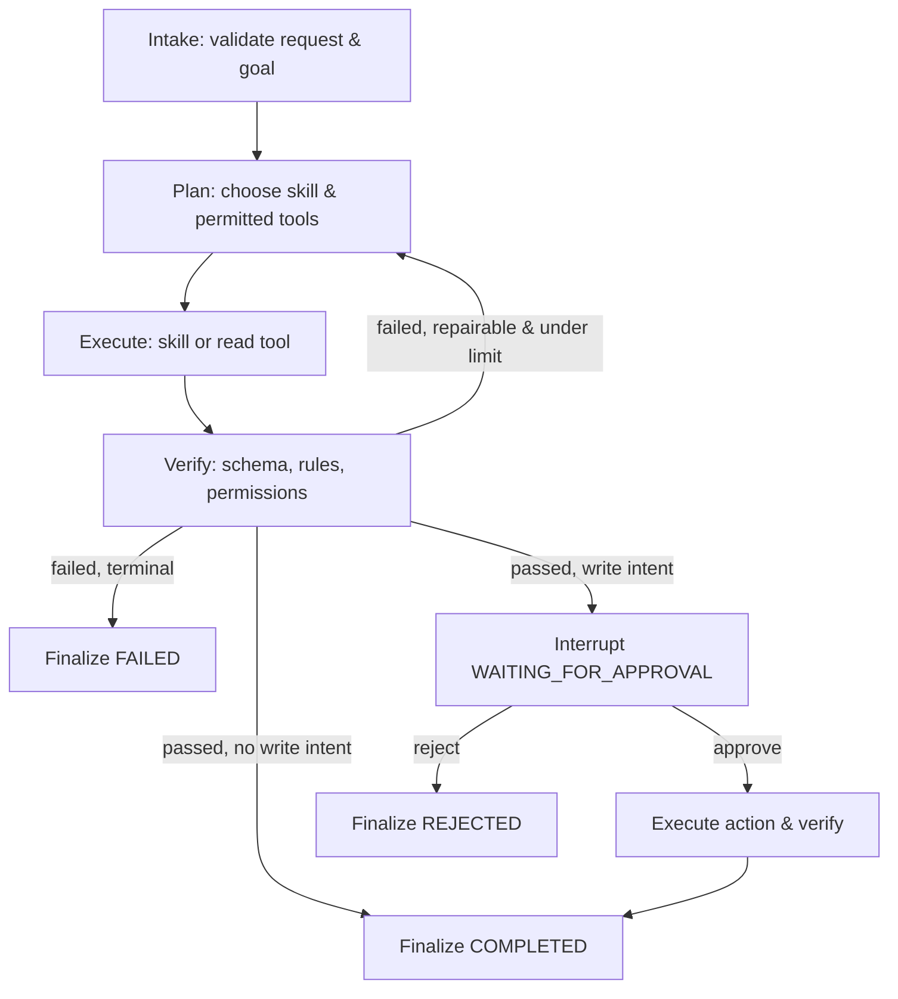
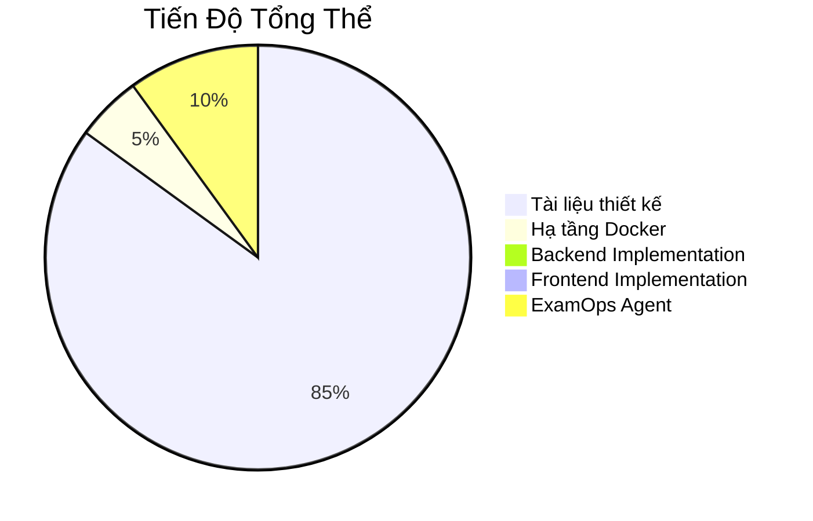

# Báo Cáo Tổng Quan Dự Án — Exam Platform & ExamOps Agent

**Ngày lập:** 2026-10-05  
**Phiên bản:** 1.0  

---

## 1. Tổng Quan Hệ Thống

Dự án bao gồm **hai hệ thống độc lập** hoạt động song song trong một monorepo duy nhất:

| Hệ thống | Vai trò | Công nghệ |
|---|---|---|
| **Exam Platform** | System of Record — lưu trữ và xử lý toàn bộ dữ liệu thi cử | Laravel 13, PHP 8.3+, PostgreSQL 16, Next.js 15+ |
| **ExamOps Agent** | Intelligent Orchestration Layer — trợ lý AI thông minh | Python 3.11+, FastAPI, LangGraph, Pydantic |

```text
PHP/
├── core-api/          ← Backend RESTful API (Laravel 13)
├── web-client/        ← Frontend Web Client (Next.js 15+)
├── agentic-system/    ← ExamOps Agent (Python, FastAPI) [đã khởi tạo cấu hình nền tảng]
├── docker/            ← Docker Compose configs
├── docs/              ← 40+ tài liệu thiết kế & đặc tả
└── AGENTS.md          ← Hiến pháp kỹ thuật dự án
```

### Nguyên tắc cốt lõi

> **Exam Platform** là nguồn chân lý duy nhất cho dữ liệu.  
> **ExamOps Agent** chỉ đọc/đề xuất ghi thông qua API contracts, không bao giờ truy cập trực tiếp database.

---

## 2. Exam Platform — Hệ Thống Thi Trực Tuyến

### 2.1. Đề tài

**Xây dựng RESTful API cho hệ thống thi trực tuyến bằng Laravel**

### 2.2. Mục tiêu chức năng

Quản lý toàn bộ vòng đời kỳ thi trực tuyến:



### 2.3. Vai trò người dùng (RBAC)

| Vai trò | Quyền hạn chính |
|---|---|
| **Admin** | Quản trị toàn bộ hệ thống, tài khoản, cấu hình, audit |
| **Teacher** | Tạo/duyệt câu hỏi, soạn đề, lập lịch ca thi, giám sát |
| **Student** | Xem ca thi được gán, làm bài, nộp bài, xem kết quả |

### 2.4. Mô hình miền (Domain Model)

Hệ thống quản lý **13 bảng CSDL** với các thực thể chính:



**4 loại câu hỏi:** `single_choice`, `multiple_choice`, `true_false`, `fill_in_the_blank`

### 2.5. Máy trạng thái (State Machines)

```text
Question:   draft → approved → rejected
Session:    draft → published → in_progress → closed
Attempt:    in_progress → submitted → graded
```

### 2.6. Stack kỹ thuật

| Tầng | Công nghệ |
|---|---|
| **Backend Runtime** | PHP 8.3+ FPM |
| **Backend Framework** | Laravel 13 |
| **Database** | PostgreSQL 16 |
| **Authentication** | Laravel Sanctum (Stateless Bearer Token) |
| **Cache / Queue** | Redis 7 |
| **Frontend Framework** | Next.js 15+ (App Router), React 19 |
| **Frontend State** | TanStack Query v5, Zod |
| **Frontend UI** | Tailwind CSS, Lucide React |
| **Containerization** | Docker Compose |
| **CI/CD** | GitHub Actions |
| **Testing** | Pest / PHPUnit |

### 2.7. Kiến trúc API

- **Prefix:** `/api/v1`
- **Phong cách:** RESTful thuần túy — không Blade, không Livewire, không Session stateful
- **Luồng xử lý:**

```text
HTTP Request → Route → Middleware → Auth → Form Request
→ Controller → Policy → Action/Service → Eloquent
→ PostgreSQL → API Resource → JSON Response
```

### 2.8. An ninh & Concurrency

| Cơ chế | Chi tiết |
|---|---|
| **Chống IDOR** | Laravel Policy kiểm tra ownership tại resource-level |
| **Chống rò rỉ đề** | 2 API Resource phân tách (Admin vs Student), zero-leakage |
| **Server-Authoritative Clock** | `deadline = min(started_at + duration, session.end_at)` |
| **Chống Double-Submit** | `lockForUpdate()` + DB Transaction trên ExamAttempt |
| **Idempotent Upsert** | `attempt_id + question_id` cho AttemptAnswer |

### 2.9. Trạng thái triển khai Backend

| Hạng mục | Trạng thái |
|---|---|
| Tài liệu thiết kế (40+ files) | ✅ Hoàn thành |
| Docker Compose | ✅ Cấu hình sẵn |
| Laravel skeleton | ⬜ Chưa scaffold |
| Routes, Controllers, Models | ⬜ Chưa implement |
| Migrations, Seeds | ⬜ Chưa tạo |
| Feature Tests | ⬜ Chưa viết |
| Frontend App | ⬜ Chưa implement |

---

## 3. ExamOps Agent — Lớp Điều Phối AI

### 3.1. Mục tiêu

Xây dựng một **Agentic AI System** độc lập, đóng vai trò trợ lý thông minh cho việc quản trị kỳ thi:

> **Agent = Model + Harness**
>
> Harness = Context + Tools + Skills + State + Workflow + Verification + Permission + Observability + Human Approval + Error Handling

### 3.2. Kiến trúc tổng thể



### 3.3. Ranh giới tuyệt đối

| Cho phép | CẤM |
|---|---|
| Đọc dữ liệu Exam Platform qua API | Truy cập trực tiếp PostgreSQL |
| Đề xuất thay đổi (write proposal) | Tự ý ghi dữ liệu không qua approval |
| Chạy độc lập trên runtime riêng | Nhúng logic agent vào Laravel |
| SQLite checkpoint riêng | Dùng DB/Redis của Exam Platform |

### 3.4. Hai kỹ năng miền Foundation

| Skill | Input | Output | Mô tả |
|---|---|---|---|
| **exam-blueprint** | Ràng buộc đề thi (số câu, thời lượng, phân bố độ khó) | `ExamBlueprint` | Thiết kế khung đề thi có cấu trúc |
| **exam-readiness-review** | Blueprint + danh sách câu hỏi | `ReadinessReview` (PASS/FAIL/WARNING) | Thẩm định chất lượng và sự sẵn sàng |

### 3.5. Workflow (Agent Loop)



**Trạng thái terminal:** `COMPLETED`, `FAILED`, `REJECTED`  
**Retry policy:** `MAX_RETRIES = 2` chỉ cho lỗi transient (timeout/502/503)

### 3.6. Harness — 10 Lớp Kiểm Soát

| # | Lớp Harness | Thiết kế Foundation |
|---|---|---|
| 1 | **Context** | Pydantic schema, giới hạn kích thước input |
| 2 | **Tools** | Registry allowlist, typed contract, HTTPX client |
| 3 | **Skills** | `exam-blueprint`, `exam-readiness-review` |
| 4 | **State** | `AgentState` 18 trường, SQLite checkpoint |
| 5 | **Workflow** | LangGraph 6 nodes, bounded retries |
| 6 | **Verification** | Schema + Permission + Math + Deterministic checks |
| 7 | **Permission** | Service allowlist, caller auth, least privilege |
| 8 | **Observability** | OpenTelemetry spans, audit events |
| 9 | **Human Approval** | Interrupt + checkpoint + resume cho write |
| 10 | **Error Handling** | Typed errors, timeout, finite termination |

### 3.7. FastAPI Endpoints

| Method | Endpoint | Mô tả |
|---|---|---|
| `GET` | `/health` | Health check |
| `POST` | `/api/v1/tasks` | Tạo task mới |
| `GET` | `/api/v1/tasks/{thread_id}` | Xem trạng thái task |
| `POST` | `/api/v1/tasks/{thread_id}/resume` | Gửi quyết định approve/reject |

### 3.8. An ninh Agent

- **Caller identity:** API Key qua header `X-API-Key` (giai đoạn dev)
- **Approval bất biến:** Hash proposal, không sửa sau approval
- **Checkpoint security:** Mask secrets, không log token/correct_answer
- **HTTP client fail-closed:** Base URL allowlist, TLS, timeout, size limit

### 3.9. Tính năng DEFERRED (hoãn lại)

| Tính năng | Lý do hoãn |
|---|---|
| RAG / Vector Database | Chưa có yêu cầu nghiệp vụ cụ thể |
| Multi-Agent Systems | Over-engineering cho giai đoạn foundation |
| Model Context Protocol (MCP) | Chưa cần thiết |
| Redis | Chưa cần cache/queue cho agent |

### 3.10. Trạng thái triển khai Agent

| Hạng mục | Trạng thái |
|---|---|
| Foundation Design Review | ✅ **APPROVED** |
| 4 quyết định kiến trúc then chốt | ✅ Đã chốt |
| Architecture Evidence Matrix (17 concepts) | ✅ 14 hoàn thành, 3 deferred |
| Code scaffolding (`agentic-system/`) | 🔄 **Đã khởi tạo cấu hình** (`pyproject.toml`, `.env.example`, `README.md`) |
| Tests & Evaluations | ⬜ Chưa viết |

---

## 4. Hệ Thống Tài Liệu

Dự án sở hữu **40+ tài liệu Markdown** tổ chức thành **10 nhóm chức năng**:

```text
docs/
├── 01-requirements/          ← Yêu cầu & Nghiệp vụ (5 files)
├── 02-domain-database/       ← Mô hình Miền & CSDL (5 files)
├── 03-architecture-api/      ← Kiến trúc & API (5 files + ADRs)
├── 04-security-concurrency/  ← Bảo mật & Đồng thời (3 files)
├── 05-frontend/              ← Thiết kế Frontend (1 file)
├── 06-operations-devops/     ← Vận hành & DevOps (4 files)
├── 07-testing-execution/     ← Kiểm thử & Thực thi (2 files)
├── 08-guidelines/            ← Quy chuẩn & Đào tạo (2 files)
├── agentic-ai/               ← Thiết kế ExamOps Agent (1 file)
└── agents/                   ← Agent Skills catalog (1 file)
```

### Tài liệu quan trọng

| Tài liệu | Mô tả |
|---|---|
| [`AGENTS.md`](file:///c:/Users/Admin/Desktop/PHP/AGENTS.md) | Hiến pháp kỹ thuật — quy tắc vàng cho toàn bộ dự án |
| [`00-FOUNDATION_DESIGN.md`](file:///c:/Users/Admin/Desktop/PHP/docs/agentic-ai/00-FOUNDATION_DESIGN.md) | Thiết kế nền tảng ExamOps Agent (APPROVED) |
| [`12-API_DESIGN.md`](file:///c:/Users/Admin/Desktop/PHP/docs/03-architecture-api/12-API_DESIGN.md) | Đặc tả 23 API endpoints Exam Platform |
| [`09-DATABASE_DESIGN.md`](file:///c:/Users/Admin/Desktop/PHP/docs/02-domain-database/09-DATABASE_DESIGN.md) | Thiết kế 13 bảng CSDL PostgreSQL |
| [`23-IMPLEMENTATION_PLAN.md`](file:///c:/Users/Admin/Desktop/PHP/docs/07-testing-execution/23-IMPLEMENTATION_PLAN.md) | Lộ trình triển khai 12 Phase |

---

## 5. Agent Skills — Bộ Công Cụ Phát Triển

Dự án cài đặt **12 Agent Skills** tại `.agents/skills/`:

| Giai đoạn | Skill | Mục đích |
|---|---|---|
| Specification | `spec-driven-development` | Viết đặc tả trước khi code |
| Domain | `domain-modeling` | Xây dựng Ubiquitous Language |
| Architecture | `documentation-and-adrs` | Ghi quyết định kiến trúc |
| Database | `postgresql-table-design` | Thiết kế schema PostgreSQL |
| Security | `security-guidance` | Phát triển bảo mật chuẩn OWASP |
| API Review | `api-security-review` | Đánh giá OWASP API Top 10 |
| Backend | `laravel-best-practices` | Chuẩn hóa code Laravel |
| Frontend | `next-best-practices` | Chuẩn hóa code Next.js |
| Review | `code-reviewer` | Review tính chính xác |
| Security Review | `code-review-security` | Kiểm tra bảo mật mã nguồn |
| CI/CD | `ci-cd-and-automation` | Tự động hóa quality gates |
| Observability | `observability-and-instrumentation` | Structured logging & tracing |

---

## 6. Hạ Tầng Container

Docker Compose đã cấu hình sẵn:

| Service | Image | Port | Mô tả |
|---|---|---|---|
| `app` | PHP 8.3-FPM | — | Laravel application server |
| `web` | Nginx | `8000` | Reverse proxy cho core-api |
| `client` | Node.js 20 Alpine | `3000` | Next.js dev server |
| `postgres` | PostgreSQL 16 | `5432` | Database (db: `exam_platform`) |

---

## 7. Tổng Kết Tiến Độ



| Giai đoạn | Trạng thái | Ghi chú |
|---|---|---|
| 📄 Tài liệu thiết kế | ✅ **~85% hoàn thành** | 40+ files, đầy đủ requirements, domain, API, security, testing |
| 🐳 Docker Compose | ✅ **Sẵn sàng** | 4 services đã cấu hình |
| 🔧 Backend (Laravel) | ⬜ **Chưa bắt đầu** | Cần scaffold Laravel, migrations, routes, controllers |
| 🎨 Frontend (Next.js) | ⬜ **Chưa bắt đầu** | Chỉ có config files |
| 🤖 ExamOps Agent | 🟢 **Đã khởi tạo cấu hình** | Foundation Design APPROVED, cấu hình pyproject.toml, .env.example, README.md đã sẵn sàng |
| 🧪 Testing | ⬜ **Chưa bắt đầu** | Chiến lược đã thiết kế, chưa viết test |

### Bước tiếp theo ưu tiên

1. **Scaffold Laravel** trong `core-api/` và tạo migrations cho 13 bảng
2. **Implement API endpoints** theo thứ tự dependencies (Users → Subjects → Topics → Questions → ...)
3. **Triển khai mã nguồn `agentic-system/`** (FastAPI, State, LangGraph, Tools, Skills) theo Foundation Design
4. **Viết Feature Tests** song song với implementation

---

> **Triết lý phát triển:** *Xây từng nghiệp vụ thật, không generate toàn bộ project một lần. Mỗi dòng code là một bài học thực chiến.*
