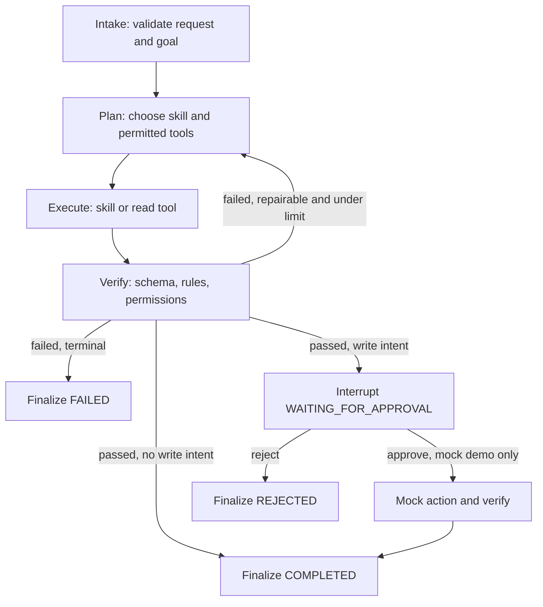

# ExamOps Agent — Foundation Design Review

**Ngày kiểm tra:** 2026-10-05  
**Trạng thái:** APPROVED — READY FOR FOUNDATION IMPLEMENTATION  
**Phạm vi:** dịch vụ Python độc lập; chưa scaffold mã, chưa sửa `core-api/` hoặc `web-client/`.

## 1. Cơ sở và giới hạn của audit

Nguồn yêu cầu là bản tài liệu đặc tả “BUILD FOUNDATION — EXAMOPS AGENTIC AI SYSTEM”. Trạng thái trong tài liệu này phân biệt **đã thấy trong mã**, **chỉ được đặc tả**, và **chưa khả dụng**.

Đã kiểm tra `AGENTS.md`, README gốc và README của hai ứng dụng, bản đồ `docs/` (42 tệp Markdown trước tài liệu này), các đặc tả chính về yêu cầu, miền, API, bảo mật, kiểm thử, vận hành, `docker-compose.yml`, hai GitHub Actions workflow và 12 thư mục `.agents/skills/`. Thư mục gốc không có `.git/`; `git status` trả về “not a git repository”. `docker compose config --quiet` chạy thành công, chỉ xác nhận cú pháp Compose; chưa khởi động dịch vụ hay chạy test ứng dụng.

| Hạng mục | Quan sát hiện tại | Kết luận |
|---|---|---|
| Cấu trúc thật | `core-api/` chỉ có README; `web-client/` có README, `.env.example`, `next.config.ts`, `vercel.json` | Tên `backend/`, `frontend/` trong yêu cầu là sơ đồ đích, không phải đường dẫn hiện hữu. Giữ `core-api/`, `web-client/`; thêm `agentic-system/` ngang cấp. |
| Route, controller, request, resource, policy, model, enum, migration, test backend | Không có `core-api/routes/api.php`, `core-api/app/`, `core-api/database/`, `core-api/tests/` | **NOT AVAILABLE**. Không có endpoint Laravel nào được xác nhận chạy. |
| Frontend | Chưa có `package.json` hoặc `src/` | Chỉ có cấu hình và tài liệu đích; không phân tích sâu ở phase này. |
| Xác thực và vai trò | `AGENTS.md` và `docs/04-security-concurrency/13-AUTH_AND_ACCESS_CONTROL.md` mô tả Sanctum, `admin`/`teacher`/`student` và Policy | **DESIGNED ONLY**; chưa có auth hoặc RBAC thực thi. |
| API read dự kiến | `docs/03-architecture-api/12-API_DESIGN.md` liệt kê subjects, topics, questions, exams, sessions | **NOT AVAILABLE** để agent gọi; inventory tài liệu không phải route inventory chạy được. |
| API write dự kiến | Tài liệu mô tả tạo Exam, gán câu hỏi, publish session | **NOT AVAILABLE**; không tạo tool write thật ở foundation. |
| API nguy hiểm | Publish/close session, gán sinh viên, thay đổi đề/câu hỏi và mọi write có tác động thi cử | Khi endpoint tồn tại phải có permission, Laravel Policy và human approval theo chính sách; foundation chỉ demo proposal/mock. |
| `.agents/skills/` | 12 skill có `SKILL.md` và `skills-lock.json`; `api-security-review`, `code-review-security`, `observability-and-instrumentation` tham chiếu tệp `plays/`, `templates/`, `references/` không hiện diện | Có catalog kỹ năng phát triển, chưa có hai domain skill ExamOps, invocation trace hoặc eval. Ba skill nêu trên không thể coi là quy trình đầy đủ cho tới khi phục hồi tài nguyên phụ trợ. |
| CI/CD | `.github/workflows/ci.yml` bỏ qua gates khi thiếu `composer.json`/`package.json`; frontend deployment có nhánh production khi push `main` và có token | Workflow tồn tại trên đĩa, nhưng chưa chứng minh test/build pass. Không bật deployment cho ExamOps trong foundation. |

**Sai lệch tài liệu cần giải quyết sau:** `AGENTS.md` nêu ba loại Question, trong khi `02-REQUIREMENTS.md` và DB design nêu bốn; `core-api/README.md` ghi 14 bảng, DB design ghi 13; quy tắc một attempt mỗi sinh viên/ca thi trong `AGENTS.md` không khớp `max_attempts`/`attempt_number` trong DB design. `19-TEST_STRATEGY.md` có bảy hàng RTM, nên tuyên bố truy vết 100% trong `00-DESIGN_REVIEW.md` chưa được minh chứng. Những điểm này ảnh hưởng các skill blueprint/readiness và phải được chốt trước tích hợp domain thật.

## 2. Requirement → use case → business rule

| ID | Requirement / use case | Business rule và acceptance |
|---|---|---|
| F-01 | Teacher/Admin yêu cầu thiết kế blueprint đề thi | Chỉ trả về `ExamBlueprint` có schema hợp lệ; không ghi Exam Platform. Phân bố độ khó phải cộng 100%, số câu/duration dương. |
| F-02 | Teacher/Admin đánh giá readiness của blueprint và tập câu hỏi đã cung cấp | Kiểm tra deterministic số câu, trùng ID, status approved, điểm, thời lượng và phân bố. Thiếu dữ liệu → `WARNING`/`FAIL`, không tự suy đoán `PASS`. |
| F-03 | Agent đọc dữ liệu Exam Platform qua tool hẹp | Chỉ gọi endpoint đã xác nhận; hiện tại dùng fake adapter có nhãn `MOCK`, không trình bày như tích hợp live. |
| F-04 | Agent đề xuất write | Dừng tại `WAITING_FOR_APPROVAL`; không có write tool Laravel ở foundation. Demo approve/reject bằng safe mock adapter, với audit trail. |
| F-05 | Task bị gián đoạn được resume | Cùng `thread_id`, checkpoint SQLite bền vững và không thực hiện lại các bước đã hoàn thành. |

## 3. Agent goal và harness

**Goal:** tạo blueprint hoặc review readiness có cấu trúc, có chứng cứ và trạng thái kết thúc rõ; chỉ đề xuất write khi người dùng nêu write intent. Một workflow đơn, không phải chatbot đa nhiệm.

| Lớp harness | Foundation | Extension point |
|---|---|---|
| Context | Pydantic request schema, dữ liệu đầu vào tối thiểu, giới hạn kích thước | Context provider về sau |
| Tools | Registry allowlist, typed contract, HTTPX client, mock adapter được gắn nhãn | Laravel read tools khi route/auth thật có mặt; MCP deferred |
| Skills | `exam-blueprint`, `exam-readiness-review` là quy trình tái sử dụng | Skill khác sau eval |
| State | `AgentState` rõ trường; SQLite checkpoint riêng | PostgreSQL checkpointer riêng, không dùng DB Exam Platform |
| Workflow | LangGraph với node intake → plan → execute → verify → approval khi cần → finalize | Bổ sung node dựa trên case thực, không tách multi-agent |
| Verification | Schema, permission, deterministic business checks; fail closed | Live contract tests với backend |
| Permission | Service allowlist và caller authorization độc lập với model; Laravel là chốt cuối | Identity federation/RBAC khi có frontend/backend thật |
| Observability | Structured audit events và OpenTelemetry console exporter tùy chọn | OTLP exporter và retention production |
| Human approval | Interrupt + checkpoint + resume; mock write riêng | Write tool thật chỉ sau auth và contract review |
| Error handling | Typed errors, timeout, retry giới hạn cho transient, termination hữu hạn | Circuit breaker chỉ khi đo tải cần |

**Boundary:** User → FastAPI ExamOps → Graph → Skill/Tool → `ExamPlatformClient` → Laravel `/api/v1` → PostgreSQL. Agent không đọc DB Exam Platform trực tiếp và không tự bỏ qua Policy/Sanctum. `agentic-system/` có kho SQLite checkpoint riêng. RAG, vector DB, Redis, MCP và multi-agent đều **DEFERRED**.

## 4. Tool và skill contracts

`ExamPlatformClient` chỉ nhận base URL đã cấu hình, không cho model truyền URL/method tùy ý. Mỗi tool khai báo `name`, description, input/output schema, required permission, timeout, retry policy, error types, side effect và approval rule. Danh mục live hiện tại **rỗng** vì chưa có route. `list_subjects`, `get_exam`, `get_exam_session` là **candidates**, không phải endpoint đã xác nhận. Mock adapter phục vụ test có `source=MOCK`; kết quả cuối không được nói đã đọc Exam Platform live.

`exam-blueprint`: input là ràng buộc đề, output là `ExamBlueprint`; các bước parse/chuẩn hóa → lập phân bố → kiểm tra tổng và số nguyên → trả thiết kế. Không ghi DB. `exam-readiness-review`: input là blueprint + question records được cung cấp hoặc tool đọc; output `ReadinessReview` (`PASS`/`FAIL`/`WARNING`, checks, violations, recommendations). Kiểm tra deterministic quyết định PASS; model không được ghi đè kết quả fail. Mỗi skill cần contract, ví dụ đúng/sai và eval riêng.

## 5. State, workflow và termination

`AgentState` tối thiểu: `task_id`, `thread_id`, `actor_context`, `goal`, `intent`, `constraints`, `plan`, `current_step`, `tool_calls`, `tool_results`, `verification`, `approval_status`, `errors`, `retry_count`, `final_result`, `created_at`, `updated_at`. Conversation messages được lưu riêng và giới hạn; không dùng messages làm kho trạng thái. State/checkpoint không lưu token hay đáp án đúng.



`MAX_RETRIES=2` cho lỗi transient có timeout/502/503 và chỉ với read idempotent; 400/401/403/422, validation, business-rule và human rejection dừng. Resume dùng `thread_id` và `Command(resume=...)`, kiểm tra checkpoint đang `WAITING_FOR_APPROVAL`, identity/permission của người duyệt và một quyết định chỉ áp dụng một lần. Trạng thái terminal: `COMPLETED`, `FAILED`, `REJECTED`; `WAITING_FOR_APPROVAL` là trạng thái tạm. Không vòng lặp vô hạn.

## 6. Security review và open questions

1. **Caller identity chưa có nguồn tin cậy.** Trường `actor` trong `POST /tasks` là input không tin cậy; không suy ra Teacher/Admin từ JSON. Foundation chỉ chạy local/dev với cơ chế xác thực service/caller độc lập và quyền mặc định rỗng; mọi live read/write bị vô hiệu khi chưa nối identity với Laravel. Cần chốt ai được `resume`/approve và cách ràng buộc với task owner trước khi mở ra mạng.
2. **Approval phải gắn với đề xuất bất biến.** Lưu action, arguments đã kiểm tra, hash và actor đề xuất trong checkpoint; đổi proposal sau approval → vô hiệu approval. Recheck permission và dữ liệu liên quan trước execution thật. Demo mock không chứng minh bảo vệ write live.
3. **Checkpoint và trace có thể chứa dữ liệu nhạy cảm.** Giới hạn dữ liệu, mask secrets và student data, file SQLite ngoài source control, quyền đọc file phù hợp, retention/cleanup có quy trình. Không log request body thô, bearer token, API key hay `correct_answer`.
4. **HTTP client phải fail closed.** Base URL allowlist theo config, TLS ở môi trường không phải local, timeout, giới hạn response size, validate schema và reject redirect ngoài host. Token service chỉ ở environment; không tự retry write.
5. **Tài liệu ASVS chưa kiểm chứng tại workspace.** `security-guidance/SKILL.md` tham chiếu `data/asvs/*.md` nhưng các tệp đó không hiện diện; tài liệu này áp dụng ranh giới từ `AGENTS.md`, threat model và yêu cầu người dùng, không nhận là đã đạt ASVS. Phục hồi reference hoặc review bằng nguồn chính thức trước khi triển khai live authentication/authorization.

## 7. Proposed file tree và dependencies

Chỉ tạo tệp khi phase tương ứng có test và mục đích; không tạo folder rỗng.

```text
PHP/
├── core-api/                       # giữ nguyên
├── web-client/                     # giữ nguyên
├── agentic-system/
│   ├── pyproject.toml
│   ├── uv.lock
│   ├── .env.example
│   ├── .gitignore
│   ├── README.md
│   ├── src/examops/
│   │   ├── main.py                  # FastAPI composition root
│   │   ├── config.py
│   │   ├── schemas.py               # API + structured model contracts
│   │   ├── state.py                 # AgentState
│   │   ├── graph.py                 # workflow/routing
│   │   ├── model.py                 # provider Protocol + one adapter
│   │   ├── platform_client.py       # HTTPX, no arbitrary URL tool
│   │   ├── tools.py                 # typed allowlist registry
│   │   ├── skills.py                # blueprint + readiness
│   │   ├── verification.py
│   │   ├── permissions.py
│   │   ├── persistence.py           # SQLite checkpointer lifecycle
│   │   └── telemetry.py             # OTel + audit events
│   ├── tests/
│   │   ├── unit/
│   │   ├── integration/
│   │   └── evals/
│   └── docs/                       # architecture/loop/contracts/security/eval, khi code đã có
└── docs/agentic-ai/00-FOUNDATION_DESIGN.md
```

Runtime: Python `>=3.11`, `fastapi`, `uvicorn`, `pydantic`, `httpx`, `langgraph`, `langgraph-checkpoint-sqlite`, `opentelemetry-api`, `opentelemetry-sdk`. Dev: `pytest`, `respx` (mock HTTPX), `ruff`, `mypy`. `uv` quản lý môi trường/lock. Một OpenAI-compatible HTTP adapter được đề xuất để giảm coupling; chọn Gemini hoặc provider cụ thể sau khi có credentials/test contract, không hard-code vendor vào graph. Không cần thêm SDK thứ hai chỉ để có interface. Python 3.13 và uv hiện có trên máy, nhưng compatibility sẽ được kiểm chứng bằng `uv sync` và tests trên phiên bản đã khóa. LangGraph có SQLite checkpointer riêng cho phát triển; [tài liệu checkpoint](https://langchain-ai.github.io/langgraph/reference/checkpoints/) xác nhận SQLite không phải lựa chọn production. [PyPI của package](https://pypi.org/project/langgraph-checkpoint-sqlite/) nêu cảnh báo giới hạn deserialization; khi triển khai cần bật strict msgpack/allowlist tương ứng.

## 8. FastAPI contract dự kiến

`GET /health`; `POST /api/v1/tasks`; `GET /api/v1/tasks/{thread_id}`; `POST /api/v1/tasks/{thread_id}/resume`. Chỉ trả schema công khai `task_id`, `thread_id`, status, summary/evidence/approval proposal; không trả checkpoint nội bộ hoặc trace chứa secrets. `POST /tasks` không trao quyền dựa vào `actor` body. `resume` cần xác thực và quyền approve trên đúng task; duplicate decision trả lỗi ổn định, không execute lại. Trước khi chứng minh auth, chỉ phục vụ local demo.

## 9. Verification, observability, evaluation

Test dự kiến: schema reject dữ liệu sai; blueprint tổng tỷ lệ và số câu; readiness fail khi câu trùng/chưa approved; permission deny; HTTPX mock 401/403/422/timeout/503; graph success/fail/retry limit; checkpoint sống qua restart; approve/reject không chạy lại node đã xong; mock write không thể chạy trước approval; secrets không lọt log. Eval cases có input/expected/pass criteria cho sáu nhóm: blueprint hợp lệ, tổng tỷ lệ sai, thiếu duration, câu trùng, write intent, timeout. **Mock pass chỉ chứng minh harness**, không chứng minh endpoint Laravel, model provider live hoặc bảo mật production.

Trace tối thiểu: `trace_id`, `task_id`, `thread_id`, node, skill, tool, duration, status, error type. Audit event tách khỏi application log: tool/skill start/success/failure, approval request/grant/reject, verification pass/fail, workflow terminal. Không đưa raw payload nhạy cảm vào span attributes. Source của terminal event và test/eval report phải có thể truy ngược từ `task_id`.

## 10. Design Review gate
 
**Phán quyết cuối cùng: APPROVED — READY FOR FOUNDATION IMPLEMENTATION.**
 
Bản thiết kế kiến trúc đã hoàn tất thẩm định và đạt đủ điều kiện tiên quyết. Bốn quyết định then chốt đã được thống nhất:

1. **Quyết định 1 (Phạm vi Foundation):** Chấp nhận phạm vi **Local/Mock-only** với `MockExamPlatformAdapter` gắn nhãn `source="MOCK"` minh bạch trong suốt giai đoạn thiết kế và kiểm thử cho tới khi Laravel Core API hoàn thiện các endpoint thực thi.
2. **Quyết định 2 (Xác thực Caller & Approver):** Giai đoạn phát triển áp dụng cơ chế xác thực API Key dịch vụ qua header `X-API-Key`. Endpoint `POST /resume` đối chiếu chặt chẽ quyền của người phê duyệt với task owner, chỉ lắng nghe tại `localhost`.
3. **Quyết định 3 (Chiến lược Model Provider):** Áp dụng kiến trúc Hybrid qua `ModelProvider` Protocol: mặc định dùng `MockModelProvider` hermetic để kiểm thử không phụ thuộc mạng/chi phí, đồng thời tích hợp sẵn adapter cho Google Gemini và OpenAI-compatible cấu hình qua `.env`.
4. **Quyết định 4 (Thống nhất mô hình miền):** Thống nhất chuẩn theo Database Design: **4 loại câu hỏi** (`single_choice`, `multiple_choice`, `true_false`, `fill_in_the_blank`), **13 bảng CSDL**, và mặc định **1 lượt thi** cho kỳ thi chính thức (`max_attempts = 1`).

Toàn bộ ranh giới an ninh, tính toán deterministic toán học và nguyên tắc phân tầng đã được bảo đảm. Bản thiết kế chính thức được phê duyệt để làm cơ sở triển khai.

---

## 11. Bảng Đối Chiếu Tiêu Chuẩn Kiến Trúc Nền Tảng (Architecture Evidence Matrix)

| STT | Khái niệm Kiến trúc (Core Concept) | Đặc tả Kiến trúc & Giải pháp Kỹ thuật (Implementation Design) | Bằng chứng Trong Tài Liệu | Trạng thái (Status) |
| :---: | :--- | :--- | :--- | :---: |
| **1** | **Model Integration** | Giao diện trừu tượng `ModelProvider` Protocol (generate_structured, generate_text) hỗ trợ đa nhà cung cấp (Mock, Gemini, OpenAI-compatible). Graph cốt lõi không gắn chặt vào vendor. | Mục 3, 7, 10 | **HOÀN THÀNH THIẾT KẾ** |
| **2** | **Structured Output** | Bắt buộc sử dụng Pydantic Schema cho toàn bộ đầu ra nhận thức: `AgentGoal`, `AgentPlan`, `VerificationResult`, `FinalResult`. Tuyệt đối không parse text tự do. | Mục 2, 5, 8 | **HOÀN THÀNH THIẾT KẾ** |
| **3** | **Agent Goal** | Định nghĩa đối tượng `AgentGoal` gồm: actor, intent, subject, constraints, requested_action, requires_write, requires_approval. Phân loại mục tiêu trước khi lập kế hoạch. | Mục 2, 3 | **HOÀN THÀNH THIẾT KẾ** |
| **4** | **Agent Loop** | Đồ thị trạng thái hữu hạn có hướng (Directed State Graph) 6 node: `intake` $\rightarrow$ `plan` $\rightarrow$ `execute` $\rightarrow$ `verify` $\rightarrow$ `human_review` $\rightarrow$ `finalize`. Bounded retries `MAX_RETRIES = 2`. | Mục 5, 6 | **HOÀN THÀNH THIẾT KẾ** |
| **5** | **Tool Use** | Hợp đồng công cụ `BaseToolContract` định kiểu chặt chẽ; Tool Registry kiểm soát quyền và tác dụng phụ; cấm tuyệt đối "God Tool" `call_any_api`. Tích hợp HTTPX client an toàn. | Mục 4, 6 | **HOÀN THÀNH THIẾT KẾ** |
| **6** | **Skill Engineering** | Phân định rạch ròi Tool ("thao tác nguyên tử") vs Skill ("quy trình nghiệp vụ tái sử dụng"); 2 kỹ năng miền: `exam-blueprint` (thiết kế khung đề) và `exam-readiness-review` (thẩm định chất lượng). | Mục 4 | **HOÀN THÀNH THIẾT KẾ** |
| **7** | **State Engineering** | Mô hình `AgentState` tường minh với 18 trường dữ liệu; Phân tách hoàn toàn giữa Vùng tin nhắn hội thoại (Conversation Window) và Trạng thái dữ liệu tác vụ (Task State). | Mục 5 | **HOÀN THÀNH THIẾT KẾ** |
| **8** | **Checkpoint** | Cơ chế lưu trữ trạng thái bền vững theo `thread_id` qua `SqliteSaver` (giai đoạn dev) và lộ trình di chuyển `PostgresSaver` (giai đoạn production) trên DB riêng. | Mục 5 | **HOÀN THÀNH THIẾT KẾ** |
| **9** | **Recovery & Resume** | Phục hồi tác vụ nguyên trạng từ Checkpoint khi nhận quyết định phê duyệt (`approve`/`reject`); tiếp tục chu trình mà không chạy lại các bước đã hoàn tất. | Mục 5, 8 | **HOÀN THÀNH THIẾT KẾ** |
| **10** | **Human Approval** | Cổng Human-in-the-Loop ngắt (`interrupt`) tự động đối với mọi hành vi Ghi (`requires_write == True`); đóng gói `ApprovalProposal`, chuyển trạng thái `WAITING_FOR_APPROVAL`. | Mục 2, 5, 6 | **HOÀN THÀNH THIẾT KẾ** |
| **11** | **Verification** | Khung thẩm định đa tầng (Schema $\rightarrow$ Permission $\rightarrow$ Toán học $\rightarrow$ Deterministic). LLM tuyệt đối không có quyền tự chuyển kết quả thành PASS nếu vi phạm. | Mục 2, 3, 9 | **HOÀN THÀNH THIẾT KẾ** |
| **12** | **Testing & Evaluation** | Bộ đánh giá 6 kịch bản chuẩn mực (Evaluation Suite): blueprint hợp lệ, tỉ lệ sai, thiếu thời lượng, câu hỏi trùng lặp, hành động ghi cần duyệt, và lỗi timeout mạng. | Mục 9 | **HOÀN THÀNH THIẾT KẾ** |
| **13** | **Observability** | Theo dõi phân tán OpenTelemetry Spans (`trace_id`, `task_id`, `node`, `tool`, `duration`); Tách biệt rạch ròi giữa Application Logs và Audit Trail (11 sự kiện nghiệp vụ). | Mục 3, 9 | **HOÀN THÀNH THIẾT KẾ** |
| **14** | **Security & Permission** | Mô hình đặc quyền tối thiểu (Least Privilege), nguyên tắc Fail-Closed, chính sách Zero-Leakage (chống lộ đề và làm sạch Bearer Token, API Key trong logs). | Mục 6 | **HOÀN THÀNH THIẾT KẾ** |
| **15** | **Knowledge / RAG** | Tích hợp cơ sở tri thức vector database để tra cứu ngữ nghĩa sâu trong ngân hàng hàng chục nghìn câu hỏi. | Mục 3 | **DEFERRED (HOÃN)** |
| **16** | **Multi-Agent Systems** | Phân chia hệ thống thành nhiều Agent độc lập giao tiếp qua message bus (Planner Agent, Reviewer Agent, Proctor Agent). | Mục 3 | **DEFERRED (HOÃN)** |
| **17** | **Model Context Protocol** | Chuẩn hóa giao tiếp công cụ thông qua giao thức mở MCP Server. | Mục 3 | **DEFERRED (HOÃN)** |

### Kết Luận Kiến Trúc (Architectural Conclusion):
1. **Tính độc lập & Phân tầng sạch:** Exam Platform đóng vai trò là **System of Record (SoR)** lưu trữ chân lý dữ liệu tại PostgreSQL, trong khi ExamOps Agent đóng vai trò là **Lớp Điều phối Trí tuệ (Intelligent Orchestration Layer)** chạy trên runtime Python độc lập.
2. **Kỹ thuật Harness Tiên tiến:** Toàn bộ tính xác suất của mô hình ngôn ngữ lớn (LLM) được kiềm chế và dẫn dắt bởi một bộ Harness xác định (Deterministic Harness) bao gồm Schema định kiểu, Thuật toán toán học, Khóa kiểm tra quyền hạn và Cổng phê duyệt của con người.
3. **Tuân thủ Chuẩn mực Doanh nghiệp:** Không sa đà vào mã nguồn tự do hay over-engineering, tài liệu phản ánh chính xác tư duy của một **Senior AI Systems Architect** trong việc xây dựng hệ thống phần mềm quy mô lớn.


