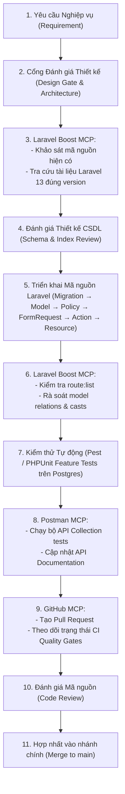

# 🛠️ Hướng Dẫn Cấu Hình & Vận Hành Backend Engineering MCP Suite

**Dự án**: Exam Platform Monorepo  
**Tài liệu**: `docs/agents/BACKEND_MCP_SETUP.md`  
**Phạm vi**: Workspace Scope (`.agents/mcp_config.json`)  
**Mục tiêu**: Chuẩn hóa bộ công cụ MCP hỗ trợ kỹ sư Backend Laravel 13, PostgreSQL, Postman, GitHub CI/CD và Docker

---

## 🎯 1. Phân Định Trách Nhiệm MCP (Backend Purpose Mapping)

| MCP Server | Vai Trò & Trách Nhiệm Cốt Lõi |
| :--- | :--- |
| **Laravel Boost** | **Trợ lý am hiểu Laravel sâu sắc**: Đọc & phân tích Routes, Models, Eloquent relationships, Database Schema, kiểm tra Logs/Errors, tra cứu tài liệu Laravel 13 chính thức đúng phiên bản. |
| **Postman** | **Quản trị API Contracts & Kiểm thử**: Khởi tạo/cập nhật API specifications, quản lý Postman Collections, kiểm thử tự động API endpoints và sinh tài liệu API. |
| **GitHub** | **Tự động hóa Quy trình Phát triển**: Quản lý Pull Requests, Issues, kiểm tra trạng thái chạy của GitHub Actions CI/CD workflows, hỗ trợ Code Review. |
| **Docker** | **Quản lý Môi trường Container hóa**: Quản lý trạng thái các dịch vụ container (`app`, `web`, `postgres`, `redis`), kiểm tra logs và tài nguyên. |
| **Postgres MCP** *(Tùy chọn)* | **Phân tích CSDL Nâng cao**: Chỉ kích hoạt khi cần phân tích chuyên sâu: `EXPLAIN ANALYZE`, kiểm tra chậm (slow queries), đánh giá chỉ mục Composite Index. |

---

## 🔄 2. Chu Trình Phát Triển Backend (Backend Development Workflow)



---

## ⚖️ 3. Quy Tắc Ranh Giới Dữ Liệu Bắt Buộc (Database Boundary Rule)

> **NGUYÊN TẮC BẤT BIẾN**: AI Agent **tuyệt đối không được bypass** tầng ứng dụng Laravel để thay đổi dữ liệu trực tiếp trong CSDL!

- **Nghiêm cấm** sử dụng bất kỳ công cụ Database/MCP nào để:
  - ❌ `INSERT / UPDATE / DELETE` người dùng (`users`), đổi quyền (`role`).
  - ❌ Nộp bài thi (`submit exam`), sửa điểm số (`modify score`).
  - ❌ Tạo đề thi (`create exam`), gán ca thi (`assign sessions`).
- **Mọi thao tác nghiệp vụ miền (Domain Logic)** bắt buộc phải thực thi thông qua **Laravel Service, Action hoặc RESTful API Endpoint**, tuân thủ nghiêm ngặt Form Request validation, Database Transactions và Policy authorization.
- **Truy cập CSDL trực tiếp (Direct DB Access)** chỉ được phép dùng cho:
  - 🔍 Khảo sát cấu trúc bảng (Schema inspection).
  - ⚡ Phân tích kế hoạch thực thi câu truy vấn (`EXPLAIN`).
  - 🩺 Chẩn đoán an toàn (Safe read-only diagnostics).

---

## 🛡️ 4. Nguyên Tắc An Ninh & Bảo Mật (Security Standards)

- **Tuyệt đối không commit bí mật**: Không bao giờ ghi trực tiếp GitHub PAT, Postman API Key, DB Passwords, Laravel `APP_KEY`, Sanctum Token, hay OAuth Token vào bất kỳ tệp tin nào trong kho mã nguồn.
- **Cơ chế nạp thông tin xác thực**:
  - Ưu tiên cơ chế **OAuth 2.0 Flow** chính thức.
  - Sử dụng biến môi trường hệ thống hoặc GitHub Secrets trong CI/CD.
  - Tệp `.gitignore` bảo vệ tuyệt đối các tệp `.env*` và thông tin cấu hình nhạy cảm.

---

## 📊 5. Bảng Trạng Thái Máy Chủ MCP Backend (Verification Matrix)

| MCP Server | Trạng Thái (Status) | Phạm Vi (Scope) | Mục Đích (Purpose) | Mức Quyền Hạn (Access Level) |
| :--- | :--- | :--- | :--- | :--- |
| **Laravel Boost** | `DEFERRED` | Workspace (`core-api`) | Laravel-aware coding, routes, models, logs, docs | Read-first / Inspection (Kích hoạt tại Phase 1) |
| **Postman** | `CONNECTED` | Remote (`https://mcp.postman.com/minimal`) | Quản lý API Collections, Specs, Endpoint testing | Controlled / Read-first |
| **GitHub** | `CONNECTED` | Remote (`https://api.githubcopilot.com/mcp/`) | Tra cứu Repo, PR, Issues, GitHub Actions CI status | Read-first |
| **Docker** | `SKIPPED` | Local (Desktop 24.0.7) | Quản lý Container runtime | `SKIPPED — TOOLKIT NOT AVAILABLE` |
| **Postgres** | `DEFERRED` | Local | Phân tích CSDL chuyên sâu (EXPLAIN, Slow queries) | Read-only strictly (Không cài mặc định) |

---

## ⚙️ 6. Cấu Hình Workspace Hiện Tại (`.agents/mcp_config.json`)

```json
{
  "mcpServers": {
    "shadcn": {
      "command": "npx",
      "args": ["shadcn@latest", "mcp"]
    },
    "playwright": {
      "command": "npx",
      "args": ["@playwright/mcp@latest"]
    },
    "21st": {
      "serverUrl": "https://21st.dev/api/mcp",
      "headers": {
        "x-api-key": "${API_KEY_21ST}"
      }
    },
    "postman": {
      "serverUrl": "https://mcp.postman.com/minimal"
    },
    "github": {
      "serverUrl": "https://api.githubcopilot.com/mcp/"
    }
  }
}
```

---

## 📋 7. Kế Hoạch Kích Hoạt Laravel Boost (Khai Triển Ở Phase 1)

Ngay khi skeleton Laravel 13 được khởi tạo trong `core-api/` theo lệnh:
```bash
docker compose exec app composer create-project laravel/laravel .
```

Ta sẽ kích hoạt Laravel Boost bằng các bước:
1. Cài đặt package dev:
   ```bash
   docker compose exec app composer require laravel/boost --dev
   ```
2. Cài đặt cấu hình MCP:
   ```bash
   docker compose exec app php artisan boost:install
   ```
3. Đăng ký vào `.agents/mcp_config.json`:
   ```json
   "laravel-boost": {
     "command": "php",
     "args": ["artisan", "boost:mcp"],
     "cwd": "C:\\Users\\Admin\\Desktop\\PHP\\core-api"
   }
   ```
