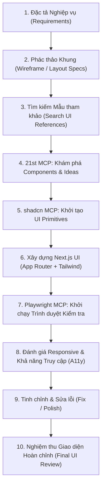
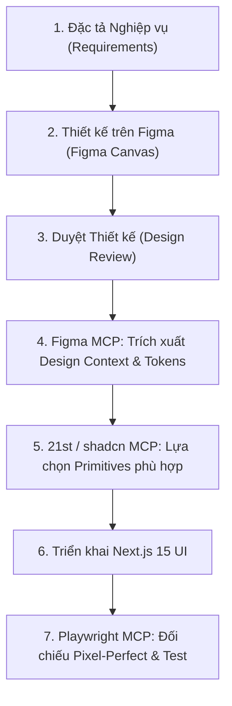

# 🎨 Hướng Dẫn Cấu Hình & Vận Hành UI MCP Cho Vibe Coding

**Dự án**: Exam Platform Monorepo  
**Tài liệu**: `docs/agents/UI_MCP_SETUP.md`  
**Phạm vi**: Workspace Scope (`.agents/mcp_config.json`)  
**Mục tiêu**: Chuẩn hóa công cụ hỗ trợ Vibe Coding giao diện người dùng (Next.js 15, Tailwind, shadcn/ui)

---

## 🎯 1. Phân Định Mục Đích (Purpose Mapping)

Mỗi MCP server đảm nhận một vai trò chuyên biệt trong chu trình thiết kế và phát triển giao diện:

| MCP Server | Vai Trò & Trách Nhiệm Cốt Lõi |
| :--- | :--- |
| **21st** | Tìm kiếm component tham khảo, định hướng phong cách giao diện (UI Direction), khám phá production-ready animated components từ cộng đồng. |
| **shadcn** | Thư viện UI primitives chuẩn công nghiệp: Form, Dialog, Dropdown, Table, Input, Sheet, Layout components. |
| **Playwright** | Tự động hóa trình duyệt (Browser Automation): Kiểm tra giao diện (UI inspection), tương tác, chụp ảnh màn hình (Visual verification), kiểm thử Responsive & Accessibility (A11y). |
| **Figma** *(Nếu client hỗ trợ)* | Đọc ngữ cảnh thiết kế trực tiếp từ file Figma (Design tokens, layout specs, visual hierarchy) để chuyển đổi sang code (Design-to-Code). |

---

## 🔄 2. Quy Trình Vibe Coding Giao Diện (UI Workflow)

### 2.1. Quy trình chuẩn hiện tại (Standard Vibe Coding Workflow)



### 2.2. Quy trình nâng cao (Khi Figma MCP khả dụng)



---

## ⚙️ 3. Cấu Hình Workspace (`.agents/mcp_config.json`)

Tệp cấu hình được đặt tại phạm vi Workspace của dự án:

```json
{
  "mcpServers": {
    "shadcn": {
      "command": "npx",
      "args": ["shadcn@latest", "mcp"]
    },
    "playwright": {
      "command": "npx",
      "args": ["@playwright/mcp@latest"]
    },
    "21st": {
      "serverUrl": "https://21st.dev/api/mcp",
      "headers": {
        "x-api-key": "${API_KEY_21ST}"
      }
    }
  }
}
```

---

## 🔒 4. Nguyên Tắc An Ninh & Quản Lý Bí Mật (Security Rules)

1. **Tuyệt đối không commit bí mật**: Không bao giờ ghi trực tiếp API keys, OAuth tokens, session tokens vào bất kỳ tệp tin nào được Git theo dõi (`.agents/mcp_config.json`, README, commit messages, PRs).
2. **Khai báo qua Biến môi trường**: Các secret (như `API_KEY_21ST`) được nạp qua biến môi trường của hệ thống hoặc tệp `.env.local` (đã nằm trong `.gitignore`).

---

## 📊 5. Bảng Trạng Thái Máy Chủ MCP (Verification Matrix)

| MCP Server | Trạng Thái (Status) | Giao Thức (Transport) | Xác Thực (Auth) | Mục Đích (Purpose) |
| :--- | :--- | :--- | :--- | :--- |
| **shadcn** | `CONNECTED` | Stdio (`npx shadcn@latest mcp`) | Không yêu cầu | UI Primitives, forms, dialogs, tables |
| **playwright** | `CONNECTED` | Stdio (`npx @playwright/mcp@latest`) | Không yêu cầu | Browser automation, visual inspection, snapshot |
| **21st** | `AUTH REQUIRED` | Remote HTTP/SSE (`serverUrl`) | `API_KEY_21ST` | Component discovery, UI inspirations |
| **figma** | `SKIPPED` | Remote (`https://mcp.figma.com/mcp`) | OAuth 2.0 | Client Antigravity chưa nằm trong allowlist của Figma |

---

## 🛑 6. Giới Hạn Phạm Vi Bước Setup (Do Not Build UI Yet)

Theo quy chuẩn kỹ thuật, bước này **CHỈ** thiết lập và kiểm chứng công cụ MCP. Tuyệt đối **KHÔNG**:
- Tự ý sinh mã trang Dashboard hay các màn hình phòng thi.
- Tự ý cài đặt các component tùy tiện vào thư mục `web-client/`.
- Sửa đổi cấu trúc mã nguồn giao diện hiện tại khi chưa có yêu cầu cụ thể.
